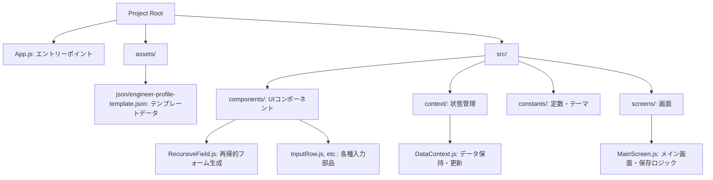
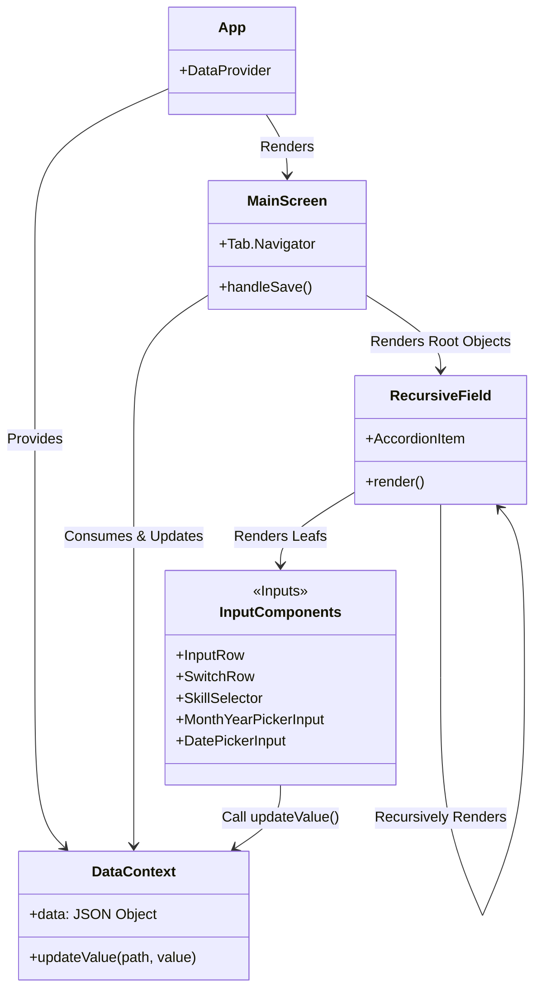
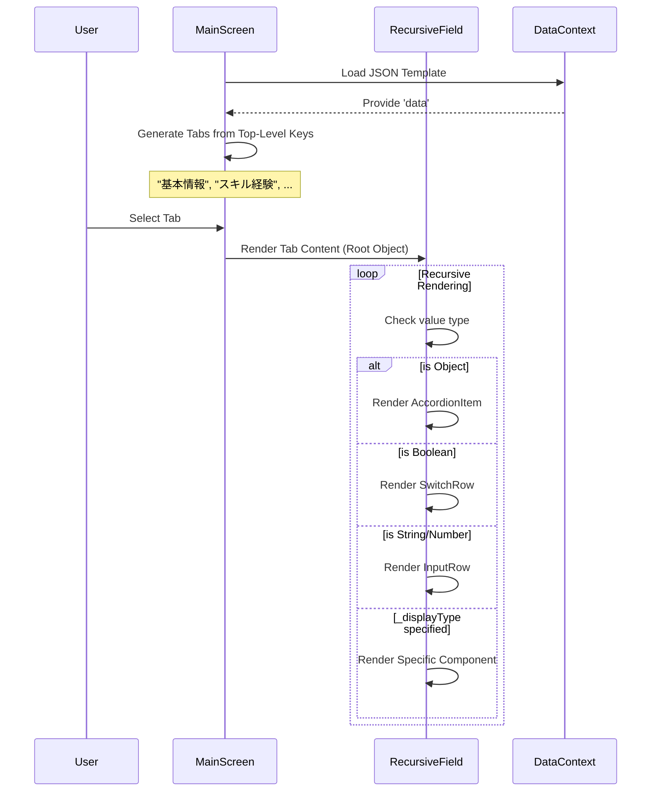
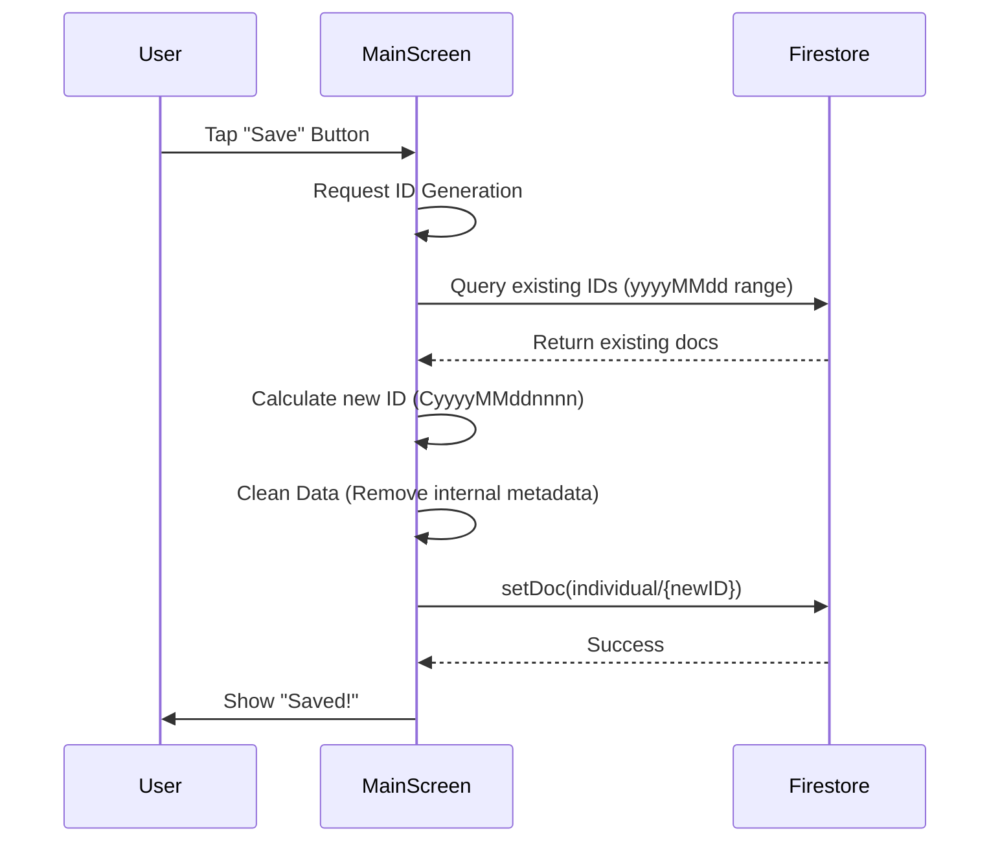

# エンジニア個人登録アプリ (Engineer Registration App)

このアプリケーションは、エンジニアの経歴やスキル情報を登録するためのモバイルアプリケーションです。Expo (React Native) で構築され、データはFirestoreに保存されます。

## 🏗 アーキテクチャ概要

本アプリは、設定ファイル（`engineer-profile-template.json`）を読み込み、その構造に基づいて動的にUIフォームを生成する「メタデータ駆動型UI」アーキテクチャを採用しています。

### ディレクトリ構造

## 🧩 コンポーネント構成とデータフロー

`DataContext` がアプリケーション全体のデータ状態（JSONツリー）を保持し、各コンポーネントに提供します。`RecursiveField` はデータを再帰的に走査し、データの型やメタデータ（`_displayType`）に応じて適切な入力コンポーネントをレンダリングします。

## 🔄 処理フロー

### 1. フォーム生成フロー

JSONデータの階層構造をそのままタブとアコーディオンUIに変換します。

### 2. データ保存フロー (Firestore)

## 🛠 Tech Stack

*   **Framework**: Expo (React Native)
*   **Language**: JavaScript (React)
*   **Database**: Firebase Firestore
*   **UI Architecture**: Metadata-Driven UI, Recursive Components
*   **State Management**: React Context API
*   **Components**: Custom Components + `@react-native-community/datetimepicker`

## 📁 主要ファイル解説

| ファイル名 | 説明 |
| --- | --- |
| `App.js` | アプリケーションのエントリーポイント。プロバイダーの設定等。 |
| `src/context/DataContext.js` | JSONデータの読み込み、保持、更新ロジックを提供。 |
| `src/screens/MainScreen.js` | タブナビゲーションの構築と、Firestoreへの保存処理を担当。 |
| `src/components/RecursiveField.js` | JSONツリーを再帰的にコンポーネントに変換する中核コンポーネント。 |
| `assets/json/engineer-profile-template.json` | フォームの構造と初期値を定義するテンプレートファイル。これを編集するだけでUIが変化します。 |
