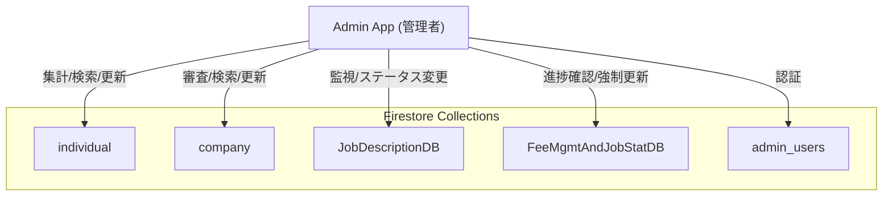

# 管理者用アプリ（admin_app）設計概要

- フレームワーク: Expo（React Native）
- 共有モジュール: shared/common_frontend（UI, 状態, Firebase設定）
- データソース: Firestore（**全コレクションへのアクセス権限を持つ**）
- 目的: プラットフォーム全体の管理、ユーザー管理、求人・選考状況の統括

## Firestore 接続
- Firestoreへの接続は共有設定 [firebaseConfig.js](file:///Users/yamakawamakoto/ReactNative_Expo/engineer-registration-app-yama/shared/common_frontend/src/core/firebaseConfig.js) を介して行います
- 使用環境変数（Expoの公開環境変数）:
  - EXPO_PUBLIC_FIREBASE_API_KEY
  - EXPO_PUBLIC_FIREBASE_AUTH_DOMAIN
  - EXPO_PUBLIC_FIREBASE_PROJECT_ID
  - EXPO_PUBLIC_FIREBASE_STORAGE_BUCKET
  - EXPO_PUBLIC_FIREBASE_MESSAGING_SENDER_ID
  - EXPO_PUBLIC_FIREBASE_APP_ID
  - EXPO_PUBLIC_FIREBASE_MEASUREMENT_ID
- Firestore プロジェクト（管理画面、要ログイン）:
  - https://console.firebase.google.com/u/0/project/flutter-frontend-21d0a/firestore/data

### 連携コレクション一覧
本アプリは以下のすべてのコレクションと連携します。機能ごとのアクセス範囲に注意してください。

| コレクション名 | 用途 | 主な操作 | ID接頭辞 |
| :--- | :--- | :--- | :--- |
| **individual** | 個人エンジニア情報 | 閲覧, 編集(サポート用), 削除 | C |
| **company** | 法人・企業情報 | 閲覧, 審査, 編集代行 | B |
| **JobDescriptionDB** | 求人票データ | 閲覧, 内容確認, ステータス変更 | J |
| **FeeMgmtAndJobStatDB** | 選考進捗・手数料 | 全件閲覧, 手数料計算確認, エラー修正 | S |
| **admin_users** | 管理者アカウント情報 | 認証, 権限管理 | A |

## データフローと機能マップ

### 1. ダッシュボード機能
- 画面: [DashboardScreen.js](file:///Users/yamakawamakoto/ReactNative_Expo/engineer-registration-app-yama/apps/admin_app/expo_frontend/src/features/dashboard/DashboardScreen.js)
- 連携コレクション:
  - `individual`: 新規登録者数の集計
  - `company`: 新規企業数の集計
  - `FeeMgmtAndJobStatDB`: 現在進行中の選考数、今月の手数料見込み

### 2. ユーザー管理機能（予定）
- 連携コレクション: `individual`, `company`
- 機能:
  - ユーザー検索・詳細閲覧
  - アカウント停止・削除
  - 登録情報の修正（サポート対応時）

### 3. 求人・選考管理機能（予定）
- 連携コレクション: `JobDescriptionDB`, `FeeMgmtAndJobStatDB`
- 機能:
  - 不適切な求人の非公開化
  - 選考ステータスの強制更新（トラブル対応）

## 共有モジュール構成
- UI: shared/common_frontend/src/core/components
  - 管理画面用の共通コンポーネント（テーブル、フィルタなど）を利用
- 状態: shared/common_frontend/src/core/state/DataContext
  - 選択中のユーザーデータや一時的な編集内容の保持
- Firebase: shared/common_frontend/src/core/firebaseConfig
  - `db` インスタンスを通じた全コレクションへのアクセス

## 起動方法（管理者アプリ）
- スクリプト: [scripts/start_expo.sh](file:///Users/yamakawamakoto/ReactNative_Expo/engineer-registration-app-yama/scripts/start_expo.sh)
- 実行例:
  - `./scripts/start_expo.sh admin_app`

## セキュリティと権限
- **最重要**: 本アプリは全データへのアクセス権を持つため、Firebase Security Rules にて `admin_users` コレクションに含まれるUIDのみがアクセスできるよう厳格に制限する必要があります。
- 端末へのデータキャッシュは最小限に留め、ログアウト時に確実にクリアする実装が求められます。

## データスキーマ参照
各コレクションの詳細なスキーマについては、それぞれの設計ドキュメントを参照してください。

- **individual**: [designdocument_individual.md](./designdocument_individual.md)
- **company**: [designdocument_corporate_user_app.md](./designdocument_corporate_user_app.md)
- **JobDescriptionDB**: [designdocument_job_description.md](./designdocument_job_description.md)
- **FeeMgmtAndJobStatDB**: [designdocument_fmjs.md](./designdocument_fmjs.md)
