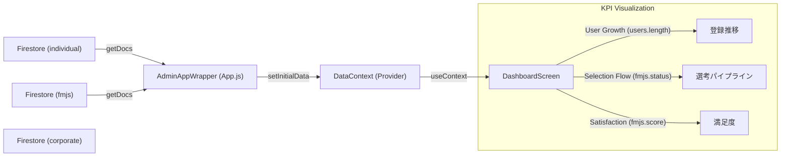
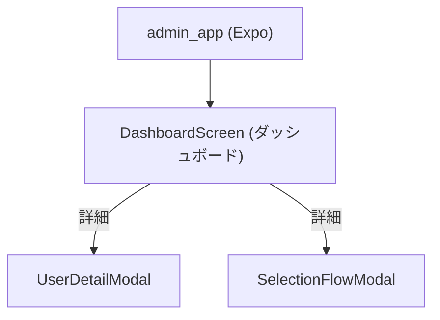

# 管理者アプリ（admin_app）設計概要

- フレームワーク: Expo（React Native）
- 共有モジュール: shared/common_frontend（UI, Firebase設定）
- データソース: Firestore（全コレクションへのアクセス権限を持つ）
- 目的: プラットフォーム全体の統括、監視、および主要KPIの可視化

## Firestore 接続と全コレクション連携
管理者アプリはシステムの中枢として、以下の全コレクションと連携します。

- Firestoreへの接続は共有設定 [firebaseConfig.js](file:///Users/yamakawamakoto/ReactNative_Expo/engineer-registration-app-yama/shared/common_frontend/src/core/firebaseConfig.js) を介して行います。
- **特記事項**: 管理者はセキュリティルール上、全コレクションに対して Read/Write 権限を持つことを想定しています。

### 連携コレクション一覧

| コレクション名 | 役割 | Adminでの用途 | 連携機能 |
| :--- | :--- | :--- | :--- |
| **individual** | 個人ユーザー（エンジニア） | 登録者数推移分析、不正ユーザー監視、離脱分析 | DashboardScreen (Growth Chart) |
| **corporate** | 法人ユーザー（企業） | 企業審査、アカウント管理、利用状況確認 | CompanyManagementScreen (Future) |
| **fmjs** | 選考・手数料・サーベイ | 選考進捗パイプライン分析、満足度調査集計、売上予測 | DashboardScreen (Selection Flow, Satisfaction) |
| **jd** | 求人票 (Job Description) | 不適切求人の監視、求人動向分析 | JobMonitorScreen (Future) |
| **admin_users** | 管理者アカウント | 管理者権限管理、操作ログ | Auth (Future) |

## データフロー (Dashboard)
データ取得は `App.js` 内の `AdminAppWrapper` で一括して行い、`DataContext` を通じて各画面に配信するアーキテクチャを採用しています（Individual App等と統一）。



## 共有モジュール構成
- UI: shared/common_frontend/src/core/components
  - 共通のグラフコンポーネントやカードUIを利用（予定）
- Firebase: shared/common_frontend/src/core/firebaseConfig
  - `db` インスタンスの共有

## 画面構成


## データ集計ロジック (DashboardScreen)
### 1. 登録ユーザー数推移 (User Growth)
- **ソース**: `individual` コレクション
- **ロジック**: 全ドキュメントを取得し、その総数を月別などの時系列データとしてマッピング（現状はモック分布ロジックでシミュレーション）。
- **目的**: プラットフォームの成長率を監視する。

### 2. 選考プロセス (Selection Flow)
- **ソース**: `fmjs` コレクション
- **ロジック**: 各ドキュメントの `status` フィールド（`entry`, `doc_pass`, `interview_1`, etc.）を集計。
- **目的**: 選考のボトルネックを特定し、マッチング効率を改善する。

### 3. マッチング満足度 (Satisfaction)
- **ソース**: `fmjs` コレクション
- **ロジック**: `satisfactionScore` (1-5) を集計し、分布を表示。
- **目的**: サービスの質（Quality of Match）を担保する。

## 起動方法（管理者アプリ）
- スクリプト: [scripts/start_expo.sh](file:///Users/yamakawamakoto/ReactNative_Expo/engineer-registration-app-yama/scripts/start_expo.sh)
- 実行コマンド:
  ```bash
  ./scripts/start_expo.sh admin_app
  ```

## 注意点・改善提案
### 1. ユーザー数推移グラフ (User Growth)
- **現状**: `individual` コレクションの「総数」のみを正確に反映し、月別の推移はモックロジックで均等配分しています。
- **改善案**: `individual` ドキュメントに `createdAt` (Timestamp) フィールドが実装され次第、その日付に基づいて集計するロジックへ変更することを推奨します。

### 2. 繋がりの推移 (Connections Chart)
- **現状**: データソースとなるコレクションが存在しないため、UI上はプレースホルダー表示としています（ダミーデータも削除済み）。
- **改善案**: マッチング機能（`matches` コレクション等）が実装された後、そのデータを集計してグラフ化する必要があります。

### 3. データ量とパフォーマンス (Scalability)
- **現状**: `getDocs` を使用して、アプリ起動時に `individual` および `fmjs` コレクションの**全ドキュメント**を取得しています。開発段階では問題ありませんが、本番運用でデータが増加すると起動時間の遅延や通信量の増大を招きます。
- **改善案**: 将来的にユーザー数が数千規模になった場合は、以下の対応を推奨します。
  - **Firestoreの集計クエリ (`count()`) の利用**: 総数のみが必要な場合。
  - **サーバーサイド集計**: Cloud Functions 等で定期的にKPIを集計し、専用の `stats` コレクションに保存してAdminアプリからはそれを読み取る方式への移行。
