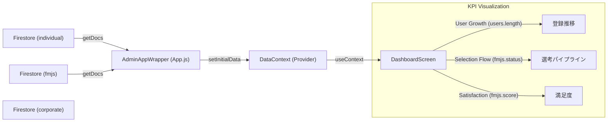
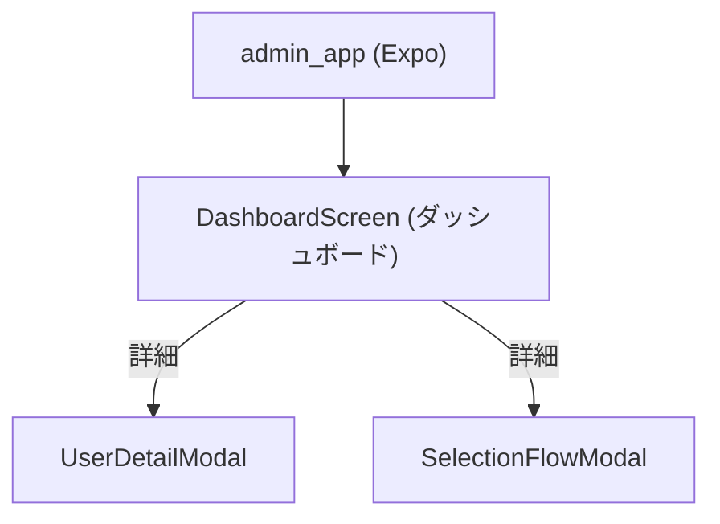

# 管理者アプリ（admin_app）設計概要

- フレームワーク: Expo（React Native）
- 共有モジュール: shared/common_frontend（UI, Firebase設定）
- データソース: Firestore（全コレクションへのアクセス権限を持つ）
- 目的: プラットフォーム全体の統括、監視、および主要KPIの可視化

## Firestore 接続と全コレクション連携
管理者アプリはシステムの中枢として、以下の全コレクションと連携します。

- Firestoreへの接続は共有設定 [firebaseConfig.js](file:///Users/yamakawamakoto/ReactNative_Expo/engineer-registration-app-yama/shared/common_frontend/src/core/firebaseConfig.js) を介して行います。
- **特記事項**: 管理者はセキュリティルール上、全コレクションに対して Read/Write 権限を持つことを想定しています。

### 連携コレクション一覧

| コレクション名 | 役割 | Adminでの用途 | 連携機能 |
| :--- | :--- | :--- | :--- |
| **individual** | 個人ユーザー（エンジニア） | 登録者数推移分析、不正ユーザー監視、離脱分析 | DashboardScreen (Growth Chart) |
| **corporate** | 法人ユーザー（企業） | 企業審査、アカウント管理、利用状況確認 | CompanyManagementScreen (Future) |
| **fmjs** | 選考・手数料・サーベイ | 選考進捗パイプライン分析、満足度調査集計、売上予測 | DashboardScreen (Selection Flow, Satisfaction) |
| **jd** | 求人票 (Job Description) | 不適切求人の監視、求人動向分析 | JobMonitorScreen (Future) |
| **admin_users** | 管理者アカウント | 管理者権限管理、操作ログ | Auth (Future) |

## データフロー (Dashboard)
データ取得は `App.js` 内の `AdminAppWrapper` で一括して行い、`DataContext` を通じて各画面に配信するアーキテクチャを採用しています（Individual App等と統一）。



## 共有モジュール構成
- UI: shared/common_frontend/src/core/components
  - 共通のグラフコンポーネントやカードUIを利用（予定）
- Firebase: shared/common_frontend/src/core/firebaseConfig
  - `db` インスタンスの共有

## 画面構成


## データ集計ロジック (DashboardScreen)
### 1. 登録ユーザー数推移 (User Growth)
- **ソース**: `individual` コレクション
- **ロジック**: 全ドキュメントを取得し、その総数を月別などの時系列データとしてマッピング（現状はモック分布ロジックでシミュレーション）。
- **目的**: プラットフォームの成長率を監視する。

### 2. 選考プロセス (Selection Flow)
- **ソース**: `fmjs` コレクション
- **ロジック**: 各ドキュメントの `status` フィールド（`entry`, `doc_pass`, `interview_1`, etc.）を集計。
- **目的**: 選考のボトルネックを特定し、マッチング効率を改善する。

### 3. マッチング満足度 (Satisfaction)
- **ソース**: `fmjs` コレクション
- **ロジック**: `satisfactionScore` (1-5) を集計し、分布を表示。
- **目的**: サービスの質（Quality of Match）を担保する。

## 個人一覧UI仕様（DashboardScreen / 個人タブ）
### 目的
- 個人ユーザーの一覧に「スキル傾向の要約」を同一行内で表示し、詳細閲覧への導線を短縮する

### 一覧行の構成
- **タップ操作**
  - 行全体をタップするとユーザー詳細モーダル（UserDetailModal）を表示する
  - 行内のミニヒートマップのタイルをタップするとツールチップを表示する（行タップは発火しない）
- **スキルバッジ表示**
  - CORE / SUB1 / SUB2 を同一行で横方向に並べ、横スクロール可能
  - バッジ表示は Firestore の `スキル経験` を元に抽出する
- **ミニヒートマップ表示**
  - 一覧行右側に、全90タイル（10×9）から抽出した「高密度領域」を縮小表示する

### ミニヒートマップのデータ参照範囲
- **一覧表示では `スキル経験` のみ参照**する（`志向` は参照しない）
  - 実装: `HeatmapCalculator.calculateSkillsOnly(data)` を利用

### ミニヒートマップの抽出アルゴリズム（高密度領域）
- 全90タイル（10×9）のグリッドを対象にスコア（0.0〜1.0）を計算し、スライディングウィンドウで合計値が最大となる領域を抽出する
- 抽出サイズ: **縦3 × 横4**
- 抽出結果は「一覧に表示する順（3×4の配列）」と「元のタイルID（0〜89）」を保持し、ツールチップ表示時のラベル取得に利用する

### ミニヒートマップの表示仕様
- タイル数: **縦3 × 横4**
- タイルサイズ: `HeatmapGrid` の計算式（containerWidth/columns - margin）を基準にし、一覧用に縮小係数（0.7倍）を適用
- 色: shared の `HeatmapGrid` と同じ閾値で色分け（0 / 0.2 / 0.5 / 0.8）

### ツールチップ仕様（ミニヒートマップ）
- 目的: タップしたタイルに対応するスキル種別とレベルを表示する
- 表示内容（一覧用）:
  - スキル名（HeatmapMapper.getLabel(tileId)）
  - レベル（Lv0〜Lv4）
- 表示位置:
  - タップしたタイルのすぐ上に表示されるようオフセットを調整
  - 吹き出しの先端（矢印）が、タップしたタイル中心を指すように `arrowLeft` を算出して配置する
  - 画面端ではツールチップの左右位置をクリップし、表示崩れを抑制する

## 詳細モーダル仕様（UserDetailModal）
### 概要
一覧行をタップした際に表示される、個人ユーザーの詳細情報画面。`individual_user_app` のマイページ相当の情報を管理者向けに表示する。

### レイアウト仕様
- **画面占有率**: 画面全体の **80%**（`width: SCREEN_WIDTH * 0.8`, `height: SCREEN_HEIGHT * 0.8`）とし、背景はオーバーレイ表示とする
- **構成要素**:
  1. **ヒーローヘッダー**: ユーザーID、プロフィール画像、氏名、職種、Emailを表示
  2. **スキルバッジ**: CORE / SUB1 / SUB2 のスキルカードを横並びで表示（モーダル幅に合わせてリサイズ）
  3. **フルヒートマップ**: `HeatmapGrid` コンポーネントを使用し、全90タイルのスキル・志向情報を表示（モーダル幅の80%基準で表示）

### 関連ファイル
- 画面: `apps/admin_app/expo_frontend/src/features/dashboard/DashboardScreen.js`
- 共有ロジック: `shared/common_frontend/src/core/utils/HeatmapCalculator.js`
- 共有マッピング: `shared/common_frontend/src/core/utils/HeatmapMapper.js`
- 参考コンポーネント: `shared/common_frontend/src/core/components/HeatmapGrid.js`

## 求人一覧UI仕様（DashboardScreen / 求人タブ）
### 概要
個人タブと同様のUIを採用し、求人（Job Description）の一覧においてもスキル要件の可視化と詳細閲覧のUXを提供する。

### データソース
- **コレクション**: `job_description` コレクション内のサブコレクション `JD_Number`
- **取得ロジック**: `App.js` にて、`job_description` の全 Company ドキュメントを走査し、各 `JD_Number` サブコレクションから求人データをフラットに展開して取得する。
- **データ構造**: `id` は `company_ID` + `_` + `JD_Number` で一意に生成される。
- **スキルデータ参照**: `スキル経験` フィールド（`job_description` アプリとデータ構造を統一）

### 一覧行の構成
- **基本情報**
  - **ポジション名**: `求人基本項目.ポジション名` を表示（未設定時はフォールバック）
  - **JD No**: `JD_Number` (2桁の数字) を表示
  - **Company**: `company_ID` をもとに `corporate` コレクションから企業名を解決して表示
- **スキルバッジ**
  - `job_description` アプリのデザインを踏襲し、各カテゴリ先頭1つを表示
  - **必須スキル (CORE)**: ラベル「必須スキル」、ピンク系スタイル、幅60px
  - **歓迎スキル1 (SUB1)**: ラベル「歓迎1」、青系スタイル、幅42px
  - **歓迎スキル2 (SUB2)**: ラベル「歓迎2」、オレンジ系スタイル、幅42px
- **ミニヒートマップ**
  - スキル要件のヒートマップ（縦3×横4）を表示
  - `HeatmapCalculator.calculateSkillsOnly` を利用して算出

### 詳細モーダル仕様（JobDetailModal）
- **画面占有率**: 画面全体の **80%**
- **表示内容**:
  - ヘッダー情報（ポジション名, JD No, Company名）
  - スキルバッジ（一覧と同様のデザイン・構成）
  - フルヒートマップ（スキル要件全体、90タイル）

## 法人一覧UI仕様（DashboardScreen / 法人タブ）
### 概要
法人（企業）の一覧を表示し、使用技術（Tech Stack）の概要を可視化することで、企業の技術スタックを一目で把握できるようにする。

### データソース
- **コレクション**: `company` (Corporate App用), `corporate`, `Company` (Admin用)
- **取得ロジック**: `App.js` にて各コレクションを取得し、IDベースでマージして利用。

### 一覧行の構成
- **基本情報**: 社名、ID、住所を表示。
- **使用技術バッジ**:
  - `corporate_user_app` の「使用技術」タブと同様のロジックで、「メイン」に設定されている技術のみを抽出して表示。
  - 画面右側のスペースを有効活用し、縮小して表示。
- **タップ操作**:
  - 行をタップすると、その企業の詳細画面（`CompanyDetailScreen`）へ遷移する。

## 法人詳細画面仕様（CompanyDetailScreen）
### 概要
法人一覧から遷移する詳細画面。`corporate_user_app` の企業プロフィール画面（`CompanyPageScreen`）を再利用して表示する。

### 実装の特徴
- **共有コンポーネントの利用**:
  - `shared/common_frontend` 内の `CompanyPageScreen` をラップして使用。
  - これにより、企業向けアプリと管理者向けアプリで同一のプロフィールUIを提供。
- **データ取得とフォールバック**:
  - 画面遷移時に渡された `companyId` を元に、Firestoreから最新の企業データを再取得する。
  - データ構造がフラット（Admin用）な場合でも、`CompanyPageScreen` が期待するネスト構造（`会社概要` 等）へ自動的にマッピングして表示するロジックを実装済み。
    - 例: `data['name']` -> `data['会社概要']['社名']` へのフォールバック

## データ構造の統一方針（一覧表示の互換性）
- 目的: 各タブ（個人・法人・求人）の一覧表示で、データ構造が「フラット」または「ネスト」のどちらでもUIが破綻しないよう統一的に扱う。
- 対象コンポーネント:
  - 個人一覧: [EngineerListItem.js](file:///Users/yamakawamakoto/ReactNative_Expo/engineer-registration-app-yama/shared/common_frontend/src/features/engineer/components/EngineerListItem.js)
  - 法人一覧: [CompanyListItem.js](file:///Users/yamakawamakoto/ReactNative_Expo/engineer-registration-app-yama/shared/common_frontend/src/features/company/components/CompanyListItem.js)
  - 求人一覧: [JobListItem.js](file:///Users/yamakawamakoto/ReactNative_Expo/engineer-registration-app-yama/shared/common_frontend/src/features/job/components/JobListItem.js)
- 統一仕様:
  - 文字列化の厳守: Text要素には必ず文字列を渡す（オブジェクトを渡さない）
  - フォールバック戦略:
    - 個人: `基本情報.姓/名` → `name` → `"名称未設定"`
    - 法人: `会社概要.社名` → `name/companyName` → `"名称未設定"`
    - 求人: `求人基本項目.ポジション名` → `title` → `"タイトル未設定"`
  - ID表示の安全化:
    - 個人: `id` → `基本情報.id` → `"-"`
    - 法人: `id` を文字列化して表示（`String(id)`）
    - 求人: `JD_Number` → `求人基本項目.JD_Number` → `"-"`
  - 住所整形（法人）:
    - `formatAddress(addr)` により、郵便番号/都道府県/市区町村/町名_番地/建物名_部屋番号等を連結して文字列化
    - 未設定時は `"-"` を表示
- 背景:
  - `corporate_user_app` ではネスト構造（例: `会社概要`）が前提、一方で `admin_app` ではフラット構造が混在
  - これにより一覧表示でレンダーエラー（Objects are not valid as a React child）が発生し得るため、上記の互換処理を各ListItemに導入

## 詳細画面における文字列化方針
- 適用対象:
  - 法人詳細: [CompanyPageScreen（shared）](file:///Users/yamakawamakoto/ReactNative_Expo/engineer-registration-app-yama/shared/common_frontend/src/features/company_profile/screens/CompanyPageScreen.js)
  - 法人詳細（Corporate App版）: [CompanyPageScreen（corporate_user_app）](file:///Users/yamakawamakoto/ReactNative_Expo/engineer-registration-app-yama/apps/corporate_user_app/expo_frontend/src/features/company_profile/CompanyPageScreen.js)
  - 個人マイページ: [MyPageScreen（individual_user_app）](file:///Users/yamakawamakoto/ReactNative_Expo/engineer-registration-app-yama/apps/individual_user_app/expo_frontend/src/features/profile/MyPageScreen.js)
- ポリシー:
  - Text要素に渡す値は `String(v)` で文字列化してから表示する
  - 例: 会社名、事業内容、氏名、メール等を文字列化してレンダリング
  - これにより、Firestoreのスキーマ差異やデータ混在時にもレンダーエラーを防ぐ

## 起動方法（管理者アプリ）
- スクリプト: [scripts/start_expo.sh](file:///Users/yamakawamakoto/ReactNative_Expo/engineer-registration-app-yama/scripts/start_expo.sh)
- 実行コマンド:
  ```bash
  ./scripts/start_expo.sh admin_app
  ```

## 注意点・改善提案
### 1. ユーザー数推移グラフ (User Growth)
- **現状**: `individual` コレクションの「総数」のみを正確に反映し、月別の推移はモックロジックで均等配分しています。
- **改善案**: `individual` ドキュメントに `createdAt` (Timestamp) フィールドが実装され次第、その日付に基づいて集計するロジックへ変更することを推奨します。

### 2. 繋がりの推移 (Connections Chart)
- **現状**: データソースとなるコレクションが存在しないため、UI上はプレースホルダー表示としています（ダミーデータも削除済み）。
- **改善案**: マッチング機能（`matches` コレクション等）が実装された後、そのデータを集計してグラフ化する必要があります。

### 3. データ量とパフォーマンス (Scalability)
- **現状**: `getDocs` を使用して、アプリ起動時に `individual` および `fmjs` コレクションの**全ドキュメント**を取得しています。開発段階では問題ありませんが、本番運用でデータが増加すると起動時間の遅延や通信量の増大を招きます。
- **改善案**: 将来的にユーザー数が数千規模になった場合は、以下の対応を推奨します。
  - **Firestoreの集計クエリ (`count()`) の利用**: 総数のみが必要な場合。
  - **サーバーサイド集計**: Cloud Functions 等で定期的にKPIを集計し、専用の `stats` コレクションに保存してAdminアプリからはそれを読み取る方式への移行。
