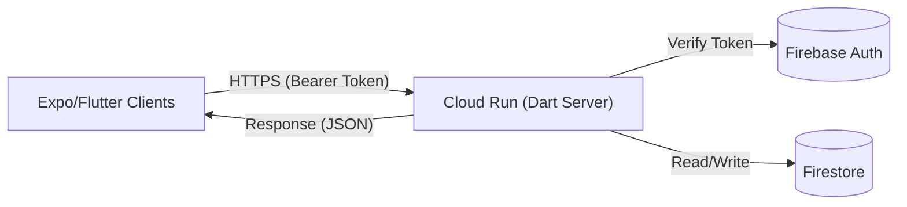

# バックエンドアプリ（apps/backend）設計概要

プロジェクト全体のサーバーサイドロジックを集約し、全クライアントアプリケーション（Admin, Corporate, Individual, Job Description）に対して統一的なAPIを提供するPure Dartアプリケーションです。

## 1. 概要
- **役割**: ビジネスロジックの集中管理、セキュリティ（認証・認可）、データ整合性の担保。
- **プラットフォーム**: Google Cloud Run (Serverless Container)。
- **言語/FW**: Dart (Pure Dart) / Shelf (Web Server Framework)。
- **クライアント**: Admin App, Corporate App, Individual App, Job Description App, FMJS。

## 2. ディレクトリ構造

現在は最小構成ですが、将来的に以下のレイヤー構造へ拡張予定です。

```
apps/backend/
├── bin/
│   ├── server.dart          # エントリーポイント (Shelfサーバー起動)
│   └── verify_shared.dart   # 共有ライブラリの参照検証用スクリプト
├── lib/ (Planned)
│   ├── src/
│   │   ├── config/          # 環境変数・設定読み込み
│   │   ├── controllers/     # ハンドラー (HTTPリクエスト処理)
│   │   ├── middlewares/     # 認証・ログ出力・エラーハンドリング
│   │   ├── services/        # ビジネスロジック (Service Layer)
│   │   └── repositories/    # データアクセス (Firestore/外部API)
│   └── backend.dart         # ライブラリのエクスポート
├── Dockerfile               # Cloud Run用マルチステージビルド設定
└── pubspec.yaml             # 依存関係定義
```

## 3. 技術スタックとアーキテクチャ

### Core Technologies
- **Runtime**: Dart Native (AOT Compiled to Linux/AMD64)
- **Framework**: `package:shelf`, `package:shelf_router`
- **Deployment**: Google Cloud Run
- **Container**: `scratch` (Distrolessより軽量な空イメージ) 上で静的リンクされたバイナリを実行

### Shared Libraries Integration
Monorepo内の共有ライブラリを活用しますが、Pure Dart環境であるため制約があります。

| ライブラリ | 参照可否 | 理由・用途 |
| :--- | :--- | :--- |
| **shared/domain_models** | ✅ 可能 | エンティティ定義の共有 (User, Company等) |
| **shared/common_logic** | ✅ 可能 | 純粋な計算ロジック (ヒートマップ計算等) |
| **shared/common_backend** | ✅ 可能 | サーバーサイド共通処理 (Logging, Utils) |
| **shared/common_frontend** | ❌ 不可 | Flutter SDKに依存しているためビルド不可 |

## 4. データフロー

将来的（Phase 2以降）には、クライアントはFirestoreを直接参照せず、このBackend APIを経由してデータを取得・更新するアーキテクチャへ移行します。



## 5. API エンドポイント設計方針

RESTful APIを採用し、リソースベースのURL設計を行います。

- `GET /api/v1/health`: ヘルスチェック
- `GET /api/v1/users/me`: 自身のプロフィール取得
- `POST /api/v1/jobs/{id}/apply`: 求人への応募アクション

## 6. セキュリティ方針

詳細な認証・認可設計については、**[認証・認可設計 (Authentication_Authorization.md)](../security/Authentication_Authorization.md)** を参照してください。

- **認証**: Authorization Header に含まれる Firebase ID Token を検証し、`uid` を特定します。
- **認可**: 特定された `uid` と Custom Claims (`role`) に基づき、APIレベルでアクセス制御を行います。
- **バリデーション**: `domain_models` のバリデーションロジックを再利用し、不正なデータの混入を防ぎます。

## 7. 開発・実行方法

### ローカル実行
```bash
cd apps/backend
dart run bin/server.dart
# Server listening on port 8080
```

### Docker ビルドと実行（ルートディレクトリから実行）
```bash
# イメージのビルド
docker build -t backend-app -f apps/backend/Dockerfile .

# コンテナの起動
docker run -p 8080:8080 backend-app
```

## 8. ロードマップと開発計画

### 🎯 最終的なゴール (Target State)
**「Full-stack Dart アーキテクチャの完全実現」**

*   **単一言語統一**: フロントエンド (Flutter) とバックエンド (Dart Server) を同一言語で記述し、モデル (`domain_models`) とロジック (`common_logic`) を100%共有する。
*   **型安全な通信**: OpenAPI (Swagger) などを経由せず、Dartの型定義を直接共有してRPCのような型安全な通信を実現する。
*   **高速な開発サイクル**: バックエンドの変更が即座にフロントエンドの型エラーとして検知される環境。

### 📅 Phase 1: バックエンド基盤構築 (現在)
現状はここに含まれます。

*   ✅ **Pure Dart サーバーの構築**: `shelf` + `shelf_router` による基本構成。
*   ✅ **Docker化とCloud Run対応**: AOTコンパイルによる高速起動コンテナ。
*   ⬜ **共有ロジックの移植**: 現在各Expoアプリ内に散らばっている `dart_backend` ロジックを `apps/backend` に集約する。
*   ⬜ **認証認可の統合**: Firebase Auth の ID Token 検証ロジックを実装し、セキュアなAPIエンドポイントを作成する。

### 📅 Phase 2: ロジック移行とAPI化
Expoアプリからロジックを剥がし、APIサーバーへ委譲します。

*   ⬜ **API設計と実装**:
    *   ユーザー管理 (User Management)
    *   求人管理 (Job Management)
    *   選考プロセス (Selection Process)
*   ⬜ **クライアントSDKの整備**: 各Expoアプリから簡単にAPIを叩けるクライアントライブラリ (`shared/api_client` 相当) を整備する。

### 📅 Phase 3: フロントエンド刷新 (Future)
React Native (Expo) から Flutter への完全移行。

*   ⬜ **Flutter Frontend の構築**: `apps/*_app/flutter_frontend` の開発開始。
*   ⬜ **完全なコード共有**: `shared/domain_models` をフロントエンド・バックエンド双方で直接インポート。
