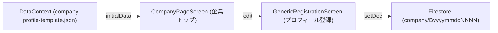
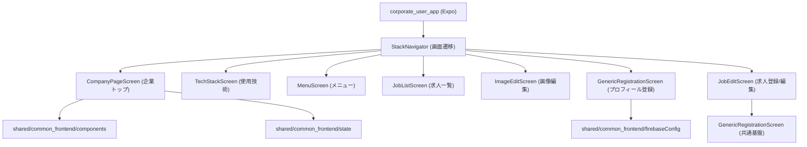
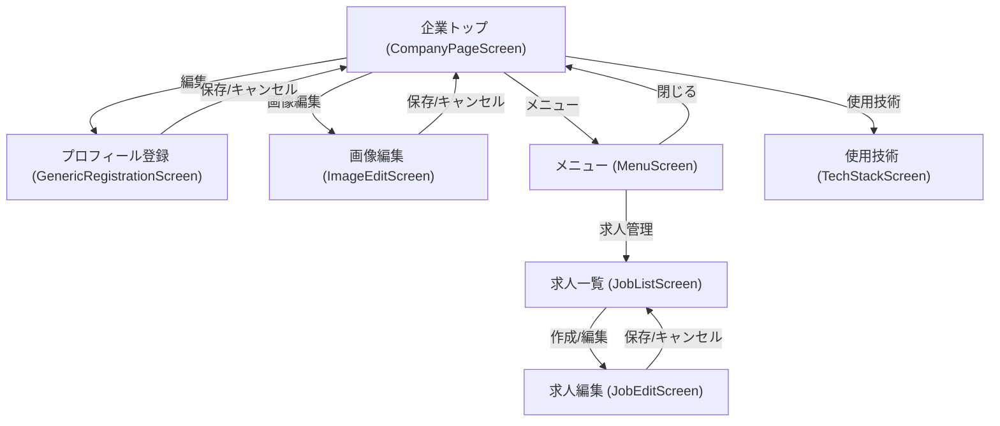
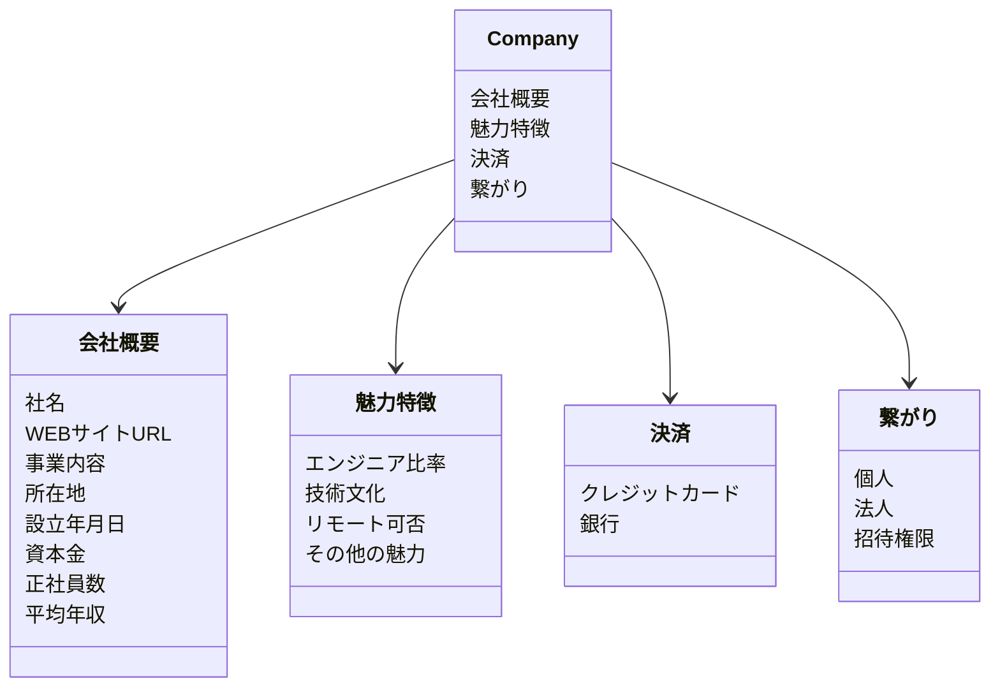

# 法人ユーザーアプリ（corporate_user_app）設計概要

- フレームワーク: Expo（React Native）
- 共有モジュール: shared/common_frontend（UI, 状態, 登録画面, Firebase設定）
- データソース: Firestore（プロジェクトは環境変数で指定）、テンプレートJSONのフォールバック
- 目的: 企業プロフィールの表示・編集、技術スタックや魅力/特徴の提示、将来的な求人・つながり導線の提供

## データ管理原則
- **モデル利用の徹底 (Model-First)**:
  - データの取得・操作には必ず `Company` モデルを使用します（`shared/common_frontend/src/core/models/Company.js`）。
  - 生のFirestoreデータへの直接アクセスは原則禁止とし、モデルのゲッター（`company.companyName` 等）を使用します。
  - **エンジニア情報の参照**: エンジニア検索等で `User` モデルを参照する場合、通常は `public_profile`（匿名情報）のみが取得されます。マッチング成立後のエンジニアに対してのみ、`private_info`（氏名・連絡先等）へのアクセス権が付与され、結合された完全な `User` モデルが取得可能になります。

## Firestore 接続
- Firestoreへの接続は共有設定 [firebaseConfig.js](file:///Users/yamakawamakoto/ReactNative_Expo/engineer-registration-app-yama/shared/common_frontend/src/core/firebaseConfig.js) を介して行います
- 使用環境変数（Expoの公開環境変数）:
  - EXPO_PUBLIC_FIREBASE_API_KEY
  - EXPO_PUBLIC_FIREBASE_AUTH_DOMAIN
  - EXPO_PUBLIC_FIREBASE_PROJECT_ID
  - EXPO_PUBLIC_FIREBASE_STORAGE_BUCKET
  - EXPO_PUBLIC_FIREBASE_MESSAGING_SENDER_ID
  - EXPO_PUBLIC_FIREBASE_APP_ID
  - EXPO_PUBLIC_FIREBASE_MEASUREMENT_ID
- Firestore プロジェクト（管理画面、要ログイン）:
  - https://console.firebase.google.com/u/0/project/flutter-frontend-21d0a/firestore/data
- 参照コレクション/ID仕様（登録画面）
  - コレクション: company
  - IDフィールド: id
  - ID接頭辞: B（例: B20260108xxxx）
  - 参照ドキュメント例:
    - コレクション: company
    - ドキュメントID: B00000

## データフロー
- 画面（企業トップ）: [CompanyPageScreen.js](file:///Users/yamakawamakoto/ReactNative_Expo/engineer-registration-app-yama/apps/corporate_user_app/expo_frontend/src/features/company_profile/CompanyPageScreen.js)
- フォールバックデータ: DataContext により初期テンプレート（assets/json/company-profile-template.json）を保持
- 登録画面（保存処理）: [GenericRegistrationScreen.js](file:///Users/yamakawamakoto/ReactNative_Expo/engineer-registration-app-yama/shared/common_frontend/src/features/registration/GenericRegistrationScreen.js)
- 技術スタック表示: [TechStackScreen.js](file:///Users/yamakawamakoto/ReactNative_Expo/engineer-registration-app-yama/apps/corporate_user_app/expo_frontend/src/features/company_profile/TechStackScreen.js)



## 共有モジュール構成
- UI: shared/common_frontend/src/core/components
  - GlassCard, RecursiveField, 入力系コンポーネント
- 登録機能: shared/common_frontend/src/features/registration
  - GenericRegistrationScreen（テンプレートベースのフィールド編集と保存）
- 状態: shared/common_frontend/src/core/state/DataContext
  - initialDataの受け渡しと更新API
- テーマ: shared/common_frontend/src/core/theme/theme
  - 色・フォント・レイアウト基準
- Firebase: shared/common_frontend/src/core/firebaseConfig
  - initializeApp と getFirestore の初期化



## 画面遷移（法人ユーザーアプリ）


## セキュリティと設定
- Firebase鍵はコードに直書きせず、EXPO_PUBLIC_* の環境変数で提供
- 秘密情報のログ出力やリポジトリへのコミットは避ける
- 開発/本番のプロジェクト切り替えは環境変数で管理

## 🆕 11. ディープリンク統合 (Deep Link Integration)
LPアプリ等からのリダイレクトをスムーズに受け入れるための設計が導入されています。

### 1. カスタム URL スキーム
`app.config.js` にて以下のスキームが定義されています：
- **scheme**: `corporate-app`

これにより、デバイス（シミュレータ含む）上で `corporate-app://home` などのURLを開くと、本アプリが自動的に起動します。

### 2. Linking リスナーの実装
`App.js` にて、アプリが起動中（Warm Start）および終了状態（Cold Start）の両方でディープリンクを検知し、ナビゲーションやログ出力を行う仕組みを実装しています。

- **Cold Start**: `Linking.getInitialURL()` で起動時のURLを取得。
- **Warm Start**: `Linking.addEventListener('url', ...)` でバックグラウンド復帰時のURLを監視。
- **ログ識別子**: `[DeepLink][corporate_user_app]`

### 3. LPアプリ（Redirection Hub）との連携
開発環境において、LPアプリから本アプリへ遷移する際、以下の自動化ロジックが働きます：
1. **ポート監視**: LPアプリの `navigationHelper.js` が、本アプリのポート（8083）をポーリング（`waitForPort`）します。
2. **自動起動**: ポートが閉じている場合、開発用の `dev_broker.mjs` を通じて `start_expo.sh corporate_user_app` がバックグラウンドで実行されます。
3. **リダイレクト**: 本アプリの準備が整い次第、ディープリンクまたは HTTP URL により自動的に画面が切り替わります。

## 🆕 12. 求人票（JD）管理 (JD Management)

法人ユーザーが自社の求人を管理するための機能です。

### 1. 構成画面
- **JobListScreen**: 登録済みの求人一覧を表示。`DataContext` から動的に `companyId` を取得し、自社の求人のみを表示。公開/非公開の即時切り替え、編集、削除アクションを提供。
- **JobEditScreen**: 求人の新規作成および内容編集。`GenericRegistrationScreen` を内部で利用し、タブ形式で複雑なJDデータを管理。

### 2. 削除ガードレール (Deletion Guardrail)
データの整合性を維持するため、以下のロジックが導入されています。
- **チェック内容**: 削除対象の求人（`JD_Number`）に対して、`selection_progress` コレクション内に「選考中」などの進行中のレコードが存在するかを確認。
- **制限**: 進行中の選考がある場合は削除をブロックし、ユーザーに警告アラートを表示。
- **実体**: `JobDescriptionService.hasOngoingSelections` にて判定。

### 3. 採番ルール
新規作成時、`JobDescriptionService.getNextJdNumber` を用いて、当該企業内で未使用の最小連番（01-99）を自動的に取得して割り当てます。

## 起動方法（法人ユーザーアプリ）
- スクリプト: [scripts/start_expo.sh](file:///Users/yamakawamakoto/ReactNative_Expo/engineer-registration-app-yama/scripts/start_expo.sh)
- 実行例:
  - ./scripts/start_expo.sh corporate_user_app
- 接続URL（開発時デフォルト）:
  - `exp://127.0.0.1:8083` (Localhost)
  - `corporate-app://` (Custom Scheme)

## データスキーマ（推奨フォーマット）
### 前提
- 登録/保存は共有ロジック [GenericRegistrationScreen.js](file:///Users/yamakawamakoto/ReactNative_Expo/engineer-registration-app-yama/shared/common_frontend/src/features/registration/GenericRegistrationScreen.js) に準拠します
- 企業トップはテンプレート [company-profile-template.json](file:///Users/yamakawamakoto/ReactNative_Expo/engineer-registration-app-yama/apps/corporate_user_app/expo_frontend/assets/json/company-profile-template.json) を初期表示に用います

### 会社概要（例）
```json
{
  "会社概要": {
    "社名": "ヤヲー株式会社",
    "WEBサイトURL": "https://www.yawoo.co.jp",
    "事業内容": "インターネット広告事業ほか",
    "代表者名": "入澤 ツヨシ",
    "所在地": {
      "郵便番号(ハイフンなし)": "1028282",
      "都道府県": "東京都",
      "市区町村": "千代田区",
      "町名_番地": "紀尾井町99-99",
      "建物名_部屋番号等": "東京ガーデンプラス紀尾井町 紀尾井の塔"
    },
    "平均年収": 650,
    "正社員数": 11176,
    "資本金": 24800000000,
    "設立年月日": "1996-01−20",
    "男女比率": "50:50",
    "エンジニア人口比率": "38%",
    "背景画像URL": "https://example.com/bg.png",
    "ロゴ画像URL": "https://example.com/logo.png"
  }
}
```

### 魅力/特徴（例）
```json
{
  "魅力/特徴": {
    "CEOが元エンジニア": false,
    "CTOが取締役になっている": false,
    "OSSやクラウド中心の開発": false,
    "会社のテックblogが定期投稿": false,
    "原則フルリモート勤務": false,
    "副業OK": false,
    "エンジニアにとってのその他の魅力": ""
  }
}
```

### 支払い情報（例）
```json
{
  "決済": {
    "クレジットカード": {
      "カード名義人": "",
      "カード番号": 0,
      "有効期限_MM/YY": 0,
      "CVV_セキュリティコード": 0
    },
    "銀行": {
      "金融機関名": "",
      "支店名": "",
      "口座名義人": "",
      "口座番号": 0,
      "口座種別": {
        "当座": false,
        "普通": false,
        "貯蓄": false
      }
    }
  }
}
```

### ドキュメント全体例（Corporate）
```json
{
  "id": "B00000",
  "会社概要": { /* 例を参照 */ },
  "魅力/特徴": { /* 例を参照 */ },
  "決済": { /* 例を参照 */ },
  "繋がり": { /* 必要に応じて拡張 */ }
}
```



### 記述ガイドライン
- キー名は既存テンプレートの構造に従う（例: 会社概要 / 魅力/特徴 / 決済 / 繋がり）
- 企業ID（id）は登録時に自動採番（ByyyymmddNNNN形式）
