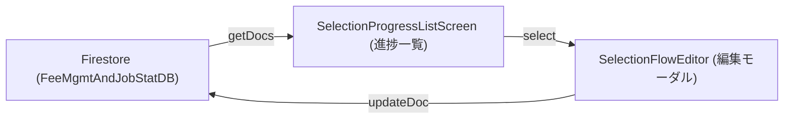
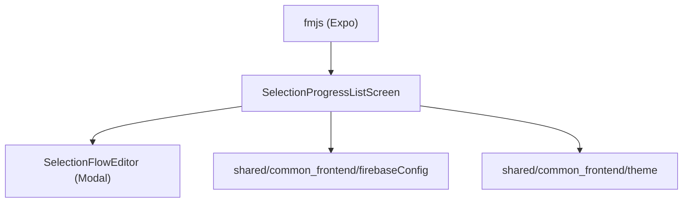
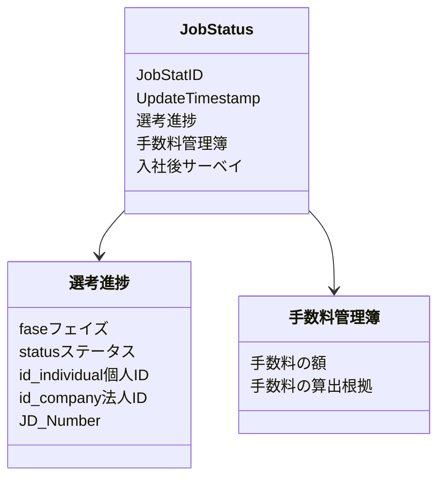

# 管理用アプリ（fmjs）設計概要

- フレームワーク: Expo（React Native）
- 共有モジュール: shared/common_frontend（UI, テーマ, Firebase設定）
- データソース: Firestore（FeeMgmtAndJobStatDB）
- 目的: エージェント/管理者による選考進捗状況および手数料の管理（Field Management Job System）

## Firestore 接続
- Firestoreへの接続は共有設定 [firebaseConfig.js](file:///Users/yamakawamakoto/ReactNative_Expo/engineer-registration-app-yama/shared/common_frontend/src/core/firebaseConfig.js) を介して行います
- 使用環境変数（Expoの公開環境変数）:
  - EXPO_PUBLIC_FIREBASE_API_KEY
  - EXPO_PUBLIC_FIREBASE_AUTH_DOMAIN
  - EXPO_PUBLIC_FIREBASE_PROJECT_ID
  - EXPO_PUBLIC_FIREBASE_STORAGE_BUCKET
  - EXPO_PUBLIC_FIREBASE_MESSAGING_SENDER_ID
  - EXPO_PUBLIC_FIREBASE_APP_ID
  - EXPO_PUBLIC_FIREBASE_MEASUREMENT_ID
- Firestore プロジェクト（管理画面、要ログイン）:
  - https://console.firebase.google.com/u/0/project/flutter-frontend-21d0a/firestore/data
- 参照コレクション/ID仕様
  - コレクション: FeeMgmtAndJobStatDB
  - IDフィールド: JobStatID (またはドキュメントID)
  - ID接頭辞: S（例: S202412310001）
  - 参照ドキュメント例:
    - コレクション: FeeMgmtAndJobStatDB
    - ドキュメントID: S202412310001

## データフロー
- 一覧画面: [SelectionProgressListScreen.js](file:///Users/yamakawamakoto/ReactNative_Expo/engineer-registration-app-yama/apps/fmjs/expo_frontend/src/screens/SelectionProgressListScreen.js)
- 編集機能: [SelectionFlowEditor.js](file:///Users/yamakawamakoto/ReactNative_Expo/engineer-registration-app-yama/apps/fmjs/expo_frontend/src/components/SelectionFlowEditor.js)
  - モーダル形式で選考フェーズやステータスを更新



## 共有モジュール構成
- UI: shared/common_frontend/src/core/components
  - テーマ定数（THEME）などを利用
- Firebase: shared/common_frontend/src/core/firebaseConfig
  - db (Firestoreインスタンス) の利用



## 画面構成
- **SelectionProgressListScreen**:
  - 全案件の選考進捗をリスト表示
  - フェーズ（1次面接、内定など）の可視化
  - ステータス（選考中、入社済みなど）によるフィルタリング（将来実装）
- **SelectionFlowEditor**:
  - 選択した案件の詳細編集
  - フェーズのトグル切り替え

## 起動方法（fmjs）
- スクリプト: [scripts/start_expo.sh](file:///Users/yamakawamakoto/ReactNative_Expo/engineer-registration-app-yama/scripts/start_expo.sh)
- 実行例:
  - `./scripts/start_expo.sh fmjs`

## データスキーマ
### 選考進捗・手数料管理データ（例）
```json
{
  "JobStatID": "S202412310001",
  "UpdateTimestamp_yyyymmddtttttt": 20250114140837,
  "選考進捗": {
    "fase_フェイズ": {
      "1次面接": true,
      "2次面接": false,
      "その他選考": false,
      "オファー面談": false,
      "カジュアル面談": false,
      "入社_請求": false,
      "内定": false,
      "内定受諾": false,
      "応募_書類選考": false,
      "最終面接": false,
      "短期離職_返金": false,
      "退職日確定": false
    },
    "status_ステータス": { "選考中": true },
    "id_individual_個人ID": "IND001",
    "id_company_法人ID": "COMP001",
    "JD_Number": "JD001"
  },
  "手数料管理簿": {
    "手数料の額": 0,
    "手数料の算出根拠": { "Fee": 0.4, "理論年収": 6000000 }
  },
  "入社後サーベイ_PostJoiningSurvey": null
}
```



### 記述ガイドライン
- IDは `S` + `yyyyMMdd` + 連番 の形式を想定
- `fase_フェイズ` 内のキーは固定の選択肢として扱う
- `status_ステータス` は現在の状態を示すフラグ
