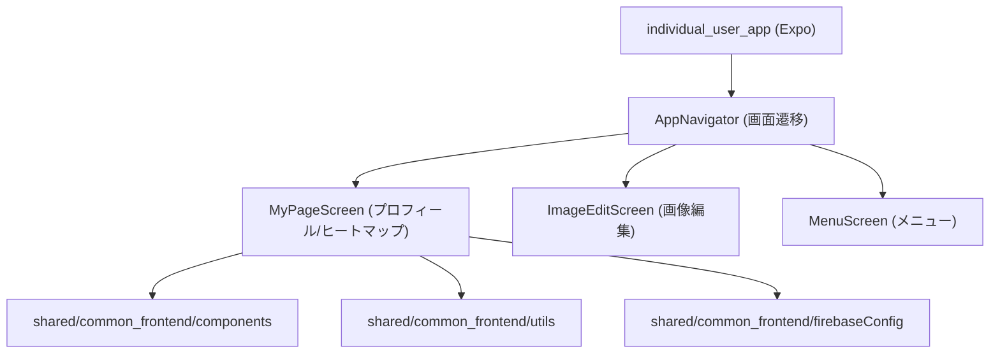
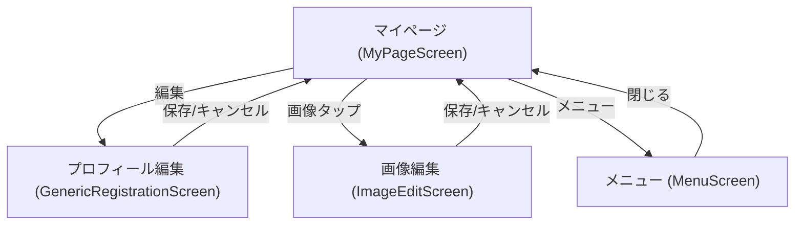
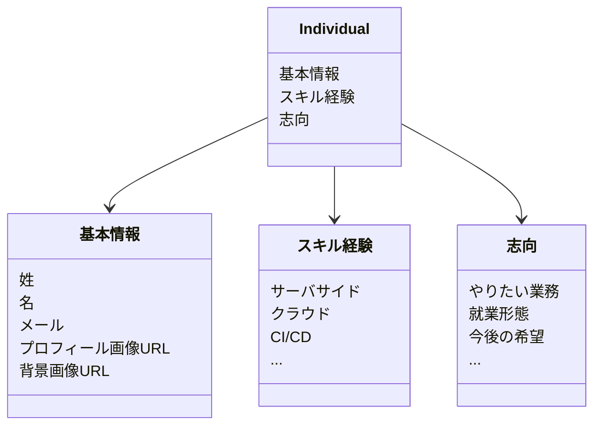

# 個人ユーザーアプリ（individual_user_app）設計概要

- フレームワーク: Expo（React Native）
- 共有モジュール: shared/common_frontend（UI, 状態, ヒートマップ, Firebase設定）
- データソース: Firestore（プロジェクトは環境変数で指定）、テンプレートJSONのフォールバック
- 目的: 個人のプロフィールとスキル・志向ヒートマップの可視化

## データ管理原則
- **モデル利用の徹底 (Model-First)**:
  - データの取得・操作には必ず `User` モデルを使用します（`shared/common_frontend/src/core/models/User.js`）。
  - `User.fromPublicPrivate()` メソッドにより、Firestore上で分割管理されている `public_profile` と `private_info` を透過的に結合して扱います。
  - 生のFirestoreデータへの直接アクセスは原則禁止とし、モデルのゲッター（`user.fullNameKanji` 等）を使用します。

## Firestore 接続
- Firestoreへの接続は共有設定 [firebaseConfig.js](file:///Users/yamakawamakoto/ReactNative_Expo/engineer-registration-app-yama/shared/common_frontend/src/core/firebaseConfig.js) を介して行います
- 使用環境変数（Expoの公開環境変数）:
  - EXPO_PUBLIC_FIREBASE_API_KEY
  - EXPO_PUBLIC_FIREBASE_AUTH_DOMAIN
  - EXPO_PUBLIC_FIREBASE_PROJECT_ID
  - EXPO_PUBLIC_FIREBASE_STORAGE_BUCKET
  - EXPO_PUBLIC_FIREBASE_MESSAGING_SENDER_ID
  - EXPO_PUBLIC_FIREBASE_APP_ID
  - EXPO_PUBLIC_FIREBASE_MEASUREMENT_ID
- Firestore プロジェクトはブラウザからの管理画面で確認できます（例: flutter-frontend-21d0a）。認証が必要です
- 参照ドキュメント例:
  - コレクション: `public_profile` (公開情報), `private_info` (非公開・PII)
  - ドキュメントID: C000000000000

## データフロー
- 画面: [MyPageScreen.js](file:///Users/yamakawamakoto/ReactNative_Expo/engineer-registration-app-yama/apps/individual_user_app/expo_frontend/src/features/profile/MyPageScreen.js)
- フォールバックデータ: DataContext により初期テンプレート（assets/json/engineer-profile-template.json）を保持
- リモートデータ: Firestoreから individual/C000000000000 を取得
- ヒートマップ計算: [HeatmapCalculator.js](file:///Users/yamakawamakoto/ReactNative_Expo/engineer-registration-app-yama/shared/common_frontend/src/core/utils/HeatmapCalculator.js)
- ヒートマップ表示: [HeatmapGrid.js](file:///Users/yamakawamakoto/ReactNative_Expo/engineer-registration-app-yama/shared/common_frontend/src/core/components/HeatmapGrid.js)

```mermaid
graph LR
    A1["Firestore (public_profile/ID)"]
    A2["Firestore (private_info/ID)"]
    B["MyPageScreen (個人トップ)"]
    C["HeatmapCalculator (共有ロジック)"]
    D["HeatmapGrid (共有UI)"]
    E["DataContext (テンプレートフォールバック)"]

    A1 -->|getDoc| B
    A2 -->|getDoc (Owner auth)| B
    E -->|initialData| B
    B -->|User.fromPublicPrivate| B
    B -->|calculate data| C
    C -->|values 0..89| D
```

## 共有モジュール構成
- UI: shared/common_frontend/src/core/components
  - HeatmapGrid, GlassCard, その他インプット・セレクタ類
- ユーティリティ: shared/common_frontend/src/core/utils
  - HeatmapCalculator（スコアリングとマッピング）
  - HeatmapMapper（90タイルのラベル/インデックス対応）
- 状態: shared/common_frontend/src/core/state/DataContext
  - initialDataの受け渡しと更新API
- テーマ: shared/common_frontend/src/core/theme/theme
  - 色・フォント・レイアウト基準
- Firebase: shared/common_frontend/src/core/firebaseConfig
  - initializeApp と getFirestore の初期化

## 🆕 アプリケーション・モード (App Mode)
本アプリは `LaunchController` を通じて、複数のエントリポイントを切り替えて起動することができます。

### 1. Default モード (Full App)
- **エントリポイント**: `src/apps/FullApp.js`
- **概要**: 通常のエンジニア個人向けマイページおよび全機能を提供します。 `User` モデルを介して Firestore データ（public/private）を統合・加工して表示します。

### 2. Registration モード (Pure Registration Mode)
- **エントリポイント**: `src/apps/RegistrationApp.js`
- **概要**: `ind-reg-app` ブランチのUIを完全に継承した、登録特化型の独立ページです。
- **特徴**:
  - `PureRegistrationScreen` を使用し、`yama` ブランチの複雑な加工ロジックをバイパスします。
  - ボトムナビゲーションを表示せず、テンプレートJSONに基づいた純粋な入力を可能にします。
  - データのフラット化（`User` モデルによる変換）の影響を受けないよう、孤立したコンポーネント群（`PureRecursiveField` 等）で構成されています。

## 🆕 ディープリンク統合 (Deep Link Integration)
本アプリは他のアプリ（LPアプリ等）からのリダイレクトをスムーズに受け入れるための設計が導入されています。

### 1. カスタム URL スキーム
`app.config.js` にて以下のスキームが定義されています：
- **scheme**: `individual-app`

これにより、デバイス（シミュレータ含む）上で `individual-app://home` などのURLを開くと、本アプリが自動的に起動します。

### 2. Linking リスナーの実装
`App.js` にて、アプリが起動中（Warm Start）および終了状態（Cold Start）の両方でディープリンクを検知し、ナビゲーションやログ出力を行う仕組みを実装しています。

- **Cold Start**: `Linking.getInitialURL()` で起動時のURLを取得。
- **Warm Start**: `Linking.addEventListener('url', ...)` でバックグラウンド復帰時のURLを監視。
- **ログ識別子**: `[DeepLink][individual_user_app]`

### 3. LPアプリ（Redirection Hub）との連携
開発環境において、LPアプリから本アプリへ遷移する際、以下の自動化ロジックが働きます：
1. **ポート監視**: LPアプリの `navigationHelper.js` が、本アプリのポート（8082）をポーリング（`waitForPort`）します。
2. **自動起動**: ポートが閉じている場合、開発用の `dev_broker.mjs` を通じて `start_expo.sh individual_user_app` がバックグラウンドで実行されます。
3. **リダイレクト**: 本アプリの準備が整い次第、ディープリンクまたは HTTP URL により自動的に画面が切り替わります。



## 画面遷移（個人ユーザーアプリ）


## ヒートマップ計算の要点
- スキル経験のスコアリング（0.0〜1.0）
  - 共有スコア表（例: 専門/応用/基礎/個人活動/経験なし）
- 志向のスコアリング（0.0〜1.0）
  - ブール選好（true→1.0）／選択肢ベース（とてもやりたい→1.0 等）
- 90タイル（9×10）に対する最大値の適用（経験と志向の合成）
- タイルタップでツールチップ表示（ラベル、レベル、説明）

## セキュリティと設定
- Firebase鍵はコードに直書きせず、EXPO_PUBLIC_* の環境変数で提供
- 秘密情報のログ出力やリポジトリへのコミットは避ける
- 開発/本番のプロジェクト切り替えは環境変数で管理

## 起動方法（個人ユーザーアプリ）
- スクリプト: [scripts/start_expo.sh](file:///Users/yamakawamakoto/ReactNative_Expo/engineer-registration-app-yama/scripts/start_expo.sh)
- 実行例:
  - **Full App (Default)**:
    ```bash
    ./scripts/start_expo.sh individual_user_app
    ```
  - **Registration Mode (Pure)**:
    ```bash
    EXPO_PUBLIC_APP_MODE=registration ./scripts/start_expo.sh individual_user_app
    ```
- 接続URL（開発時デフォルト）:
  - `exp://127.0.0.1:8082` (Localhost)
  - `individual-app://` (Custom Scheme)

## データスキーマ（推奨フォーマット）
### 前提
- 計算は共有ロジック [HeatmapCalculator.js](file:///Users/yamakawamakoto/ReactNative_Expo/engineer-registration-app-yama/shared/common_frontend/src/core/utils/HeatmapCalculator.js) に準拠します
- ラベル→インデックスの対応は [HeatmapMapper](file:///Users/yamakawamakoto/ReactNative_Expo/engineer-registration-app-yama/shared/common_frontend/src/core/utils/HeatmapMapper.js) の定義に従います（キー名はHeatmapMapperが認識するラベルで登録してください）

### スキル経験（例）
- 末端ノードに以下5つの評価項目のいずれか（または複数）を true として付与します（最大値が採用されます）
  - 専門的な知識やスキルを有し他者を育成/指導できる
  - 実務で数年の経験があり、主要メンバーとして応用的な問題を解決できる
  - 実務で基礎的なタスクを遂行可能
  - 実務経験は無いが個人活動で経験あり
  - 経験なし

```json
{
  "スキル経験": {
    "サーバサイド": {
      "Java": {
        "実務で数年の経験があり、主要メンバーとして応用的な問題を解決できる": true
      },
      "Go": {
        "実務で基礎的なタスクを遂行可能": true
      }
    },
    "クラウド": {
      "AWS": {
        "専門的な知識やスキルを有し他者を育成/指導できる": true
      }
    },
    "CI/CD": {
      "GitHub Actions": {
        "実務経験は無いが個人活動で経験あり": true
      }
    }
  }
}
```

### 志向（例）
- 基本カテゴリはブールまたは選択肢の文字列で評価します（true=1.0、選択肢は下記スコアに対応）
  - とてもやりたい: 1.0
  - やりたい: 0.7
  - どちらでもない: 0.3
  - あまり興味なし: 0.1
  - 興味なし: 0.0
- 「今後の希望」はスキル形式（スキル経験と同様の階層）で記述可能です

```json
{
  "志向": {
    "やりたい業務": {
      "サーバサイド": "やりたい",
      "クラウド": "とてもやりたい",
      "CI/CD": "どちらでもない"
    },
    "就業形態": {
      "フルリモート": true,
      "ハイブリッド": false
    },
    "今後の希望": {
      "モバイル": {
        "iOS": {
          "とてもやりたい": true
        },
        "Android": {
          "やりたい": true
        }
      }
    }
  }
}
```

### ドキュメント全体例（Individual）
```json
{
  "基本情報": {
    "姓": "山川",
    "名": "誠",
    "メール": "example@example.com",
    "プロフィール画像URL": "https://example.com/avatar.png",
    "背景画像URL": "https://example.com/bg.png"
  },
  "スキル経験": { /* 例を参照 */ },
  "志向": { /* 例を参照 */ }
}
```



### 記述ガイドライン
- キー名はHeatmapMapperのラベルと一致させる（例: サーバサイド / クラウド / CI/CD など）
- 末端ノードは「評価選択肢: true」または「選好: 文字列」を使用
- 同一キーに複数選好・評価を設定した場合は最大値が採用されます
- 不明・未設定は省略可（未設定タイルは0.0で表示）

## HeatmapMapper ラベル一覧
- 参照: [HeatmapMapper.js](file:///Users/yamakawamakoto/ReactNative_Expo/engineer-registration-app-yama/shared/common_frontend/src/core/utils/HeatmapMapper.js)
- 総タイル数: 90（スキル 0–44、志向 45–89）
- 現状の定義は以下の通り（未使用タイルあり）

### スキル（0–44）
- OS
  - Mac, Linux, Windows, UNIX
- インフラ/クラウド
  - AWS, GCP, Azure, Docker, Kubernetes
- 言語
  - Python, Java, PHP, Ruby, TypeScript, JavaScript, Go, Dart, Swift
- フレームワーク
  - React, Vue.js, Ruby on Rails, Django, Next.js, Nuxt.js, Spring(SpringBoot), Laravel, Angular
- データベース
  - MySQL, PostgreSQL, Redis, MongoDB, Elasticsearch, BigQuery, DynamoDB, SQL Server, Oracle
- 経験・役割
  - 新規プロダクト開発(×既存プロダクトの新機能)
  - R&D/プロトタイピング
  - 運用/保守
  - プロジェクトマネジメント/ディレクション
  - 要件定義
  - 基本設計/技術選定
  - 詳細設計/実装
  - サービスのグロース/スケール
  - 顧客折衝/コンサルティング

### 志向（45–89）
- 希望職種
  - サーバサイドエンジニア
  - フロントエンドエンジニア
  - インフラ系エンジニア
  - ネイティブアプリエンジニア
  - 機械学習エンジニア
  - データ基盤エンジニア
  - データサイエンティスト
  - セキュリティエンジニア
  - 社内SE
- 今後の希望・重視する点
  - 技術面でのスキルアップ
  - ビジネス面でのスキルアップ
  - 専門領域を広げること
  - 職位を高めて裁量をもつこと
  - 要件定義
  - 基本設計/技術選定
  - 詳細設計/実装
  - プロジェクトマネジメント/ディレクション
  - 組織づくり/カルチャー醸成/ピープルマネジメント
- 追加
  - 課題抽出/サービス企画
  - 基礎研究/論文発表
  - R&D/プロトタイピング
  - サービスのグロース/スケール

### 未使用タイル拡張案（一例: 67–89）
- 「志向」側の残余タイルに、働き方/プロダクト/品質/コミュニティなどの嗜好を導入する案
- 本提案はドキュメント上の一例です。実際に使用する場合は [HeatmapMapper.js](file:///Users/yamakawamakoto/ReactNative_Expo/engineer-registration-app-yama/shared/common_frontend/src/core/utils/HeatmapMapper.js) に対応ラベルを追加してください

- 67–72 働き方・勤務形態
  - 完全フルリモート
  - ハイブリッド勤務
  - フレックス制
  - 海外勤務
  - 副業可
  - 時短勤務
- 73–78 プロダクトタイプ志向
  - B2Cプロダクト
  - B2B SaaS
  - OSS開発
  - 受託/プロジェクトベース
  - ゲーム開発
  - IoT/組込み
- 79–84 開発プロセス/品質志向
  - テスト駆動開発(TDD)
  - ドメイン駆動設計(DDD)
  - クリーンアーキテクチャ
  - 静的解析/品質ゲート
  - セキュアコーディング
  - パフォーマンスチューニング
- 85–89 コミュニティ/人材育成志向
  - OSSコントリビューション
  - テックブログ/登壇
  - メンタリング/教育
  - 採用/面談
  - ナレッジ共有文化

#### 例: 志向への記述サンプル
```json
{
  "志向": {
    "働き方・勤務形態": {
      "完全フルリモート": true,
      "ハイブリッド勤務": false
    },
    "プロダクトタイプ志向": {
      "B2B SaaS": "やりたい",
      "OSS開発": "とてもやりたい"
    },
    "開発プロセス/品質志向": {
      "テスト駆動開発(TDD)": "やりたい",
      "クリーンアーキテクチャ": "どちらでもない"
    },
    "コミュニティ/人材育成志向": {
      "OSSコントリビューション": true,
      "メンタリング/教育": "やりたい"
    }
  }
}
```
