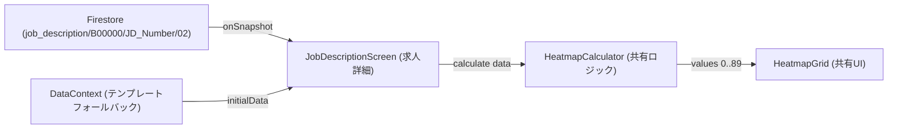
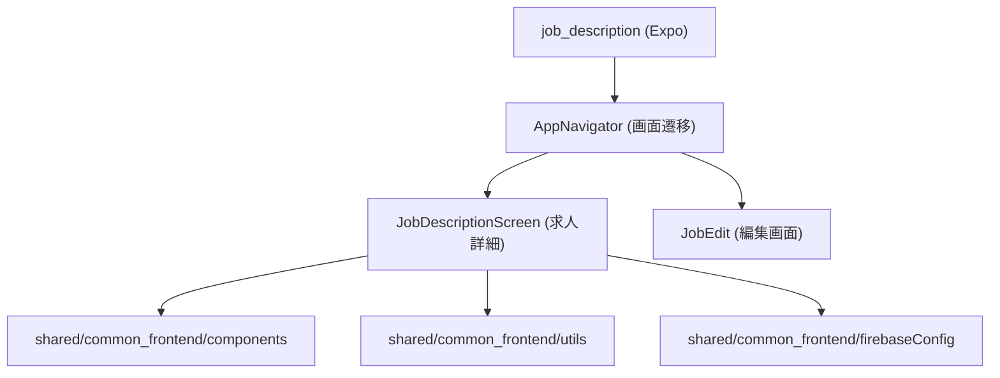
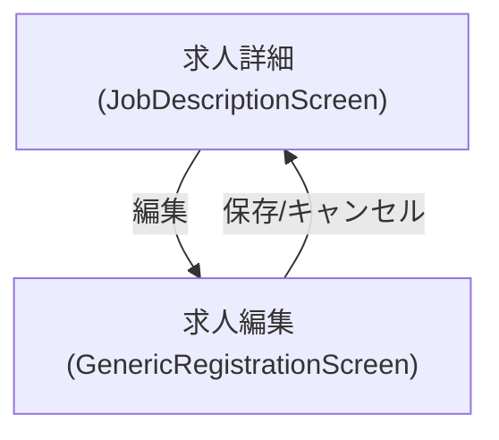
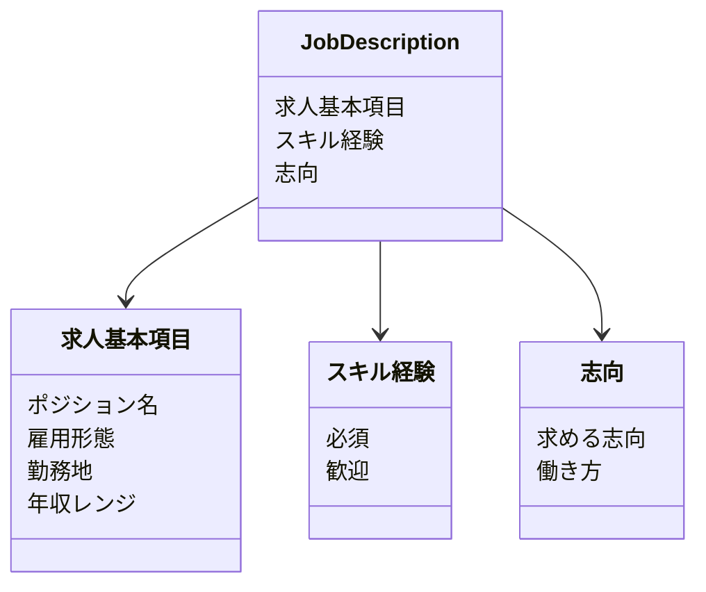

# 求人詳細アプリ（job_description）設計概要

- フレームワーク: Expo（React Native）
- 共有モジュール: shared/common_frontend（UI, 状態, ヒートマップ, Firebase設定）
- データソース: Firestore（プロジェクトは環境変数で指定）、テンプレートJSONのフォールバック
- 目的: 求人票（Job Description）の閲覧・編集、スキル・志向ヒートマップの可視化

## Firestore 接続
- Firestoreへの接続は共有設定 [firebaseConfig.js](file:///Users/yamakawamakoto/ReactNative_Expo/engineer-registration-app-yama/shared/common_frontend/src/core/firebaseConfig.js) を介して行います
- 使用環境変数（Expoの公開環境変数）:
  - EXPO_PUBLIC_FIREBASE_API_KEY
  - EXPO_PUBLIC_FIREBASE_AUTH_DOMAIN
  - EXPO_PUBLIC_FIREBASE_PROJECT_ID
  - EXPO_PUBLIC_FIREBASE_STORAGE_BUCKET
  - EXPO_PUBLIC_FIREBASE_MESSAGING_SENDER_ID
  - EXPO_PUBLIC_FIREBASE_APP_ID
  - EXPO_PUBLIC_FIREBASE_MEASUREMENT_ID
- Firestore プロジェクトはブラウザからの管理画面で確認できます（例: flutter-frontend-21d0a）。認証が必要です
- 参照ドキュメント例:
  - コレクション: job_description
  - ドキュメントパス: job_description/B00000/JD_Number/02

## データフロー
- 画面: [JobDescriptionScreen.js](file:///Users/yamakawamakoto/ReactNative_Expo/engineer-registration-app-yama/apps/job_description/expo_frontend/src/features/job_description/JobDescriptionScreen.js)
- フォールバックデータ: DataContext により初期テンプレート（assets/json/jd.jsonなど）を保持
- リモートデータ: Firestoreから job_description/B00000/JD_Number/02 を取得
- ヒートマップ計算: [HeatmapCalculator.js](file:///Users/yamakawamakoto/ReactNative_Expo/engineer-registration-app-yama/shared/common_frontend/src/core/utils/HeatmapCalculator.js)
- ヒートマップ表示: [HeatmapGrid.js](file:///Users/yamakawamakoto/ReactNative_Expo/engineer-registration-app-yama/shared/common_frontend/src/core/components/HeatmapGrid.js)



## 共有モジュール構成
- UI: shared/common_frontend/src/core/components
  - HeatmapGrid, GlassCard など
- ユーティリティ: shared/common_frontend/src/core/utils
  - HeatmapCalculator（スコアリングとマッピング）
  - HeatmapMapper（90タイルのラベル/インデックス対応）
- 状態: shared/common_frontend/src/core/state/DataContext
  - initialDataの受け渡しと更新API
- テーマ: shared/common_frontend/src/core/theme/theme
  - 色・フォント・レイアウト基準
- Firebase: shared/common_frontend/src/core/firebaseConfig
  - initializeApp と getFirestore の初期化



## 画面遷移（求人詳細アプリ）


## ヒートマップ計算の要点
- スキル経験のスコアリング（0.0〜1.0）
  - 共有スコア表（例: 専門/応用/基礎/個人活動/経験なし）
- 志向のスコアリング（0.0〜1.0）
  - ブール選好（true→1.0）／選択肢ベース（とてもやりたい→1.0 等）
- 90タイル（9×10）に対する最大値の適用（経験と志向の合成）
- タイルタップでツールチップ表示（ラベル、レベル、説明）

## セキュリティと設定
- Firebase鍵はコードに直書きせず、EXPO_PUBLIC_* の環境変数で提供
- 秘密情報のログ出力やリポジトリへのコミットは避ける
- 開発/本番のプロジェクト切り替えは環境変数で管理

## 起動方法（求人詳細アプリ）
- スクリプト: [scripts/start_expo.sh](file:///Users/yamakawamakoto/ReactNative_Expo/engineer-registration-app-yama/scripts/start_expo.sh)
- 実行例:
  - ./scripts/start_expo.sh job_description
- ポート: 8084（スクリプトで自動割り当て）
- 接続URL（例）:
  - exp://xxxxxxx-anonymous-8084.exp.direct

## データスキーマ（推奨フォーマット）
### 前提
- 計算は共有ロジック [HeatmapCalculator.js](file:///Users/yamakawamakoto/ReactNative_Expo/engineer-registration-app-yama/shared/common_frontend/src/core/utils/HeatmapCalculator.js) に準拠します
- ラベル→インデックスの対応は [HeatmapMapper](file:///Users/yamakawamakoto/ReactNative_Expo/engineer-registration-app-yama/shared/common_frontend/src/core/utils/HeatmapMapper.js) の定義に従います

### 求人票 基本項目（例）
```json
{
  "求人基本項目": {
    "ポジション名": "フロントエンドエンジニア",
    "雇用形態": "正社員",
    "勤務地": "東京/リモート可",
    "年収レンジ": "600-900万円"
  }
}
```

### スキル経験（例：必須/歓迎）
```json
{
  "スキル経験": {
    "必須": {
      "TypeScript": {
        "実務で数年の経験があり、主要メンバーとして応用的な問題を解決できる": true
      },
      "React": {
        "実務で基礎的なタスクを遂行可能": true
      }
    },
    "歓迎": {
      "Next.js": {
        "実務経験は無いが個人活動で経験あり": true
      },
      "AWS": {
        "実務で基礎的なタスクを遂行可能": true
      }
    }
  }
}
```

### 志向（例：求める志向/働き方）
```json
{
  "志向": {
    "求める志向": {
      "フロントエンドエンジニア": "やりたい",
      "サーバサイドエンジニア": "どちらでもない"
    },
    "働き方": {
      "フルリモート": true,
      "ハイブリッド": false
    }
  }
}
```

### ドキュメント全体例（Job Description）
```json
{
  "求人基本項目": { /* 例を参照 */ },
  "スキル経験": { /* 例を参照 */ },
  "志向": { /* 例を参照 */ }
}
```



### 記述ガイドライン
- キー名はHeatmapMapperのラベルと一致させる（例: TypeScript / React / Next.js / AWS など）
- 末端ノードは「評価選択肢: true」または「選好: 文字列」を使用
- 同一キーに複数選好・評価を設定した場合は最大値が採用されます
- 不明・未設定は省略可（未設定タイルは0.0で表示）

