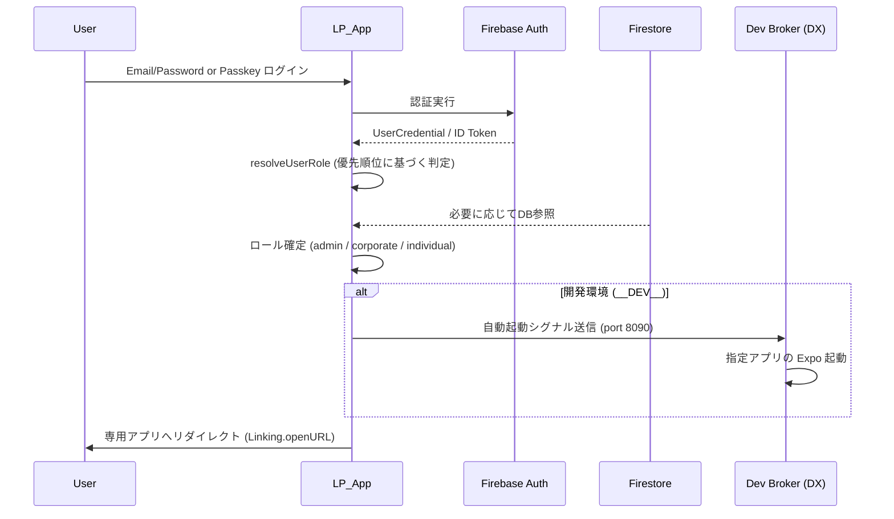
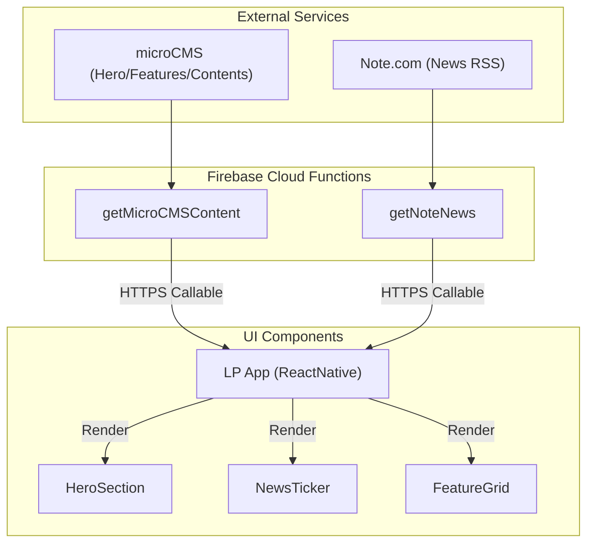

# LPアプリ（lp_app）設計概要

- フレームワーク: Expo（React Native）
- 共有モジュール: `@shared` (shared/common_frontend)
- データソース: Firebase (Firestore/Auth), microCMS, Note RSS
- 目的: キャリア開発ツールの入り口（ランディングページ）および、各専用アプリへのリダイレクト・ハブ

## 1. アプリケーション概要 (App Overview)
本アプリは、ユーザーが最初にアクセスする「顔」となるフロントエンドです。製品紹介、新着情報（Note）、コンテンツ（microCMS）を表示し、ログイン後はユーザーのロールに応じて適切な専用アプリへシームレスにリダイレクトします。

## 2. コア技術スタック (Core Technologies)
- **認証**: Firebase Auth (Email/Password) + Passkeys (`react-native-passkey`)
- **CMS**: microCMS (Cloud Functions 経由で取得)
- **ニュース**: Note RSS (Cloud Functions 経由でパースして取得)
- **解析**: Firebase Analytics (Google Analytics)
- **共有基盤**: [firebaseConfig.js](file:///Users/yamakawamakoto/ReactNative_Expo/forAgent/shared/common_frontend/src/core/firebaseConfig.js) を `@shared` 経由で利用

## 3. 認証・認可 (Authentication & Authorization)
本アプリでは、複数のデータソースから成る複雑な権限情報を、統一された優先順位で解決します。

### 認可ロール判定の優先順位 (Authorization Priority)
[authUtils.js](file:///Users/yamakawamakoto/ReactNative_Expo/forAgent/apps/lp_app/src/features/firebase/authUtils.js) に実装された以下の順序でロールを確定します：

1. **Custom Claims**: `token.claims.role` (最も信頼性が高く高速)
2. **UID 接頭辞**: 開発・デバッグ用コンベンション (`A...`=admin, `B...`=corporate, `C...`=individual)
3. **Firestore `users`/`Users`**: `role` フィールドまたは `userId` 接頭辞
4. **Firestore `public_profile`**: `userId` 接頭辞からの判定

### ログインフロー


## 4. リダイレクト・ハブ機能 (Redirection Hub)
[navigationHelper.js](file:///Users/yamakawamakoto/ReactNative_Expo/forAgent/apps/lp_app/src/utils/navigationHelper.js) が各アプリへの遷移パスを管理します。

### 管理パス
| ロール | 遷移先アプリ (Custom Schema / URL) | 説明 |
| :--- | :--- | :--- |
| **admin** | `exp://...:8081` (dev) / admin-app schema | 管理者ダッシュボードへ |
| **corporate** | `exp://...:8083` (dev) / corporate-app schema | 法人向け管理画面へ |
| **individual** | `exp://...:8082` (dev) / individual-app schema | 個人マイページへ |

### 🆕 開発者体験 (DX): 自動起動連携
開発環境において、LPアプリからリダイレクトが発生した際、ターミナルで手動で `start_expo.sh` を叩く手間を省くため、**Dev Broker** と連携しています。
- **Broker Location**: `scripts/dev_broker.mjs` (Port: 8090)
- **挙動**: `navigationHelper.js` が遷移前にブローカーへ `GET /auto-start?app=...` をリクエストし、ブローカーがバックグランドで `scripts/start_expo.sh` を実行します。

## 5. コンテンツ・ニュース管理 (CMS & News)
動的なコンテンツ管理のために、外部サービスを統合しています。

### データフロー


## 6. 画面構成 (Screen Structure)
主要な画面と遷移関係は以下の通りです。

```mermaid
graph TD
    Splash["スプラッシュ"] --> Home["ホーム (HomeScreen)"]
    Home -->|ログインボタン| Login["ログイン選択 (LoginScreen)"]
    Login -->|パスキー選択| Passkey["パスキーログイン (PasskeyLoginScreen)"]
    
    subgraph Home Sections (Static/Dynamic)
        Home --> Company["会社概要"]
        Home --> Purpose["目的・ビジョン"]
        Home --> Recruitment["採用情報"]
    end
    
    subgraph Footer/Settings
        Home --> Privacy["プライバシーポリシー"]
        Home --> Settings["設定 (デバッグ用)"]
    end
    
    Login -->|成功| Success["リダイレクト処理 (Redirecting...)"]
    Passkey -->|成功| Success
    Success -->|App Redirect| ExternalApp["専用アプリ (Admin/Corp/Ind)"]
```

## 7. 関連ドキュメント
- **[認証・認可設計 (Authentication_Authorization.md)](../security/Authentication_Authorization.md)**
- **[開発環境セットアップ](../../../scripts/README.md)** (start_expo.sh 等のスクリプト解説)
