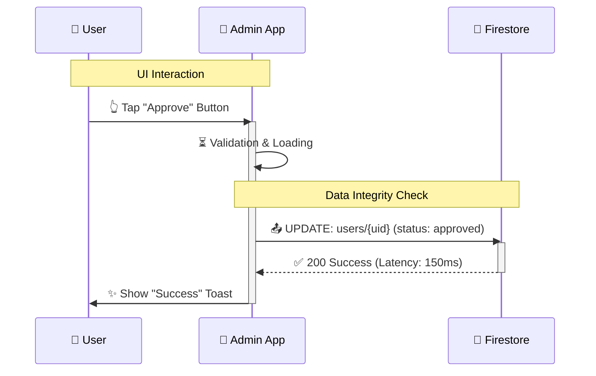

# E2Eテスト結果報告書 (Template)

このドキュメントは、E2Eテスト実行ごとの結果を記録するための標準フォーマットです。
`reference_information_fordev/instructions/TestReport_Design.md` のコンセプトに基づき、非エンジニアでも理解しやすい視覚的表現と、エンジニアが必要とする技術的詳細（Firestore I/O）を兼ね備えています。

---

## 📅 実行概要 (Execution Summary)

| 項目 | 内容 |
| :--- | :--- |
| **実行日** | 202X-XX-XX |
| **対象アプリ** | (例: Admin App / Individual App) |
| **環境** | iOS Simulator / Android Emulator (Local / CI) |
| **テストスイート** | run_e2e.sh (Full Coverage) |
| **最終結果** | 🟢 **PASS** / 🔴 **FAIL** |

### 📊 ステータス詳細

| メトリクス | 結果 |
| :--- | :--- |
| **全シナリオ数** | XX ケース |
| **成功 (Passed)** | ✅ XX |
| **失敗 (Failed)** | ❌ XX |
| **成功率** | **XX%** |
| **総実行時間** | 00m 00s |

**進捗状況:**
[ 🟢🟢🟢🟢🟢🟢🟢🟢🟢⚪️ ] (90%)

---

## 🔍 詳細検証レポート (Deep Dive I/O Analysis)

各主要シナリオについて、UIの挙動だけでなく「保存されたデータ」の正当性を記録します。

### Case 01: [シナリオ名] (例: 新規ユーザー承認フロー)

**【シナリオ概要】**
(ここにユーザーが行う操作の目的を記述)

#### 🛠️ ステップ詳細とデータの動き

| Step | Action (UI 👆) | Result (Screen 📱) | Data I/O (Firestore 💾) | Status |
| :--- | :--- | :--- | :--- | :--- |
| 1 | `[ボタン名]` をタップ | [期待される画面遷移] | - | 🟢 |
| 2 | フォーム入力: "値" | 入力値の反映 | - | 🟢 |
| 3 | **保存/確定アクション** | ローディング -> 完了 | **Write:** `collection/{id}` ∟ `field`: "value" ∟ `status`: "active" | 🟢 |
| 4 | [確認操作] | [結果確認] | **Read:** `user_settings` | 🟢 |

#### 🔄 シーケンス・インフォグラフィック (Mermaid)

---

### Case 02: [シナリオ名]

... (同様に記述)

---

## 🚨 異常検知・不具合ログ (Failure Analysis)

*(テスト失敗時のみ記述)*

> ❌ **Error in "Case XX: [機能名]"**
> * **事象:** (例: 保存ボタンを押してもローディングが終わらない)
> * **UI変化:** (スクリーンショットやメッセージ)
> * **I/Oログ:** `[FIRESTORE_IO]|UPDATE|orders` -> **TIMEOUT / PERMISSION DENIED**
> * **原因推測:** (例: Firestoreセキュリティルールの不備)

---

## 📝 備考・考察 (Notes)

- **パフォーマンス:** Firestore書き込みレイテンシ 平均 XXms (🟢 良好)
- **課題:** (次回のテストや実装で改善すべき点)

## 📅 実行概要 (Execution Summary: 2026-02-07)

| 項目 | 内容 |
| :--- | :--- |
| **実行日** | 2026-02-07 |
| **対象アプリ** | admin_app |
| **環境** | iOS Simulator (Local) |
| **最終結果** | 🔴 **FAIL** |

### 📊 ステータス詳細

| メトリクス | 結果 |
| :--- | :--- |
| **全シナリオ数** | 1 ケース |
| **成功 (Passed)** | ✅ 0 |
| **失敗 (Failed)** | ❌ 1 |
| **成功率** | **0%** |
| **総実行時間** | 3m 15s |

---

## 📅 実行概要 (Execution Summary: 2026-02-07 03:09)

| 項目 | 内容 |
| :--- | :--- |
| **実行日** | 2026-02-07 03:09 |
| **対象アプリ** | admin_app |
| **環境** | iOS Simulator (Local) |
| **最終結果** | 🔴 **FAIL** |

### 📊 ステータス詳細

| メトリクス | 結果 |
| :--- | :--- |
| **全シナリオ数** | 1 ケース |
| **成功 (Passed)** | ✅ 0 |
| **失敗 (Failed)** | ❌ 1 |
| **成功率** | **0%** |
| **総実行時間** | 3m 14s |

---

## 📅 実行概要 (Execution Summary: 2026-02-09 02:24)

| 項目 | 内容 |
| :--- | :--- |
| **実行日** | 2026-02-09 02:24 |
| **対象アプリ** | admin_app |
| **環境** | iOS Simulator (Local) |
| **最終結果** | 🔴 **FAIL** |

### 📊 ステータス詳細

| メトリクス | 結果 |
| :--- | :--- |
| **全シナリオ数** | 6 ケース |
| **成功 (Passed)** | ✅ 0 |
| **失敗 (Failed)** | ❌ 1 |
| **成功率** | **0%** |
| **総実行時間** | 4m 24s |

---

## 📅 実行概要 (Execution Summary: 2026-02-09 02:36)

| 項目 | 内容 |
| :--- | :--- |
| **実行日** | 2026-02-09 02:36 |
| **対象アプリ** | admin_app |
| **環境** | iOS Simulator (Local) |
| **最終結果** | 🔴 **FAIL** |

### 📊 ステータス詳細

| メトリクス | 結果 |
| :--- | :--- |
| **全シナリオ数** | 6 ケース |
| **成功 (Passed)** | ✅ 0 |
| **失敗 (Failed)** | ❌ 1 |
| **成功率** | **0%** |
| **総実行時間** | 3m 39s |

---

## 📅 実行概要 (Execution Summary: 2026-02-09 03:10)

| 項目 | 内容 |
| :--- | :--- |
| **実行日** | 2026-02-09 03:10 |
| **対象アプリ** | admin_app |
| **環境** | iOS Simulator (Local) |
| **最終結果** | 🔴 **FAIL** |

### 📊 ステータス詳細

| メトリクス | 結果 |
| :--- | :--- |
| **全シナリオ数** | 6 ケース |
| **成功 (Passed)** | ✅ 0 |
| **失敗 (Failed)** | ❌ 1 |
| **成功率** | **0%** |
| **総実行時間** | 3m 55s |

---

## 📅 実行概要 (Execution Summary: 2026-02-09 03:21)

| 項目 | 内容 |
| :--- | :--- |
| **実行日** | 2026-02-09 03:21 |
| **対象アプリ** | admin_app |
| **環境** | iOS Simulator (Local) |
| **最終結果** | 🔴 **FAIL** |

### 📊 ステータス詳細

| メトリクス | 結果 |
| :--- | :--- |
| **全シナリオ数** | 6 ケース |
| **成功 (Passed)** | ✅ 0 |
| **失敗 (Failed)** | ❌ 1 |
| **成功率** | **0%** |
| **総実行時間** | 1m 7s |

---

## 📅 実行概要 (Execution Summary: 2026-02-09 03:28)

| 項目 | 内容 |
| :--- | :--- |
| **実行日** | 2026-02-09 03:28 |
| **対象アプリ** | admin_app |
| **環境** | iOS Simulator (Local) |
| **最終結果** | 🔴 **FAIL** |

### 📊 ステータス詳細

| メトリクス | 結果 |
| :--- | :--- |
| **全シナリオ数** | 6 ケース |
| **成功 (Passed)** | ✅ 0 |
| **失敗 (Failed)** | ❌ 1 |
| **成功率** | **0%** |
| **総実行時間** | 3m 39s |

---

## 📅 実行概要 (Execution Summary: 2026-02-09 03:34)

| 項目 | 内容 |
| :--- | :--- |
| **実行日** | 2026-02-09 03:34 |
| **対象アプリ** | admin_app |
| **環境** | iOS Simulator (Local) |
| **最終結果** | 🔴 **FAIL** |

### 📊 ステータス詳細

| メトリクス | 結果 |
| :--- | :--- |
| **全シナリオ数** | 6 ケース |
| **成功 (Passed)** | ✅ 1 |
| **失敗 (Failed)** | ❌ 1 |
| **成功率** | **16%** |
| **総実行時間** | 3m 34s |

---

## 📅 実行概要 (Execution Summary: 2026-02-09 10:17)

| 項目 | 内容 |
| :--- | :--- |
| **実行日** | 2026-02-09 10:17 |
| **対象アプリ** | admin_app |
| **環境** | iOS Simulator (Local) |
| **最終結果** | 🔴 **FAIL** |

### 📊 ステータス詳細

| メトリクス | 結果 |
| :--- | :--- |
| **全シナリオ数** | 1 ケース |
| **成功 (Passed)** | ✅ 0 |
| **失敗 (Failed)** | ❌ 1 |
| **成功率** | **0%** |
| **総実行時間** | 3m 31s |

---

## 📅 実行概要 (Execution Summary: 2026-02-09 10:20)

| 項目 | 内容 |
| :--- | :--- |
| **実行日** | 2026-02-09 10:20 |
| **対象アプリ** | admin_app |
| **環境** | iOS Simulator (Local) |
| **最終結果** | 🔴 **FAIL** |

### 📊 ステータス詳細

| メトリクス | 結果 |
| :--- | :--- |
| **全シナリオ数** | 1 ケース |
| **成功 (Passed)** | ✅ 0 |
| **失敗 (Failed)** | ❌ 1 |
| **成功率** | **0%** |
| **総実行時間** | 2m 17s |

---

## 📅 実行概要 (Execution Summary: 2026-02-09 10:23)

| 項目 | 内容 |
| :--- | :--- |
| **実行日** | 2026-02-09 10:23 |
| **対象アプリ** | admin_app |
| **環境** | iOS Simulator (Local) |
| **最終結果** | 🔴 **FAIL** |

### 📊 ステータス詳細

| メトリクス | 結果 |
| :--- | :--- |
| **全シナリオ数** | 1 ケース |
| **成功 (Passed)** | ✅ 0 |
| **失敗 (Failed)** | ❌ 1 |
| **成功率** | **0%** |
| **総実行時間** | 2m 27s |

---

## 📅 実行概要 (Execution Summary: 2026-02-09 10:26)

| 項目 | 内容 |
| :--- | :--- |
| **実行日** | 2026-02-09 10:26 |
| **対象アプリ** | admin_app |
| **環境** | iOS Simulator (Local) |
| **最終結果** | 🔴 **FAIL** |

### 📊 ステータス詳細

| メトリクス | 結果 |
| :--- | :--- |
| **全シナリオ数** | 1 ケース |
| **成功 (Passed)** | ✅ 0 |
| **失敗 (Failed)** | ❌ 1 |
| **成功率** | **0%** |
| **総実行時間** | 2m 12s |

---

## 📅 実行概要 (Execution Summary: 2026-02-09 10:30)

| 項目 | 内容 |
| :--- | :--- |
| **実行日** | 2026-02-09 10:30 |
| **対象アプリ** | admin_app |
| **環境** | iOS Simulator (Local) |
| **最終結果** | 🟢 **PASS** |

### 📊 ステータス詳細

| メトリクス | 結果 |
| :--- | :--- |
| **全シナリオ数** | 1 ケース |
| **成功 (Passed)** | ✅ 1 |
| **失敗 (Failed)** | ❌ 0 |
| **成功率** | **100%** |
| **総実行時間** | 2m 1s |

---

## 📅 実行概要 (Execution Summary: 2026-02-09 10:33)

| 項目 | 内容 |
| :--- | :--- |
| **実行日** | 2026-02-09 10:33 |
| **対象アプリ** | admin_app |
| **環境** | iOS Simulator (Local) |
| **最終結果** | 🔴 **FAIL** |

### 📊 ステータス詳細

| メトリクス | 結果 |
| :--- | :--- |
| **全シナリオ数** | 1 ケース |
| **成功 (Passed)** | ✅ 0 |
| **失敗 (Failed)** | ❌ 1 |
| **成功率** | **0%** |
| **総実行時間** | 2m 17s |

---

## 📅 実行概要 (Execution Summary: 2026-02-09 10:36)

| 項目 | 内容 |
| :--- | :--- |
| **実行日** | 2026-02-09 10:36 |
| **対象アプリ** | admin_app |
| **環境** | iOS Simulator (Local) |
| **最終結果** | 🔴 **FAIL** |

### 📊 ステータス詳細

| メトリクス | 結果 |
| :--- | :--- |
| **全シナリオ数** | 1 ケース |
| **成功 (Passed)** | ✅ 0 |
| **失敗 (Failed)** | ❌ 1 |
| **成功率** | **0%** |
| **総実行時間** | 1m 50s |

---

## 📅 実行概要 (Execution Summary: 2026-02-09 10:53)

| 項目 | 内容 |
| :--- | :--- |
| **実行日** | 2026-02-09 10:53 |
| **対象アプリ** | admin_app |
| **環境** | iOS Simulator (Local) |
| **最終結果** | 🔴 **FAIL** |

### 📊 ステータス詳細

| メトリクス | 結果 |
| :--- | :--- |
| **全シナリオ数** | 1 ケース |
| **成功 (Passed)** | ✅ 0 |
| **失敗 (Failed)** | ❌ 1 |
| **成功率** | **0%** |
| **総実行時間** | 2m 3s |

---

## 📅 実行概要 (Execution Summary: 2026-02-09 11:22)

| 項目 | 内容 |
| :--- | :--- |
| **実行日** | 2026-02-09 11:22 |
| **対象アプリ** | admin_app |
| **環境** | iOS Simulator (Local) |
| **最終結果** | 🔴 **FAIL** |

### 📊 ステータス詳細

| メトリクス | 結果 |
| :--- | :--- |
| **全シナリオ数** | 6 ケース |
| **成功 (Passed)** | ✅ 0 |
| **失敗 (Failed)** | ❌ 1 |
| **成功率** | **0%** |
| **総実行時間** | 1m 7s |

---

## 📅 実行概要 (Execution Summary: 2026-02-09 17:08)

| 項目 | 内容 |
| :--- | :--- |
| **実行日** | 2026-02-09 17:08 |
| **対象アプリ** | admin_app |
| **環境** | iOS Simulator (Local) |
| **最終結果** | 🔴 **FAIL** |

### 📊 ステータス詳細

| メトリクス | 結果 |
| :--- | :--- |
| **全シナリオ数** | 6 ケース |
| **成功 (Passed)** | ✅ 2 |
| **失敗 (Failed)** | ❌ 1 |
| **成功率** | **33%** |
| **総実行時間** | 6m 3s |

---

## 📅 実行概要 (Execution Summary: 2026-02-09 17:34)

| 項目 | 内容 |
| :--- | :--- |
| **実行日** | 2026-02-09 17:34 |
| **対象アプリ** | admin_app |
| **環境** | iOS Simulator (Local) |
| **最終結果** | 🔴 **FAIL** |

### 📊 ステータス詳細

| メトリクス | 結果 |
| :--- | :--- |
| **全シナリオ数** | 6 ケース |
| **成功 (Passed)** | ✅ 1 |
| **失敗 (Failed)** | ❌ 1 |
| **成功率** | **16%** |
| **総実行時間** | 5m 11s |

---

## 📅 実行概要 (Execution Summary: 2026-02-09 23:20)

| 項目 | 内容 |
| :--- | :--- |
| **実行日** | 2026-02-09 23:20 |
| **対象アプリ** | corporate_user_app |
| **環境** | iOS Simulator (Local) |
| **最終結果** | 🟢 **PASS** |

### 📊 ステータス詳細

| メトリクス | 結果 |
| :--- | :--- |
| **全シナリオ数** | 1 ケース |
| **成功 (Passed)** | ✅ 1 |
| **失敗 (Failed)** | ❌ 0 |
| **成功率** | **100%** |
| **総実行時間** | 1m 50s |

---

