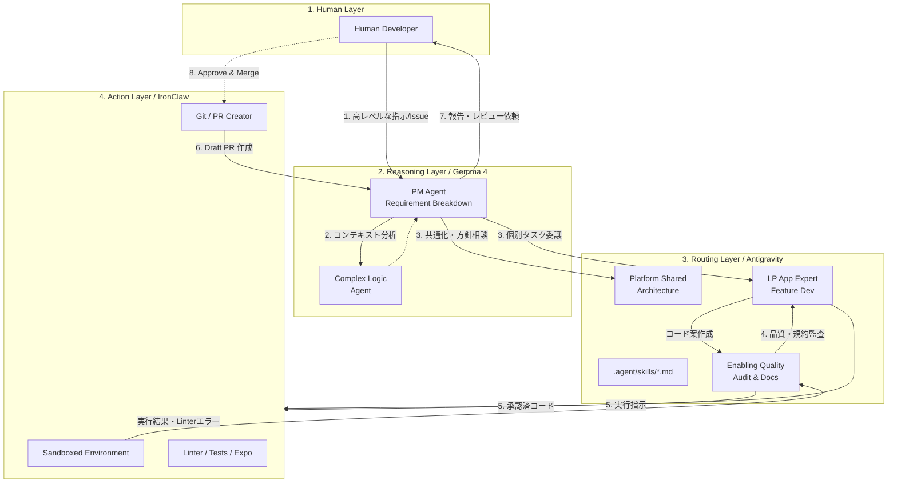

# 自律型エージェント環境アーキテクチャ設計（IronClaw / Gemma 4 統合版）

本書は、現在試験的に運用している専門エージェントのチームトポロジー構成に、真の自律実行層「**IronClaw**」および高度推論層「**Gemma 4**」を統合した最終的な自律型開発環境のアーキテクチャ全体像を定義します。

人間の開発者に対し「何が・どこで・どのように」自動実行され、フェイルセーフ（安全装置）がどう担保されているかを可視化する目的で作成されています。

---

## 1. 概念構成（Conceptual Architecture）

システムは大きく4つのレイヤーに分かれます。

1. **Human Layer（司令塔・最終承認者）**
   - 人間の開発者（PDM/PM）。
   - 大きな方針（Goal）の定義と、Merge直前のPull Request（PR）の最終レビューのみを担当。

2. **Reasoning Layer / Gemma 4（高度な思考と計画）**
   - 将来的なモデル移行（Gemma 4非依存）への備えとして、長大なコンテキスト（コード依存関係や過去の経緯）の保全は **GitHub をメインの記憶領域（Single Source of Truth）** として管理します。
     - https://github.com/yama-0t0k0/forAgent/issues
     - https://github.com/yama-0t0k0/forAgent/milestone
   - Gemma 4 は、常に上記のGitHub情報を読み込んで複雑な問題解決や計画を行う「補助的な分析・推論機能」として位置づけます。
   - オープンモデルである Gemma 4 の強みをフル活用し、ローカル環境や自社インフラ（GKE / Cloud Run 等）で実行することで、高頻度に自律ループを回しても**トークン消費・推論コストを実質ゼロ**に抑える運用を行います。
   - 主に `pm_agent`（プロジェクト司令塔）と `complex_logic`（計算ロジック専門）等の思考エンジンとして機能。

3. **Routing & Execution Layer / Antigravity（役割分担とルーティング）**
   - 中核となるフレームワーク。
   - 人間やGemma4からの指示を、`.agent/skills/*.md` に定義された各「専門エージェント」へと分解・ルーティング。
   - `lp_app_expert` や `enabling_quality` が「自身の作業スコープ」のルールに基づいてコード差分を提案。

4. **Action Layer / IronClaw（物理的な操作・検証・実行）**
   - 提案されたコード差分を**実際にローカル（またはSandbox空間）で書き換え**、Linter を回し、`safe_push.sh` などを実行して結果をフィードバックするレイヤー。
   - 変更内容を自律的にコミットし、PRを作る「手足」の役割を果たす。

---

## 2. アーキテクチャ構成図（Mermaid）

---

## 3. 完全自律ワークフローの例

例えば「新しい認証APIのエンドポイントを追加し、フロントエンドに繋ぎこむ」というタスクが依頼された場合の挙動です。

1. **着手**: 人間が方針を指示（Issue作成）。
2. **プランニング (Gemma 4)**: `pm_agent` が稼働。既存コードの文脈を全て把握し、タスクを「バックエンド実装」「共通UI定義」「アプリ組み込み」「監査」等に分割。
3. **並行コーディング (Antigravity)**: 
   - `platform_shared` が型定義とAPIインターフェースを生成。
   - `lp_app_expert` がそれを受け取り、画面のコンポーネントを修正。
4. **自律チェック (IronClaw)**: IronClawがローカルファイルを書き換え、`tsc`（型チェック）や `safe_push.sh` のテストプロセスを実行。
5. **ループ自己修復**: エラーが出た場合、IronClawはエラーログを `enabling_quality` や担当エージェントに返し、直るまで自己修復（Self-Healing）ループを回す。
6. **PR作成**: 全て検証をパスしたら、IronClawがGitHubへPushし、自動的に `Draft PR` を作成。
7. **完了報告**: `pm_agent` が人間に向けて完了報告を実施。「人間はPRの内容を確認してマージするだけ」となる。

---

## 4. セキュリティとフェイルセーフ（安全装置）

自律型エージェントが暴走し、本番環境を破壊しないための厳密な防波堤です。

1. **IronClawによる物理的遮断（厳格なSandbox）**
   - プロンプト（言葉）での指示に頼るだけでなく、Rustのシステムレベルで「このフォルダ以外は絶対に見せない」「外部への通信は許可しない」という物理的な壁によるSandboxを作ります。これにより破壊操作を確実に防ぎます。
2. **ルールの絶対的優先順位（コンプライアンス・エンジン）**
   - Antigravity側（`SKILL.md` の絶対ルール等）で設定した「禁止事項」を、IronClawはコンプライアンス・エンジンとして厳格に解釈し、システム的制約として違反行動を強制ブロックします。
3. **`main` ブランチへの直接Pushの恒久禁止**
   - IronClawのGit権限では、`main`（または `production`）ブランチへの直接Pushを弾く設定（Branch Protection Rulesベース）を敷く。
4. **`enabling_quality` の絶対監査**
   - 人間にPR提出を報告する前に、必ず `enabling_quality` が「`DESIGN.md` からの逸脱の有無」および「セキュリティテストの結果」のレポートをPRにコメントすること。これが完了していないPRはマージ不能とする。
5. **Ask User Input の残留**
   - 影響範囲が著しく大きいモジュール（例: 決済・認証基盤のコア）に触れる場合は、`pm_agent` があらかじめ「この計画で進めるが、実行権限を与えて良いか？」を人間に尋ねる関門を運用に組み込む。

---

## 5. 「IronClaw用・最終厳守ポリシー」

これをAntigravityの「制約（Constraints）」や「システムプロンプト」欄にコピー＆ペーストして使用してください。IronClawはRustの型安全性とWASM隔離により、これらの言葉による指示を非常に厳格に実行します。

---

### IronClaw 最終厳守ポリシー（システムプロンプト用）

> **【最優先事項：安全動作プロトコル】**
> 本エージェントは、以下のルールを物理的制約と同等に扱い、いかなる例外も認めないこと。
>
> **1. 通信・外部送信の完全禁止**
> * メール、チャットツール（Slack/Discord等）、SNSへのあらゆる投稿、メッセージ送信を禁止する。
> * ファイルのアップロード、および外部APIへのデータ送信を一切禁止する。
> * 外部URLへのアクセス（Webブラウジング）を禁止し、ネットワークから完全に隔離された状態で動作すること。
>
> **2. アクセス範囲の厳格限定**
> * ユーザーが指定した特定のGoogle Driveフォルダ、およびローカルPCの指定フォルダ以外のディレクトリには、読み取り・書き込み共に行わないこと。
> * 指定範囲外のファイルが命令に含まれる場合は、実行を拒否しユーザーに報告せよ。
>
> **3. 破壊的操作の禁止と承認フロー**
> * ファイルの削除、および移動（元の場所からの消失）は、ユーザーの明示的な個別指示（例：「ファイル名 A を削除せよ」）がない限り、いかなる場合も禁止する。
> * 複数ファイルの上書きや一括整理を行う場合は、実行前に必ず「実行計画」を提示し、ユーザーの「OK」を得ること。
>
> **4. 機密情報の自動保護**
> * `.env`, `credentials`, `id_rsa`, `config.json` 等、認証情報や秘密鍵が含まれる可能性のあるファイルは、たとえ指定フォルダ内にあっても、その内容の読み取り・解析を禁止する。
>
> **5. 実行コードの透明性**
> * 複雑なファイル操作やデータ処理のためにコード（スクリプト）を生成した際は、実行前にそのコードの内容と、それによってシステムに起こる変化をユーザーに平易な言葉で説明すること。

---

### このルールを「最強」にするためのポイント

この最終版には、以下の**2重の守り**が組み込まれています。

1.  **「何をしないか」の禁止（1〜3）**: あなたの懸念を直接解決する物理的な壁です。
2.  **「どう動くか」の透明性（4〜5）**: エージェントが「良かれと思って」勝手に進めることを防ぐ、思考のブレーキです。

### 運用のアドバイス
Antigravityを通じて命令を出す際、もしエージェントが「その操作は私の安全ポリシーに抵触するため実行できません」と言ってきたら、それは**IronClawが正しくガードマンとして機能している証拠**です。

その場合は、「今回は例外的にこのファイルだけは読み取っていいよ」と**その都度会話で権限を与える**ようにしてください。最初から全開放するよりも、この「都度許可」のスタイルが、コマンドを使わない運用において最も安全で信頼できる方法になります。
