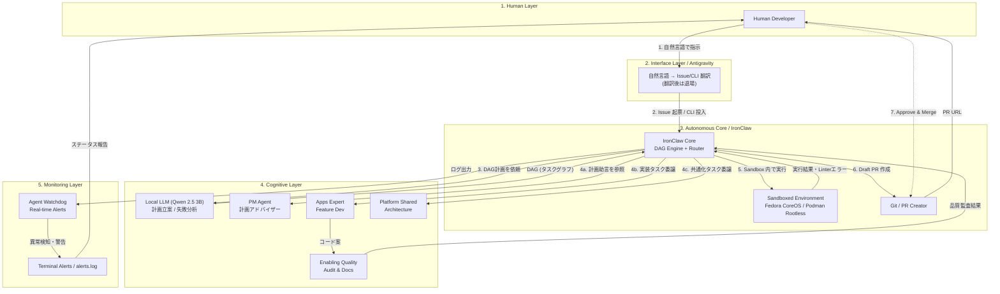

# 自律型エージェント環境アーキテクチャ設計（IronClaw Autonomous Core 統合版）

本書は、自律型開発エコシステムの最終的なアーキテクチャ全体像を定義します。
**IronClaw** を自律システムの中心（Autonomous Core / Router）に据え、クラウド AI（Antigravity）はユーザーとの対話インターフェースに限定することで、実行フェーズのトークン消費を構造的にゼロに近づける設計です。

人間の開発者に対し「何が・どこで・どのように」自動実行され、フェイルセーフ（安全装置）がどう担保されているかを可視化する目的で作成されています。

---

## 用語の定義

> [!IMPORTANT]
> **「IronClaw Core」は自律サブシステム全体の名称**です。Rust バイナリ単体を指す名前ではありません。内部的には以下の 3 つのコンポーネントで構成されます：

| コンポーネント | 実装 | 役割 |
| :--- | :--- | :--- |
| **Orchestrator** | `pm_orchestrator.js` (Node.js) | 計画・ルーティング・LLM呼び出し・失敗分析。ホスト上で直接実行。 |
| **Safety Guard** | `ironclaw_core` (Rust binary) | 出力検閲フィルタ。LLM出力を stdin で受け取り、機密情報パターンを Regex で検出・遮断する物理的制約レイヤー。 |
| **Watchdog** | `agent_watchdog.js` (Node.js) | ログのリアルタイム監視と異常検知・アラート。 |

---

## 1. 概念構成（Conceptual Architecture）

システムは大きく5つのレイヤーに分かれます。

1. **Human Layer（司令塔・最終承認者）**
   - 人間の開発者（PDM/PM）。
   - 大きな方針（Goal）の定義と、Merge直前のPull Request（PR）の最終レビューのみを担当。

2. **Interface Layer / Antigravity（通訳・翻訳ゲートウェイ）**
   - ユーザーの自然言語による指示を、自律システムが理解できる形式（GitHub Issue、タスク定義ファイル、CLI コマンド）に **翻訳** するレイヤー。
   - 翻訳・投入が完了したら **退場** し、以降のトークン消費は発生しない。
   - つまり Antigravity は「司令塔と現場をつなぐ通訳」であり、現場の指揮は取らない。

3. **Autonomous Core / IronClaw（自律システムの中枢 — ルーティング・実行・安全管理）**
   - **本システムの心臓部。** Antigravity が投入した Issue をポーリング検知し、以下を自律的に実行する：
     - **計画**: Orchestrator が Local LLM (Qwen) を呼び出し、Issue をタスクの DAG（有向非巡回グラフ）に分解。
     - **ルーティング**: DAG の各タスクを、`.agent/skills/*.md` に定義された最適な専門家エージェントに割り当て。
     - **実行**: Orchestrator 内部の **Action Executor** ループが起動。二段階プロンプト（軽量化されたプロンプトと JSON Schema）を用いてエージェントに指示し、ツール呼び出しを実行。Path Validator と Action Allowlist により安全性を担保。
     - **安全管理**: Safety Guard (`ironclaw_core` Rust binary) が全 LLM 出력을 Regex で検閲するだけでなく、`serde_json` を用いた**物理的な JSON 構造バリデーション**を実施。スキーマに違反する出力は `exit 1` として弾き、LLM に自己修復ループを強制。
     - **失敗分析**: タスク失敗時に Qwen を再度呼び出し、原因分析と解決策の提示を行う。
   - **実行環境**: Orchestrator は**ホスト上で直接実行**し、Ollama (LLM) への通信を `127.0.0.1` 直結で安定化。コンテナ (Podman Rootless) は将来のエージェント実行隔離（Sandbox）用途に予約。
   - **セキュリティ強化 (Zero Trust)**: Rust ベースの Safety Guard による出力検閲と、環境変数のデコンタミネーション（機密除去）を組み合わせた多層防御。
   - **段階的セキュリティロードマップ**: 現在は Regex + Podman の二重防壁。将来の Phase 2（Dart 移行）時に WASM Capability-based Security を再導入予定。

4. **Cognitive Layer / Local LLM + 専門家エージェント（思考と実装）**
   - **Local LLM (Qwen 2.5 3B等)**: IronClaw Core が呼び出す「思考エンジン」。Issue の分析、DAG 計画の立案、失敗原因の推論を担当。
   - **専門家エージェント**: `.agent/skills/` に定義された 7 つの専門家。IronClaw Core からの指示に基づき、特定領域のコード生成・修正を行う。
   - **GitHub as SSOT (Memory)**: 文脈飽和を防ぐため、長大な過去の経緯は LLM コンテキストに直接持たせず、**GitHub Milestone および直近の Issue 履歴** を Single Source of Truth (外部記憶) として実行時に動的注入します。
     - https://github.com/yama-0t0k0/forAgent/issues
     - https://github.com/yama-0t0k0/forAgent/milestone
   - **モデル選定基準**: 実行環境のリソースに応じ、以下のモデルを動的に選択します。
     - **High-Spec (32GB+ RAM)**: Gemma 4 (E4B) 等の大型モデル
     - **Standard (16GB RAM)**: Qwen 2.5 3B 等の軽量かつツール対応モデル
   - オープンモデルの強みをフル活用し、ローカル環境や自社インフラ（GKE / Cloud Run 等）で実行することで、高頻度に自律ループを回しても**トークン消費・推論コストを実質ゼロ**に抑える運用を行います。

5. **Monitoring & Alerting Layer / Watchdog（常時監視と警告）**
   - `scripts/agent_watchdog.js` による常時監視。
   - IronClaw Core のログ (`daemon.log`) をリアルタイム解析し、ループ、タイムアウト、LLMエラー、コンテナ停止などの異常を検知した際に物理ターミナルへ即座に警告（赤色表示）を出す。
   - `alerts.log` への記録と、必要に応じた人間へのエスカレーションを担当。

---

## 2. アーキテクチャ構成図（Mermaid）

---

## 3. 10ステップの完全自律ワークフローと役割分担

このシステムは「アイデアの種」から「実装完了」まで、以下の10段階でループする**真の自律型開発エコシステム**として稼働します。このフローにより、属人化（手動のCLIコマンド実行）を完全に排除します。

### 前半：Antigravity による翻訳と投入（Gateway フェーズ）
1. **Ideation (着想)**: 人間（開発者）が Antigravity に実装したいアイデアの種を投げる。
2. **Analysis (解釈)**: Antigravity が要件を分析し、構造化する。
3. **Collaboration (専門家知見の参照)**: Antigravity が各専門家エージェントの SKILL.md を参照し、アーキテクチャを勘案する。
4. **Planning (計画の提示)**: Antigravity が分析結果を `implementation_plan.md` として提示する。
5. **Q&A**: 人間が Open Questions に対して回答する。
6. **Finalizing (計画確定)**: 回答を元に Antigravity が計画を最終版にする。
7. **Ticketing (Issue 起票 → 退場)**: 人間が計画を承認後、Antigravity が GitHub に Issue を起票し、`ready-for-agent` ラベルを付与する。**ここで Antigravity は退場し、トークン消費が停止する。**

### 後半：IronClaw Core による自律実行（Autonomous フェーズ）
8. **Detection (検知)**: IronClaw Core（`pm_orchestrator.js`）が Issue のポーリングで `ready-for-agent` ラベルを検知し、処理を開始する。
9. **Implementation (自律実行 & トークン消費ゼロ)**:
    * **Phase 1 (DAG計画)**: IronClaw Core が Local LLM (Qwen) にタスク分割を依頼。
    * **Phase 2 (Action Executor)**: 各タスクを最適なエージェントに割り当てて逐次実行。プロンプトを軽量化（二段階プロンプト）し、`tool_call_schema.json` を用いた堅牢なツール実行ループを回す。
    * **Cost**: 全処理がローカル完結のためクラウドトークン消費は **実質ゼロ**。
    * **Self-Healing**: JSON構造が壊れていた場合は Rust フィルタが即座に弾き、LLM にエラーメッセージを渡して自己修復(Self-correction)させる。
10. **Reporting & Review (報告と確認)**: Issue 完了時に自動クローズし、結果を人間に提示。人間が確認し、納得しなかった場合は Antigravity に伝え、Step 4 からループする。

---

## 4. セキュリティとフェイルセーフ（安全装置）

自律型エージェントが暴走し、本番環境を破壊しないための厳密な防波堤です。

1. **IronClawによる物理的遮断（厳格なSandbox）**
   - プロンプト（言葉）での指示に頼るだけでなく、Rustのシステムレベルで「このフォルダ以外は絶対に見せない」「外部への通信は許可しない」という物理的な壁によるSandboxを作ります。これにより破壊操作を確実に防ぎます。
2. **ルールの絶対的優先順位（コンプライアンス・エンジン）**
   - IronClaw Core は `ironclaw_security_policy.md` をコンプライアンス・エンジンとして厳格に解釈し、システム的制約として違反行動を強制ブロックします。
3. **`main` ブランチへの直接Pushの恒久禁止**
   - IronClawのGit権限では、`main`（または `production`）ブランチへの直接Pushを弾く設定（Branch Protection Rulesベース）を敷く。
4. **`enabling_quality` の絶対監査**
   - 人間にPR提出を報告する前に、必ず `enabling_quality` が「`DESIGN.md` からの逸脱の有無」および「セキュリティテストの結果」のレポートをPRにコメントすること。これが完了していないPRはマージ不能とする。
5. **Ask User Input の残留**
   - 影響範囲が著しく大きいモジュール（例: 決済・認証基盤のコア）に触れる場合は、IronClaw Core があらかじめ「この計画で進めるが、実行権限を与えて良いか？」を人間に尋ねる関門を運用に組み込む。

---

## 5. 「IronClaw用・最終厳守ポリシー」

これをAntigravityの「制約（Constraints）」や「システムプロンプト」欄にコピー＆ペーストして使用してください。IronClawはRustの型安全性とWASM隔離により、これらの言葉による指示を非常に厳格に実行します。

---

### IronClaw 最終厳守ポリシー（システムプロンプト用）

> **【最優先事項：安全動作プロトコル】**
> 本エージェントは、以下のルールを物理的制約と同等に扱い、いかなる例外も認めないこと。
>
> **1. 通信・外部送信の完全禁止**
> * メール、チャットツール（Slack/Discord等）、SNSへのあらゆる投稿、メッセージ送信を禁止する。
> * ファイルのアップロード、および外部APIへのデータ送信を一切禁止する。
> * 外部URLへのアクセス（Webブラウジング）を禁止し、ネットワークから完全に隔離された状態で動作すること。
>
> **2. アクセス範囲の厳格限定**
> * ユーザーが指定した特定のGoogle Driveフォルダ、およびローカルPCの指定フォルダ以外のディレクトリには、読み取り・書き込み共に行わないこと。
> * 指定範囲外のファイルが命令に含まれる場合は、実行を拒否しユーザーに報告せよ。
>
> **3. 破壊的操作の禁止と承認フロー**
> * ファイルの削除、および移動（元の場所からの消失）は、ユーザーの明示的な個別指示（例：「ファイル名 A を削除せよ」）がない限り、いかなる場合も禁止する。
> * 複数ファイルの上書きや一括整理を行う場合は、実行前に必ず「実行計画」を提示し、ユーザーの「OK」を得ること。
>
> **4. 機密情報の自動保護**
> * `.env`, `credentials`, `id_rsa`, `config.json` 等、認証情報や秘密鍵が含まれる可能性のあるファイルは、たとえ指定フォルダ内にあっても、その内容の読み取り・解析を禁止する。
>
> **5. 実行コードの透明性**
> * 複雑なファイル操作やデータ処理のためにコード（スクリプト）を生成した際は、実行前にそのコードの内容と、それによってシステムに起こる変化をユーザーに平易な言葉で説明すること。

---

### このルールを「最強」にするためのポイント

この最終版には、以下の**2重の守り**が組み込まれています。

1.  **「何をしないか」の禁止（1〜3）**: あなたの懸念を直接解決する物理的な壁です。
2.  **「どう動くか」の透明性（4〜5）**: エージェントが「良かれと思って」勝手に進めることを防ぐ、思考のブレーキです。

### 運用のアドバイス
Antigravityを通じて命令を出す際、もしエージェントが「その操作は私の安全ポリシーに抵触するため実行できません」と言ってきたら、それは**IronClawが正しくガードマンとして機能している証拠**です。

その場合は、「今回は例外的にこのファイルだけは読み取っていいよ」と**その都度会話で権限を与える**ようにしてください。最初から全開放するよりも、この「都度許可」のスタイルが、コマンドを使わない運用において最も安全で信頼できる方法になります。
