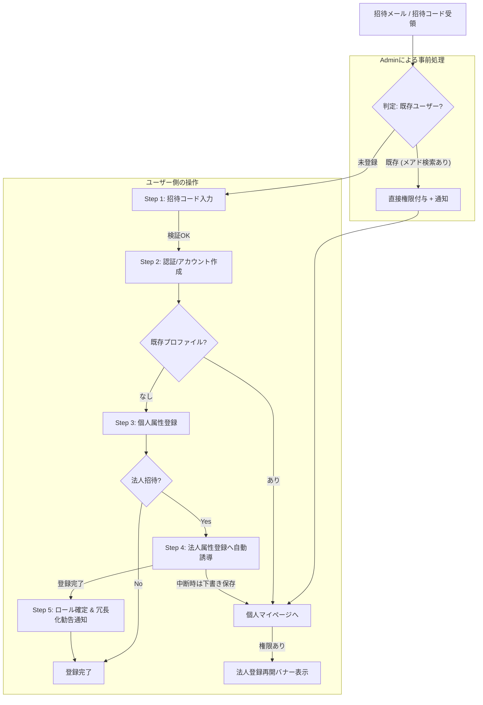

# 招待制新規登録フロー・システム設計書 (統合版)

## 1. デザイン哲学・UX方針
「エンジニアのためのプレミアムな完全招待制ビジネスSNS」として以下の3要素を最優先する。
1. **Simple & Sophisticated**: 不要な装飾を排し、直感的で迷わせないUI。
2. **One-by-One Interaction**: 一問一答形式で1項目ずつ確実に入力させる（プレミアム感の演出）。
3. **Minimal Friction**: ビジネスSNSとして最低限必要なキー項目のみを必須とし、その他の詳細はマイページからの追加登録とする。

---

## 2. 登録フロー（画面詳細）

### 各画面の要件
1. **招待コード確認**: 6〜7桁。有効期限チェックあり。
2. **個人情報保護方針**: `reference_information_fordev/instructions/個人情報保護方針_プラポリ.md` を全文表示。最下部までスクロールしないと「同意」ボタンを活性化させない。
3. **認証選択**: Google, GitHub, Email。将来的なOAuth連携を見据えたUI。
4. **属性入力**: プレミアムな一問一答UI。
   - **個人用必須項目**: 姓名、姓名(英)、メール(認証用)、電話番号、主要スキル/職種。
   - **法人用必須項目**: 会社名、担当者名、部署/役職、会社メール、会社電話。
5. **完了・通知 (New)**: 登録完了直後、法人マイページヘッダーのベルアイコンに「管理者2名体制以上の推奨」通知を表示。

---

## 3. ユーザーロール定義
「個人主体」のネットワークを構成するため、法人は属性として付与する。

| ロールラベル | 内容 | 権限 |
| :--- | :--- | :--- |
| `individual` | 全ユーザー | 基本プロフィールの構築、招待コード発行(許可制) |
| `corporate-alpha` | α：採用管理者 | 法人オーナー階層（1社最大3名）。企業情報の管理、メンバーの招待・削除、全データの管理 |
| `corporate-beta` | β：採用関係者 | 採用実務者。求人の作成、選考プロセス管理 |
| `admin` | システム管理者 | 招待コード発行、全データ管理、権限移譲 |

---

## 3.5 登録後のガバナンス保護（Alpha 運用ルール）
登録完了後、法人アカウントの健全性を維持するため、以下のガードレールが適用される。

1. **管理者（Alpha）上限名数**: 1社につき最大 3 名まで。
2. **最後1人の Alpha 保護 (Lockout Prevention)**: 
   - 社内に Alpha が 1 名しかいない状態で、そのユーザーを「削除」「降格（β/γへの変更）」「退会」させようとした場合、システムはこれをブロックする。
   - **後任指定の強制**: 実行時には警告アラートを表示し、「別のメンバーを Alpha に昇格させてから交代すること」を具体的に促す。
3. **冗長化勧告通知**: Alpha が 1 名のみの場合、ベルアイコンの通知等で定期的に複数名管理体制への移行を推奨する。

---

## 4. Firestore スキーマ設計（詳細）

### `invitationCodes` (コレクション)
招待システムの中核。

| フィールド | 型 | 説明 |
| :--- | :--- | :--- |
| `code` | string | ユニークな招待キー |
| `type` | string | `individual` または `corporate` |
| `issuerUid` | string | 発行者のユーザーID |
| `status` | string | `active` (有効), `used` (使用済), `void` (無効) |
| `expiresAt` | timestamp | 有効期限 |

### `profiles` (コレクション)
`Individual .json` をベースとした最小構成。

| フィールド | 型 | 説明 |
| :--- | :--- | :--- |
| `uid` | string | Auth UID |
| `name` | map | `{ family: string, first: string }` |
| `name_eng` | map | `{ family: string, first: string }` |
| `email` | string | 連絡用メール |
| `phone` | string | 連絡用電話番号 |
| `occupation` | string | 現職種 (エンジニア, デザイナー, 経営等) |
| `role` | string | `individual` |
| `companyId` | string? | 所属法人のID |

### `companies` (コレクション)
`company.json` をベースとした最小構成。

| フィールド | 型 | 説明 |
| :--- | :--- | :--- |
| `name` | string | 正式会社名 |
| `ownerUid` | string | 管理者(Alpha)のUID |
| `contactEmail` | string | 会社代表メール |
| `address` | string | 本社所在地 |

### `notifications` (コレクション)
システムからの通知・アラート。

| フィールド | 型 | 説明 |
| :--- | :--- | :--- |
| `uid` | string | 送信先のユーザーID |
| `type` | string | `system_alert`, `invitation`, `governance` |
| `message` | string | 通知本文 |
| `isRead` | boolean | 既読フラグ |
| `createdAt` | timestamp | 作成日時 |

### `private_info` (コレクション)
機密情報 (PII) を保護するための分離領域。

| フィールド | 型 | 説明 |
| :--- | :--- | :--- |
| `uid` | string | Auth UID |
| `email` | string | 認証および連絡用メール |
| `phone` | string | 連絡用電話番号 |
| `allowed_companies` | array<string> | 閲覧を許可された法人IDリスト |
| `updatedAt` | timestamp | 最終更新日時 |

### `registration_drafts` (コレクション)
登録プロセスの中断・再開を支えるテンポラリ領域。

| フィールド | 型 | 説明 |
| :--- | :--- | :--- |
| `uid` | string | Auth UID (ドキュメントID) |
| `type` | string | `corporate` |
| `step` | number | 中断したステップ数 |
| `formData` | map | 入力途中のデータ一式 |
| `updatedAt` | timestamp | 自動保存日時 |

---

## 5. 開発フェーズとマイルストーン

### Phase 1: Prototyping (完了)
- [x] UIフローの実装 (Invitation -> Privacy -> Method -> Form)
- [x] モックAPIによる導線確認
- [x] ナビゲーション統合

### Phase 2: Secure Integration (完了)
- [x] Firestore 実連携 (invitationCodes, profiles, private_info)
- [x] Firebase Auth 統合 (Social Login, Email)
- [x] セキュリティルールの適用
- [x] サービス層 (`registrationService.js`) の構築

### Phase 3: Verification & Fine-tuning (継続中)
- [ ] シミュレータ環境での E2E 動作検証
- [ ] 例外処理 (期限切れコード等) のハンドリング強化
- [ ] セキュリティルール (jest) による自動テストの拡充

---

## 6. セキュリティ・プライバシー設計

### 1. 招待コードの保護
- `invitationCodes` コレクションは、コード（ドキュメントID）を直接指定した場合のみ `get` 可能（`list` は禁止）。
- 使用済みコードへの再登録を拒否するロジックをサービス層およびセキュリティルールで担保。

### 2. PII (個人特定情報) の分離
- `profiles`: 他のユーザーにも公開可能な基本情報。
- `private_info`: 本人・管理者・マッチング成立企業のみが閲覧可能な機密情報（メール、電話番号等）。
---

## 7. 開発・テスト用情報

### ローカルシミュレーターでの検証
ローカル開発環境（Firestore エミュレータ）で新規登録フローをテストする際は、以下の招待コードを使用してください。

- **正常系（登録成功）**: `INVITE2024`
- **異常系（使用済みコード）**: `USED777`
- **異常系（期限切れ）**: `EXPIRED00`

> [!TIP]
> テスト用コードの投入は `./scripts/seed_invitation_codes.js` を実行してください。

---

## 8. ハイブリッド・オンボーディング・メカニズム

「プレミアムな体験」と「確実な権限管理」を両立するため、ユーザーの状態に応じた2つのルートを自動で切り替える。

### 8.1 既存ユーザーへの直接付与（Admin主導）
管理者が「法人招待」を出す際、対象のメールアドレスが既にサービスに登録されている場合、招待コードを経由せずに直接、法人登録権限を付与する。

1. **Admin検索**: `private_info` をメールアドレスで検索。
2. **直接付与**: ヒットした場合、`users/{uid}.canCreateCompany = true` を設定。
3. **通知**: アプリ内通知およびメールで、マイページに「法人登録ボタン」が出現したことを周知。

### 8.2 新規ユーザーのシームレス誘導（自動遷移・下書き）
未登録ユーザーが招待コードを使用した場合、個人登録の直後に法人登録へ自動的に誘導する。

1. **個人登録**: まずアプリ利用の基盤となる個人プロファイルを作成。
2. **自動誘導**: 完了直後、法人招待コード保持者には法人登録フォームを優先表示。
3. **オートセーブ**: 法人登録は入力項目が多いため、一問一答の回答ごとに `registration_drafts` へ保存。
4. **レジューム**: 中断しても、次回個人アプリ来訪時に「登録を再開する」バナーから即座に続きを再開可能。

---

## 9. 法人ロールおよび制限事項（ガバナンス）

### 9.1 法人登録の「1回限り」制限
1つの個人アカウントから作成できる法人アカウントは、原則として **1社のみ** とする。
- **制限の挙動**: 法人登録が完了した時点で `canCreateCompany` フラグは `false` に自動更新され、個人アプリ内の「法人登録ボタン」およびメニュー項目は即座に非表示となる。
- **再試行の禁止**: 登録完了後は、企業マイページからの編集権限のみが付与され、新たな法人を設立することはできない。

### 9.2 法人内ロール体系（α・β・γ）
法人に所属するユーザーは、以下の3つの役割（ロール）のいずれかに割り当てられる。

| ロール名 | UI表記 | 定義・権限 |
| :--- | :--- | :--- |
| `corporate-alpha` | **α：採用管理者** | 法人アカウントの設立者。企業情報の編集、メンバー招待、全採用データの閲覧が可能。 |
| `corporate-beta` | **β：採用関係者** | 採用実務の担当者。求人の作成や候補者の選考プロセス管理が可能。 |
| `corporate-gamma` | **γ：一般社員** | 非採用関係者。自社求人の閲覧やリファラル協力は可能だが、管理画面にはアクセスできない。 |

> [!IMPORTANT]
> 法人登録を完遂した「最初のユーザー」には、自動的に `corporate-alpha` ロールが付与される。

### 9.3 権限制御の優先順位
UIの表示制御およびFirestoreのセキュリティルールでは、以下の優先順位で判定を行う。
1. `role == 'corporate-alpha/beta/gamma'`: 既に法人に所属しているか？（所属済みの場合は新規登録ボタンを隠す）
2. `canCreateCompany == true`: 法人を新設する権利を持っているか？
