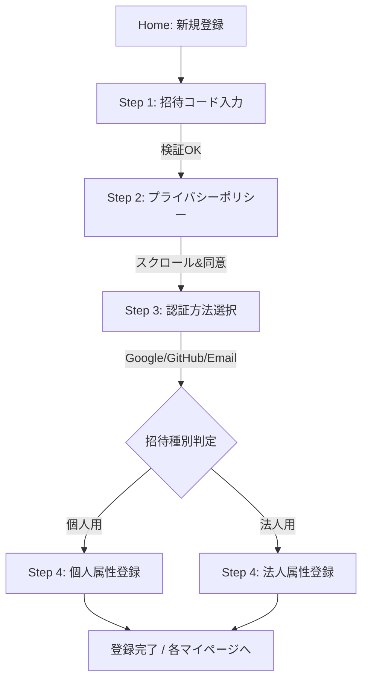

# 招待制新規登録フロー・システム設計書 (統合版)

## 1. デザイン哲学・UX方針
「エンジニアのためのプレミアムな完全招待制ビジネスSNS」として以下の3要素を最優先する。
1. **Simple & Sophisticated**: 不要な装飾を排し、直感的で迷わせないUI。
2. **One-by-One Interaction**: 一問一答形式で1項目ずつ確実に入力させる（プレミアム感の演出）。
3. **Minimal Friction**: ビジネスSNSとして最低限必要なキー項目のみを必須とし、その他の詳細はマイページからの追加登録とする。

---

## 2. 登録フロー（画面詳細）

### 各画面の要件
1. **招待コード確認**: 6〜7桁。有効期限チェックあり。
2. **個人情報保護方針**: `reference_information_fordev/instructions/個人情報保護方針_プラポリ.md` を全文表示。最下部までスクロールしないと「同意」ボタンを活性化させない。
3. **認証選択**: Google, GitHub, Email。将来的なOAuth連携を見据えたUI。
4. **属性入力**: プレミアムな一問一答UI。
   - **個人用必須項目**: 姓名、姓名(英)、メール(認証用)、電話番号、主要スキル/職種。
   - **法人用必須項目**: 会社名、担当者名、部署/役職、会社メール、会社電話。

---

## 3. ユーザーロール定義
「個人主体」のネットワークを構成するため、法人は属性として付与する。

| ロールラベル | 内容 | 権限 |
| :--- | :--- | :--- |
| `individual` | 全ユーザー | 基本プロフィールの構築、招待コード発行(許可制) |
| `corporate-alpha` | 法人管理者=採用管理者（α：代表） | 会社情報の管理、メンバー(β：採用関係者/γ：非採用関係者)の招待、組織運営 |
| `corporate-beta` | 採用担当者 | 求人情報の公開、応募者管理 |
| `admin` | システム管理者 | 招待コードの直接発行、全データ管理、権限移譲 |

---

## 4. Firestore スキーマ設計（詳細）

### `invitationCodes` (コレクション)
招待システムの中核。

| フィールド | 型 | 説明 |
| :--- | :--- | :--- |
| `code` | string | ユニークな招待キー |
| `type` | string | `individual` または `corporate` |
| `issuerUid` | string | 発行者のユーザーID |
| `status` | string | `active` (有効), `used` (使用済), `void` (無効) |
| `expiresAt` | timestamp | 有効期限 |

### `profiles` (コレクション)
`Individual .json` をベースとした最小構成。

| フィールド | 型 | 説明 |
| :--- | :--- | :--- |
| `uid` | string | Auth UID |
| `name` | map | `{ family: string, first: string }` |
| `name_eng` | map | `{ family: string, first: string }` |
| `email` | string | 連絡用メール |
| `phone` | string | 連絡用電話番号 |
| `occupation` | string | 現職種 (エンジニア, デザイナー, 経営等) |
| `role` | string | `individual` |
| `companyId` | string? | 所属法人のID |

### `companies` (コレクション)
`company.json` をベースとした最小構成。

| フィールド | 型 | 説明 |
| :--- | :--- | :--- |
| `name` | string | 正式会社名 |
| `ownerUid` | string | 管理者(Alpha)のUID |
| `contactEmail` | string | 会社代表メール |
| `address` | string | 本社所在地 |

### `private_info` (コレクション)
機密情報 (PII) を保護するための分離領域。

| フィールド | 型 | 説明 |
| :--- | :--- | :--- |
| `uid` | string | Auth UID |
| `email` | string | 認証および連絡用メール |
| `phone` | string | 連絡用電話番号 |
| `allowed_companies` | array<string> | 閲覧を許可された法人IDリスト |
| `updatedAt` | timestamp | 最終更新日時 |

---

## 5. 開発フェーズとマイルストーン

### Phase 1: Prototyping (完了)
- [x] UIフローの実装 (Invitation -> Privacy -> Method -> Form)
- [x] モックAPIによる導線確認
- [x] ナビゲーション統合

### Phase 2: Secure Integration (完了)
- [x] Firestore 実連携 (invitationCodes, profiles, private_info)
- [x] Firebase Auth 統合 (Social Login, Email)
- [x] セキュリティルールの適用
- [x] サービス層 (`registrationService.js`) の構築

### Phase 3: Verification & Fine-tuning (継続中)
- [ ] シミュレータ環境での E2E 動作検証
- [ ] 例外処理 (期限切れコード等) のハンドリング強化
- [ ] セキュリティルール (jest) による自動テストの拡充

---

## 6. セキュリティ・プライバシー設計

### 1. 招待コードの保護
- `invitationCodes` コレクションは、コード（ドキュメントID）を直接指定した場合のみ `get` 可能（`list` は禁止）。
- 使用済みコードへの再登録を拒否するロジックをサービス層およびセキュリティルールで担保。

### 2. PII (個人特定情報) の分離
- `profiles`: 他のユーザーにも公開可能な基本情報。
- `private_info`: 本人・管理者・マッチング成立企業のみが閲覧可能な機密情報（メール、電話番号等）。
---

## 7. 開発・テスト用情報

### ローカルシミュレーターでの検証
ローカル開発環境（Firestore エミュレータ）で新規登録フローをテストする際は、以下の招待コードを使用してください。

- **正常系（登録成功）**: `INVITE2024`
- **異常系（使用済みコード）**: `USED777`
- **異常系（期限切れ）**: `EXPIRED00`

> [!TIP]
> テスト用コードの投入は `./scripts/seed_invitation_codes.js` を実行してください。
