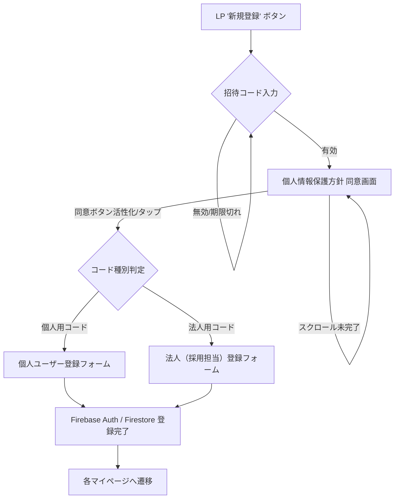
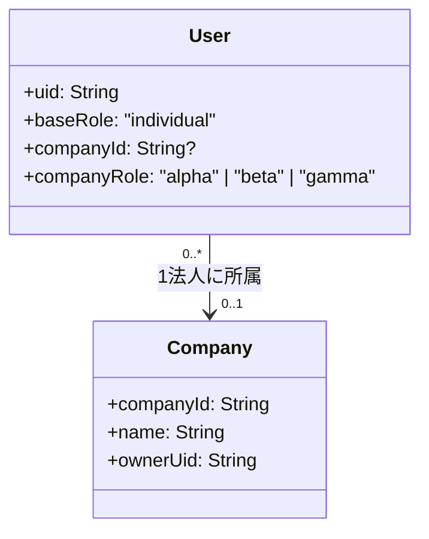

# 招待制新規登録フロー・システム設計書

本ドキュメントは、LP（ランディングページ）から始まる招待制の新規登録フロー、ユーザーロール、およびその基盤となる Firestore スキーマの設計方針をまとめたものです。

---

## 1. 登録フローの概要

ユーザーは、招待コードの入力と個人情報保護方針への同意を経て、属性（個人/法人）に応じた登録フォームへ進みます。

### 🔄 ユーザー体験フロー

---

## 2. 招待コードシステム

### 📋 招待コードの仕様
| 項目 | 内容 | 備考 |
| :--- | :--- | :--- |
| **形式** | 6〜7桁の英数字（短縮形式） | 入力しやすさを優先 |
| **有効期限** | 発行から7日間 | セキュリティと運用のバランス |
| **用途** | 個人用 / 法人用 | コードに属性を紐付け |

### 🔑 発行権限ルール
| 発行者ロール | 発行可能なコード種別 | ターゲット |
| :--- | :--- | :--- |
| **Admin (管理者)** | 個人用、法人用 | すべての新規招待 |
| **Individual (個人)** | 個人用のみ | 友人・知人の招待 |

> [!IMPORTANT]
> **Individual** ユーザーが招待コードを発行するには、Admin から「招待権限」を付与されている必要があります。

---

## 3. ユーザーロールと組織構造

「個人が主体である」という哲学に基づき、法人所属は個人アカウントへの「属性付与」として定義します。

### 👥 ユーザー分類とロール

| 分類 | ロール名/ラベル | 説明 |
| :--- | :--- | :--- |
| **個人** | `individual` | 基本ロール。全ユーザーに共通。 |
| **法人 (α)** | 採用管理者 | 法人の代表、人事責任者。全権限を持つ。 |
| **法人 (β)** | 採用関係者 | リクルーター、現場面接官。採用操作が可能。 |
| **法人 (γ)** | 非採用関係者 | 一般社員、エンジニア。自社の紹介のみ。 |

### 🏢 法人所属の概念図

---

## 4. Firestore スキーマ設計

### 📂 `invitationCodes` コレクション
比較的フィールド数が少ないため、具体的に定義します。

| フィールド名 | 型 | 説明 |
| :--- | :--- | :--- |
| `code` | string | 6〜7桁のユニークなコード |
| `type` | string | `individual` または `corporate` |
| `issuerUid` | string | 発行したユーザーの UID |
| `issuerRole` | string | 発行時のロール (admin/individual) |
| `createdAt` | timestamp | 発行日時 |
| `expiresAt` | timestamp | 有効期限（createdAt + 7days） |
| `usedCount` | number | 使用回数（通常は 1） |
| `status` | string | `active`, `used`, `expired`, `void` |

### 📂 `profiles` / `companies` コレクション（構造的概念）

- **`profiles` (or `users`)**:
    - `companyId`: 所属先の `companies` ドキュメント ID。
    - `companyRole`: 上記 α, β, γ の識別子。
- **`companies`**:
    - 法人情報を一括管理。最初の登録者（法人用コード使用）が α として設定される。

---

## 5. 実装ロードマップ

### 🚀 Phase 1: LPアプリへの統合
- 招待コード入力画面の実装
- スクロール検知付きプライバシーポリシー画面の実装
- モックAPIによる登録フローの完結

### 🏗️ Phase 2: 大規模リファクタリング
- Firestore コレクション構造の正式移行
- 法人管理（αによる β/γ の招待）機能の実装
- 各ロールに基づいたアクセス制御（Firestore Rules）の適用
