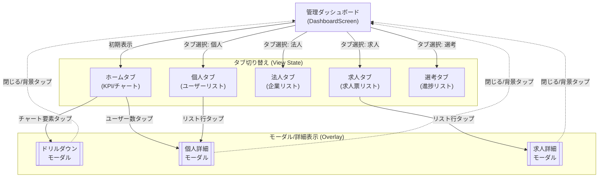
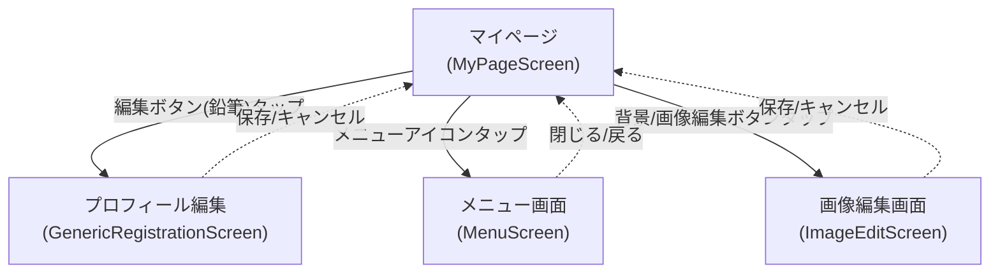
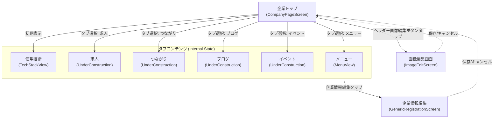
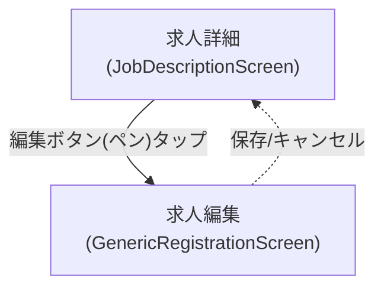
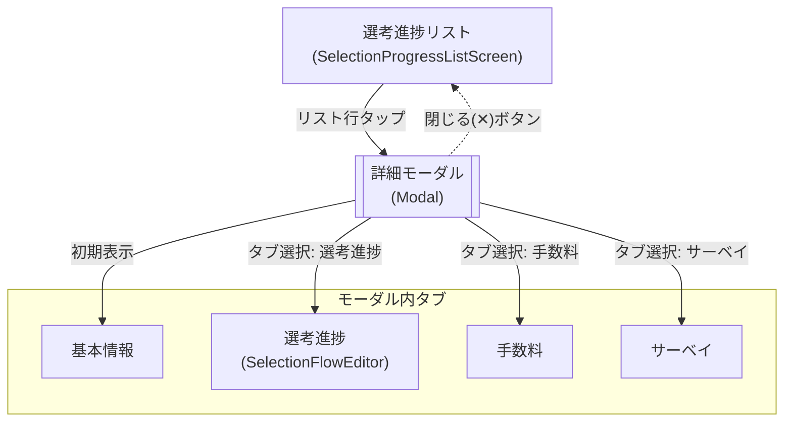

# 画面遷移図 (UI/UX Interaction Flows)

本ドキュメントでは、プロジェクト内の5つの主要サービスにおける画面遷移フローとユーザー操作（タップ、タブ切り替え、モーダル表示等）を定義します。
各フロー図は、ユーザーの体験（UX）を中心とした操作の流れを可視化しています。

参考資料
共有リンク: https://gemini.google.com/share/1ff4f3bb8aa3

## 凡例 (Legend)

| 記号 | 意味 | 説明 |
|:---:|:---|:---|
| **[Rectangle]** | **Screen** | 独立した画面ページ（URLやルートが変化する単位） |
| **[[Double Rectangle]]** | **Modal / Popup** | 現在の画面上にオーバーレイ表示される一時的な画面 |
| **subgraph** | **View State / Tabs** | 同一画面内での表示切り替え（タブ、セグメント等） |
| **-->** | **Transition / Action** | ユーザー操作による画面遷移や状態変化 |
| **-.->** | **Back / Close** | 元の画面に戻る操作（「戻る」ボタン、閉じるボタン等） |

---

## 1. 管理者向けアプリ (admin_app)

**概要**: プラットフォーム全体の状況を把握・管理するためのダッシュボード。
**特徴**: 1つの画面（DashboardScreen）内でタブを切り替えながら、詳細情報をモーダルで確認する「シングルページ・ライク」なUXです。

---

## 2. 個人ユーザー向けアプリ (individual_user_app)

**概要**: エンジニアが自身のプロフィールを管理・閲覧するためのアプリケーション。
**特徴**: マイページを起点とし、編集や設定画面へ遷移する「ハブ＆スポーク」型のUXです。

---

## 3. 企業ユーザー向けアプリ (corporate_user_app)

**概要**: 企業が自社の情報を発信し、求職者へのアピールを行うためのアプリケーション。
**特徴**: タブビュー（TabView）を使用し、コンテンツの切り替えをスムーズに行います。メニューもタブの一部として統合されています。

---

## 4. 求人詳細アプリ (job_description)

**概要**: 求人票（Job Description）の閲覧・編集を行うためのアプリケーション。
**特徴**: 閲覧モードと編集モードを往復するシンプルなフローです。

---

## 5. 選考管理アプリ (fmjs)

**概要**: 選考プロセス（Selection Flow）の進捗管理を行うためのアプリケーション。
**特徴**: 一覧リストから詳細モーダルを展開し、モーダル内でさらにタブ切り替えを行う階層的な情報表示を行います。

---

## 補足事項 (Supplementary Notes)

### 共通コンポーネント・挙動
- **GenericRegistrationScreen**: 
    - 共通コンポーネントとして実装された、汎用的な登録・編集画面です。
    - JSONテンプレートに基づき動的にフォームを生成します。
    - 「保存」タップ時にFirestoreへデータを更新し、自動的に元の画面へ戻ります。

- **UnderConstruction**: 
    - 現在開発中、または将来実装予定の画面です。
    - タップ時にはプレースホルダー画面が表示され、具体的なアクションは制限されています。

- **モーダル (Modal) 挙動**: 
    - モーダルウィンドウは現在の画面の上にオーバーレイ表示（z-index上位）されます。
    - 背景は半透明のオーバーレイで覆われ、背景部分の操作はブロックされます。
    - 「閉じる」ボタン、または背景タップ（実装による）で元の画面状態に復帰します。
    - モーダル内の状態（タブ選択など）は、モーダルが閉じられるとリセットされる場合があります（実装依存）。

### 画面間連携
- 各アプリは独立して動作しますが、Firestore（データベース）を介してデータは共有されています。
- 例：`admin_app`で編集したユーザー情報は、即座に`individual_user_app`に反映されます。
