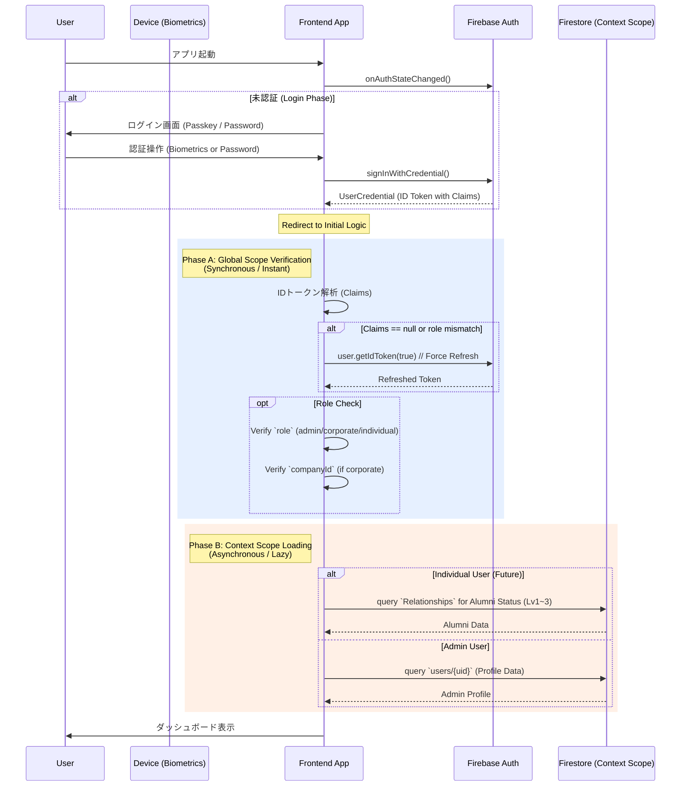

# 認証・認可設計 (Authentication & Authorization)

本ドキュメントでは、本プロジェクトにおける認証（「誰か？」の確認）および認可（「何ができるか？」の権限管理）の設計方針と実装基準を定義します。

## 1. 基本方針：ハイブリッド認証の採用

パフォーマンス、コスト、セキュリティのバランスを最適化するため、**Custom Claimsを用いたハイブリッド認証**を採用します。

### 1.1 Custom Claims とは
Firebase Authentication の IDトークン内に、ユーザーの属性や権限情報（Claims）を埋め込む機能です。
これを「デジタルのスタンプ」として活用することで、サーバーサイド（Firestore Security Rules や Backend API）での権限チェックを劇的に効率化します。

### 1.2 採用のメリット
1.  **圧倒的なパフォーマンス（爆速）**:
    *   Firestoreへの都度アクセス（`get()`）が不要になり、トークンの中身を見るだけで権限判定が完了します。
2.  **コスト削減**:
    *   権限チェックのためのFirestore読み取り課金をゼロに抑えられます。
3.  **堅牢なセキュリティ**:
    *   Claimsの設定はバックエンド（特権環境）からのみ可能であり、ユーザーによる改ざんを防止できます。

---

## 2. 認証 (Authentication)

「あなたが誰か？」を証明するプロセスです。

### 2.1 現状と将来像
*   **現状**: Admin Appにて **パスキー第一優先 / メールアドレス・パスワード フォールバック** 認証を実装済み。
*   **Phase 1 (完了)**: Admin App向けログイン画面の構築と、`AsyncStorage` による認証永続化の導入。
*   **Phase 2 (将来)**: Individual/Corporate App向けの認証フロー構築。
*   **Phase 3 (Roadmap)**: パスキーの全アプリ展開と、各OSネイティブAPIへの完全追従。

### 2.2 パスキーとの関係
パスキーと Custom Claims は競合せず、**補完関係**にあります。
*   **パスキー**: 安全かつ簡便な「ログイン（本人確認）」を提供。
*   **Custom Claims**: ログイン後の「権限チェック」を高速化。
これらを組み合わせることで、最強のUXとセキュリティを実現します。

### 2.3 実装戦略とライブラリ選定

本プロジェクトでは「モバイル体験最優先」および「将来的なFlutter移行」を見据え、以下のライブラリ選定と実装方針を採用します。

#### 2.3.1 React Native (Expo) フェーズ
Expo環境下でのネイティブ機能利用（CNG: Continuous Native Generation）を前提とし、以下の構成とします。

*   **ライブラリ**: `react-native-passkey`
    *   **選定理由**:
        *   Firebase Authのバックエンドを活用しつつ、iOS (ASAuthorizationController) / Android (Credential Manager) のネイティブAPIを直接呼び出せるデファクトスタンダード。
        *   Expo Config Pluginに対応しており、`expo-dev-client` (Custom Development Client) を用いることでExpo環境でも利用可能。
    *   **実装フロー**:
        1.  **Firebase**: WebAuthnプロバイダを有効化し、Challengeを生成。
        2.  **Native**: `react-native-passkey` で生体認証を行い、署名済みCredentialを生成。
        3.  **Verify**: Firebase JS SDK または Admin SDK (Cloud Functions) で検証し、認証を完了させる。

#### 2.3.2 Flutter 移行フェーズ (Future)
将来的な「フルスタックDart」化を見据え、Google公式のパッケージへ移行します。

*   **ライブラリ**: `passkeys` (pub.dev)
    *   **選定理由**:
        *   **公式の決定版**: Flutter Team / Google がメンテナンスしており、OSアップデート（iOS 18/Android 15等）への追従が最も早い。
        *   **親和性**: Dartバックエンド（Firebase Admin SDK等）との連携がスムーズ。
    *   **実装フロー**:
        1.  **Client**: `passkeys` パッケージでChallenge受領〜生体認証〜Credential生成を実施。
        2.  **Server (Dart)**: バックエンドでCredentialを検証。
        3.  **Auth**: 検証成功後、Firebase Custom Tokenを発行してクライアントへ返し、`signInWithCustomToken` でログイン。

#### 2.3.3 実装詳細と技術的留意点 (Technical Notes)

**A. React Native (Expo) 実装時の注意点**

*   **Firebase設定**: Firebase Console で「WebAuthn（パスキー）」プロバイダを有効化する必要があります。
*   **検証フロー**: `react-native-passkey` で取得したCredentialは、Firebase JS SDK の `reauthenticateWithPublicKeyCredential` 等、またはAdmin SDK経由で検証・同期させる必要があります。
*   **開発環境 (Expo)**:
    *   パスキーはOSの深層機能（ASAuthorizationController / Credential Manager）を使用するため、**Expo Go では動作しません**。
    *   `npx expo prebuild` を行い、**Development Client** (Custom Build) での検証が必須となります。
    *   **検証用ビルドコマンド**:
        ```bash
        # プロジェクトルートへ移動 (環境に合わせて調整してください)
        cd engineer-registration-app-yama/yama

        # iOS (Mac必須)
        cd apps/lp_app
        npx expo run:ios

        # Android
        cd apps/lp_app
        npx expo run:android

        # EAS Build (クラウドビルド)
        eas build --profile development --platform ios
        ```
*   **認証永続化 (Persistence)**:
    *   React Native環境では、`firebase/auth` の標準的な `getAuth()` 呼び出し時に `AsyncStorage` が未指定だとメモリ永続化 (`memoryPersistence`) になり、アプリ再起動でログアウトしてしまいます。
    *   **解決済み**: `firebaseConfig.js` にて `initializeAuth` を使用し、`Platform.select` により、Web環境(`browserLocalPersistence`) と Native環境(`getReactNativePersistence(ReactNativeAsyncStorage)`) を動的に切り替える実装を共通化しました。

**B. Flutter (Full Stack Dart) 移行時の設計指針**

バックエンドもDart（Dart Frog, Serverpod等）で統一する場合の役割分担は以下の通りです。

1.  **役割分担**:
    *   **フロント (Flutter/passkeys)**: ServerからChallenge受領 → 端末認証(FaceID/指紋) → 署名済みCredential生成。
    *   **バックエンド (Dart)**: Challenge生成・管理 → Credential検証 (`webauthn_dart`等を利用) → Firebase Custom Token発行。
2.  **Firebase Auth連携**:
    *   Firebase AuthのネイティブSDKはWeb版ほどパスキー対応が直感的ではないため、「①Passkeysで認証完了 → ②Backendで検証 → ③**Custom TokenでFirebaseログイン**」というフローが一般的です。
    *   移行時は `signInWithCustomToken` を用いたログインフローの実装が必要になります。


---

## 3. 認可 (Authorization) データ設計

「何をしてよいか？」を制御するデータ設計です。Custom Claims の容量制限（1000バイト）を考慮し、情報の性質に応じて保存場所を使い分けます。

### 3.1 Custom Claims に含める情報（Global Scope）
システム全体で頻繁に利用され、変更頻度が比較的低い「基本ロール」を格納します。

| キー | 値の例 | 説明 |
| :--- | :--- | :--- |
| `role` | `"admin"`, `"corporate"`, `"individual"` | アプリケーションの基本利用区分 |
| `companyId` | `"B00001"`, `null` | 所属企業ID（法人ユーザーのみ） |
| `plan` | `"free"`, `"premium"` | (将来用) サブスクリプションプラン |

> [!NOTE]
> **`id_individual`（個人ユーザーID）をCustom Claimsに含めない理由**:
> 本プロジェクトでは、個人ユーザーID（例: `C202501010001`）を **Firebase Auth の UID として運用**しているため、個人IDは `request.auth.uid` として常に利用可能である。
> このため、Claimsに重複して格納する必要がない（容量制約・伝播遅延の観点でも不利）。
> 実際にFirestore Security Rulesでも `resource.data['id_individual_個人ID'] == request.auth.uid` の形式で直接比較している。

**判定ロジック（Firestore Rules 例）**:
```javascript
// DBアクセスなしで瞬時に判定可能
allow write: if request.auth.token.role == 'admin';
allow read: if request.auth.token.companyId == resource.data.companyId;
```

### 3.2 Firestore に持たせる情報（Context Scope）
数が膨大になるリレーション情報や、動的に変動するステータスは、引き続き Firestore 上で管理し、必要に応じて参照します。

*   **アルムナイ区分 (Lv1〜Lv3)**:
    *   「個人A」対「法人B」のような個別具体的な関係性は、組み合わせが膨大になるため Custom Claims には不向きです。
    *   これらは Firestore の `Relationships` コレクション等で管理し、バックエンドロジックまたはセキュリティルールの `get()` で判定します。

    | レベル | 名称 | 定義 |
    | :--- | :--- | :--- |
    | **Lv1** | 通常つながり | 相互フォロー |
    | **Lv2** | 準アルムナイ | 現/元非正社員 or 半年以上の同僚関係（個人間）/ 勤務関係（法人間） |
    | **Lv3** | 正アルムナイ | 現/元正社員 or 2年以上の同僚関係（個人間）/ 勤務関係（法人間） |

    *参照: [Individual.json `繋がり` セクション](../../yama/reference_information_fordev/json/Individual/Individual%20.json)*

### 3.3 Custom Claims の更新タイミングと伝播遅延

> [!WARNING]
> Custom Claims の変更は **IDトークンのリフレッシュ時（最大1時間後）** に反映されます。
> つまり、`role` や `companyId` を変更しても、**即座にはクライアントに反映されません**。

**対策**:
*   Claims変更後、クライアント側で `user.getIdToken(true)` を呼び出してトークンを強制リフレッシュする。
*   UX上、Claims変更が必要な操作（例: ロール昇格）の直後に再ログインを促すフローを検討する。

### 3.4 コレクション別アクセスポリシーとの対応関係

本ドキュメントの Claims（§3.1）および Context Scope（§3.2）の設計は、以下のドキュメントで定義されたコレクション別アクセスポリシーおよび `firestore.rules` の実装と対応しています。

**→ [Sec_RefactoringPlan.md §3「Firestoreデータ構造・権限設計詳細」](./Sec_RefactoringPlan.md)**

| コレクション | 判定に使用するデータ | 参照元 |
| :--- | :--- | :--- |
| `FeeMgmtAndJobStatDB` | `token.role`, `token.companyId` | Custom Claims (§3.1) |
| `public_profile` | `auth.uid` | Firebase Auth (常時利用可) |
| `private_info` | `auth.uid`, `allowed_companies` | Firebase Auth + Firestore `get()` (§3.2) |
| `corporate` / `job_description` | `token.role`, `token.companyId` | Custom Claims (§3.1) |
| `users` | `auth.uid`, `token.role` | Firebase Auth + Custom Claims |

---

## 4. アカウント運用ルール

### 4.1 Admin権限者のID分離
開発チームメンバーであっても、個人の検証用アカウントに安易に Admin 権限を付与してはいけません。

*   **ルール**: Admin 権限を持つアカウントは、**専用の独立したID**（例: `admin_dev@example.com`）として作成・管理する。
*   **理由**:
    1.  **権限の分離**: 日常の開発・検証（一般ユーザー視点）と、管理操作（特権視点）を明確に区別し、意図しないデータ閲覧や操作ミスを防ぐため。
    2.  **セキュリティ**: 万が一の個人アカウント流出時に、管理権限まで奪われるリスクを遮断するため。

### 4.2 バックエンド実装要件
Custom Claims を付与するための仕組みを `apps/backend` (Dart) に実装する必要があります。

1.  **Firebase Admin SDK の導入**: Dart バックエンドから特権操作を行うためのセットアップ。
2.  **Claims 付与 API**: 特定のユーザーに対して `setCustomUserClaims` を実行する機能（Adminのみ実行可能）。

### 4.3 Claims 付与の運用フロー（検討事項）
Claims をいつ・誰が・どのトリガーで付与するかを明確にする必要がある。

| トリガー | 対象Claims | 付与主体 | 備考 |
| :--- | :--- | :--- | :--- |
| **ユーザー新規登録時** | `role` (individual) | Cloud Functions (自動) | `onCreate` トリガーで自動付与 |
| **法人アカウント作成時** | `role` (corporate), `companyId` | Admin画面から手動 or API | 管理者が企業紐付けと同時に付与 |
| **Admin権限の昇格時** | `role` (admin) | 既存Admin が Admin画面から手動 | 権限分離の原則に基づき、慎重に運用 |
| **企業所属の変更時** | `companyId` | Admin画面 or バックエンドAPI | 転職・異動時にCompanyIdを更新 |
| **プラン変更時** | `plan` | 決済システム連携 (将来) | サブスクリプション変更に連動 |

---

## 5. Adminアカウントの管理設計

### 5.1 新規コレクションの要否

> [!IMPORTANT]
> **結論: Admin専用の新規Firestoreコレクションは不要。**
> 既存の `users` コレクションで Admin アカウントを一元管理する。

**理由**:
1.  `users` コレクションは既に `role` フィールド（`admin`, `corporate`, `individual`）を持ち、全ロールを統一管理する設計になっている。
2.  `firestore.rules` の `isAdmin()` 関数は `request.auth.token.role == 'admin'`（Custom Claims）で判定しており、別コレクションを参照しない。
3.  アカウント管理を分散させると、整合性の維持コストが増大する。

### 5.2 Adminアカウントのデータ構造

Adminアカウントは以下の構成で管理される。

#### Firestore `users/{uid}` ドキュメント

| フィールド | 型 | 値 | 説明 |
| :--- | :--- | :--- | :--- |
| `adminId` | string | `"a000"`, `"a001"` | 管理者識別ID（aと数字3桁の4桁） |
| `role` | string | `"admin"` | アプリケーションロール |
| `companyId` | string / null | `null` | 管理者は特定企業に所属しない |
| `email` | string | `"m.yamakawa@lat-inc.com"` | 連絡先・識別用 |
| `displayName` | string | `"M. Yamakawa"` | 表示名 |
| `createdAt` | timestamp | - | 作成日時 |
| `updatedAt` | timestamp | - | 更新日時 |

#### Firebase Authentication アカウント

| 項目 | 説明 |
| :--- | :--- |
| **認証方式** | メールアドレス / パスワード |
| **Custom Claims** | `{ role: "admin" }` |
| **UID** | Firestore `users` のドキュメントIDと一致 |

### 5.3 初期Adminアカウント（2名分）

以下の2アカウントを初期構成として作成する。

| # | Admin ID | Firebase Auth Email | UID (Generated) | displayName | 用途 |
| :--- | :--- | :--- | :--- | :--- | :--- |
| 1 | `A000` | `m.yamakawa@lat-inc.com` | `KPXa3AqE8QUUdHp9plpT9ubTOvv1` | M. Yamakawa | 主管理者 |
| 2 | `A001` | `t.sameshima@lat-inc.com` | `aRm2vSYQv3ceXx3Qdnbx7HbaQSe2` | T. Sameshima | 副管理者 |

> [!NOTE]
> **作成手順**:
> 1. Firebase Console → Authentication → ユーザーを追加（メール/パスワード）
> 2. 取得した UID を使い、Firestore `users/{uid}` に上記スキーマのドキュメントを作成
> 3. Firebase Admin SDK で `setCustomUserClaims(uid, { role: 'admin' })` を実行
>
> 手順3はバックエンド実装（§4.2）完了後に自動化が可能。それまでは Firebase Console または Admin SDK スクリプトで手動設定する。

> [!NOTE]
> **UID再発行時のリカバリ（運用メモ）**:
> - 管理者アカウントのUIDが変わった場合、最低限「新UIDへ Custom Claims（admin）を付与」し、「`users/{uid}` のデータを移行」する必要があります。
> - 開発用途として、Callable Functions に `repairAdminPermissions`（Custom Claims 付与 + `users` データ移行）を用意しています（実装: `apps/functions/src/passkey.js`）。
> - 本番運用では、実行可能者の制限・監査ログ・不要になった関数の削除を前提に運用してください。

---

## 6. ログインアーキテクチャ設計（Passkey完全対応 & Hybrid Auth）

> [!CAUTION]
> **本セクションは設計ドキュメントです。実装は別途計画に基づいて行う。**

### 6.1 設計方針

1.  **Authentication (本人確認)**:
    - **Passkey First**: 2026年標準の FIDO/WebAuthn を主軸とし、UXとセキュリティを最大化する。
    - **Fallback**: パスキー未対応環境のために従来のメール/パスワード認証も維持する。

2.  **Authorization (権限管理)**:
    - **Custom Claims フル活用 (Global Scope)**: `role` や `companyId` などの基本権限は、Firestoreアクセスなしで Custom Claims から即座に判定する (§3.1準拠)。
    - **UI向けフォールバック（遷移先決定のみ）**: LPアプリ等の「遷移先決定」では、Claims未付与/伝播遅延のケースに備え、以下の順序でフォールバックを許容する（ただし、セキュリティルール上の根本権限は Custom Claims を正とする）。
        1. `user.getIdTokenResult().claims.role`（必要に応じて `user.getIdToken(true)` で強制リフレッシュ）
        2. `uid` 先頭文字（`A`=`admin`, `B`=`corporate`, `C`=`individual`）※本プロジェクトのUID規約に依存
        3. Firestore `users/{uid}.role`（互換: `Users/{uid}.role`）
        4. それでも不明なら遷移せず、復旧導線（再試行/再ログイン）を提示する
    - **Context Data 遅延ロード (Context Scope)**: アルムナイ区分（Lv1〜Lv3）などの複雑なリレーション情報は、ログイン後の非同期処理として Firestore から取得する (§3.2準拠)。

### 6.1.1 開発・検証環境の固定（dev / prod 分離）

Passkey/WebAuthn は OS レベルで **RP ID（ドメイン）と Origin の整合**が強制されるため、開発時に Origin が毎回変動する環境（例: トンネルURL、端末から到達できない `localhost`）に依存すると、再現性のない失敗が発生しやすい。

本プロジェクトでは、本番でも通用する形として以下を原則とする。

1. **dev 用の固定ドメインを用意し、検証をそこへ寄せる**
   - dev/prod それぞれで、AASA（iOS）/ Asset Links（Android）が成立するドメインを固定する。
2. **Functions 側の検証条件を「許可リスト（複数 Origin）」で管理する**
   - `PASSKEY_RP_ID` と `EXPECTED_ORIGINS`（複数）を環境変数として持ち、dev/prod を明確に分離する。
3. **UI のリダイレクト先は「端末から到達可能」であることを前提に固定する**
   - ローカルの `localhost` 依存を避け、dev は dev Hosting URL、prod は prod Hosting URL に寄せる。

> [!NOTE]
> **本プロジェクトの固定ドメイン（現運用）**:
> - **LP（prod）**: `https://latcoltd.net`（カスタムドメイン）
> - **LP（dev）**: `https://engineer-registration-lp-dev.web.app`（Firebase標準）
> - **LP（legacy）**: `https://engineer-registration-lp.web.app`（移行期間のみ互換用途で残す想定）

### 6.2 認証・認可フロー詳細



### 6.3 データアクセスの階層化

本プロジェクトの基本方針に基づき、データアクセスを明確に2層に分離して実装する。

#### Layer 1: Global Scope (Custom Claims)
*   **データソース**: Firebase Auth ID Token
*   **特徴**: **同期・ゼロレイテンシー・コストゼロ**
*   **用途**:
    *   アプリの基本ルーティング（Admin画面へ行くか、一般画面か）
    *   セキュリティルールの根本判定（`allow write: if request.auth.token.role == 'admin'`）
    *   **※ここに `id_individual` は含めない**（`auth.uid` で代替可能）。

#### Layer 2: Context Scope (Firestore)
*   **データソース**: Firestore (`users`, `Relationships`, etc.)
*   **特徴**: **非同期・読み取りコストあり**
*   **用途**:
    *   **アルムナイ区分 (Lv1〜Lv3)**: 企業と個人の動的な関係性。
    *   画面表示用の詳細プロフィールデータ。
*   **実装方針**:
    *   Layer 1 の判定通過後、必要なタイミングでのみ `get()` または `onSnapshot()` する。
    *   これにより、ログイン直後のホワイトアウト時間を最小化する。

### 6.4 画面設計 (UX)

#### LoginScreen
「パスワードレス」を前提としたモダンなUIを構築する。

1.  **Primary Action (Passkey)**:
    - 画面中央に大きく「✨ パスキーでログイン」ボタンを配置。
    - ユーザーの認知負荷を最小限にする。
2.  **Secondary Action (Fallback)**:
    - その下に控えめに「パスワードまたはメールでログイン」リンクを配置。
    - クリックすると従来の `TextInput` フォーム（Email/Password）が展開されるアコーディオンUI、または別画面へ遷移。
3.  **Registration Flow (初回)**:
    - Adminユーザーが初回（パスワードで）ログインした直後、**「次回からパスキーでログインしますか？」** というプロンプトを表示。
    - `linkWithCredential` を使用して、既存のパスワードアカウントにパスキーを紐付けるフローを実装する。

### 6.5 技術スタックと実装要件

Firebase Authentication は Passkey (WebAuthn) をネイティブサポートしている。

| コンポーネント | 技術選定 | 備考 |
| :--- | :--- | :--- |
| **Passkey Provider (Web)** | Firebase Auth (WebAuthn) | `@firebase-web-authn/browser` の `signInWithPasskey(auth, functions)` を利用する。 |
| **Passkey Provider (Native)** | `react-native-passkey` + Cloud Functions | Challenge取得 → OS認証 → 署名検証 → Custom Token発行 → `signInWithCustomToken` の経路で Firebase Auth に接続する。 |
| **Frontend** | Expo (React Native) | Passkey（Native）は Expo Go では動作しないため Development Client を前提とする。 |
| **Hosting** | Firebase Hosting | dev/prod の固定ドメインで AASA（iOS）/ Asset Links（Android）を成立させる（例: prod=`latcoltd.net`, dev=`engineer-registration-lp-dev.web.app`）。 |

> [!NOTE]
> **Admin App の提供形態**:
> Admin App は現在 Web (Firebase Hosting) としてデプロイされているため、ブラウザ標準の WebAuthn API がそのまま利用可能であり、実装ハードルは低い。
>
> **スマホブラウザでのPasskey利用時の前提**:
> Passkey / WebAuthn をスマホのブラウザで正常動作させるには、`https://` などのセキュアコンテキストが必須となる。このため、Firebase Hosting などの HTTPS ホスティング環境上で提供することを推奨する。

### 6.6 セキュリティ & リカバリー

| シナリオ | 対策 |
| :--- | :--- |
| **デバイス紛失** | パスキーはデバイス依存だが、同期（iCloud Keychain / Google Password Manager）されていれば新端末でも即ログイン可能。 |
| **同期外環境からのアクセス** | 予備手段としての「メール+パスワード」認証を維持する。 |
| **権限剥奪** | Firebase Console または Admin SDK から当該ユーザーを `disabled` にするか、特定のパスキー登録を削除する。 |

### 6.7 アーキテクチャ選定理由 (Shared Library vs Standalone App)

- OAuth（Google/GitHub Login）の観点: 利用者側から見てアプリ内完結型（Shared Library）の方がUXが良く、外部ブラウザ遷移や戻り先の不整合など「リダイレクト地獄」を回避できる。
- SSO（シングルサインオン）対応: iOSのKeychain共有などOSレベルの仕組みを活用すれば、独立アプリを作らずとも実質的なSSOを達成可能であり、Shared Library構成でも要件を満たせる。

#### Shared Library を採用する主理由
- 単一の認証コンテキスト: Auth/Functions/Firestore のクライアントSDKが同一アプリコンテキストで動作し、トークンやApp Checkの連携がシンプルになる。
- ルーティング一貫性: 役割（Admin/Corporate/Individual）に応じた画面遷移をアプリ内の状態管理で完結でき、深いリンクや戻り動線が安定する。
- エラーハンドリング容易化: 認証・認可失敗時のUI/リトライロジックを単一の設計で共通化できる。
- テスト容易性: 単一コードベースでのユニット/E2E検証が可能（Auth Portalを含む）。
- 同一オリジン前提の機能適合: Passkey/WebAuthn は同一ドメイン到達が前提であり、Hostingのrewriteのみで到達性を担保しやすい。

#### Standalone App を検討すべき条件
- 規制や分離要件: 厳密なデータ境界や監査要件により、認証UI/フローを物理的に分離する必要がある場合。
- OS固有機能の専用活用: ネイティブOSのセキュア領域への深い統合が必須で、共有ライブラリ形態だと制約が大きい場合。

#### 設計パターンとの整合
- UIの共通化: 役割別のUIは「Generic Wrapper Pattern」で共通コンポーネントへ集約し、設定注入で差分を吸収する。
- インポート戦略: Adminのみが利用する機能でも、個別アプリとAdminでのみ利用する機能はShared化せず、個別アプリに配置してAdminから直接importする（共通機能のみSharedへ）。

#### 決定のまとめ
- 本プロジェクトでは Shared Library を基本方針とし、SSOはOSのKeychain共有等で達成する。Standalone化は規制・分離要件が明確な場合に限る。

### 6.8 開発・検証用ポータル (Auth Portal)

全ユーザー共通のログイン画面を確認・検証するために、専用の **Auth Portal** を用意しています。
実体は `admin_app` のコンテナを利用していますが、ポートを分離することで独立した検証環境として機能します。

*   **起動コマンド**: `bash scripts/start_expo.sh auth_portal`
*   **ポート**: `8086`
*   **URL (Web)**: http://localhost:8086
*   **Expo Go**: `exp://xa-ezgm-anonymous-8086.exp.direct` (トンネルモード / Email・Password の確認用途)
*   **特徴**:
    *   アプリ名が「ログイン画面」として表示されます（`app.config.js` で動的切替）。
    *   Admin/Corporate/Individual 全ユーザーのログインエントリポイントとして機能検証が可能です。
    *   Passkey（Native）の検証は、§6.1.1 の原則に従い dev/prod の固定ドメインと Development Client を前提に行う。

## 7. 実装計画 (Implementation Plan)

本アーキテクチャを実現するための段階的実装ロードマップです。
進捗管理は GitHub Milestone [**Auth機能 (Milestone #14)**](https://github.com/yama-0t0k0/engineer-registration-app/milestone/14) で行います。

### Phase 1: 認証基盤の刷新 (Passkey Foundation)
まず「パスキー認証」を実装し、その予備手段としてメール/パスワード認証を統合する。

- [x] **1.1 Passkey Login UI の実装** ([Issue #369](https://github.com/yama-0t0k0/engineer-registration-app/issues/369))
    - `SignInScreen` を新規作成。
    - 「Passkeyでログイン」ボタンをメインに配置。
    - 「パスワードを使う」フォールバックUIを実装。
    - **Auth Portal (Port 8086)** での動作検証環境を構築。
- [x] **1.2 Firebase Auth 連携** ([Issue #370](https://github.com/yama-0t0k0/engineer-registration-app/issues/370))
    - `signInWithCredential` (WebAuthn) の実装 (Web対応)。
    - `signInWithEmailAndPassword` の実装 (Fallback)。
    - `AsyncStorage` を用いた認証永続化の実装。
- [x] **1.3 既存認証の置換** ([Issue #371](https://github.com/yama-0t0k0/engineer-registration-app/issues/371))
    - `App.js` の `signInAnonymously` を廃止し、`onAuthStateChanged` で未認証時に `SignInScreen` を表示するよう変更。

### Phase 2: 認可・コンテキスト統合 (Hybrid Auth)
「Custom Claims (Global Scope)」と「Context Scope (Firestore)」のハイブリッド認可を実装する。

- [ ] **2.1 Global Scope (Claims) 判定** ([Issue #372](https://github.com/yama-0t0k0/engineer-registration-app/issues/372))
    - ログイン直後に IDトークンを解析し、`role` と `companyId` を検証するロジックを実装。
    - Claims がない場合に `getIdToken(true)` で強制リフレッシュする処理を追加。
- [ ] **2.2 Context Scope (Firestore) 接続** ([Issue #373](https://github.com/yama-0t0k0/engineer-registration-app/issues/373))
    - **Admin**: `users/{uid}` からプロフィール情報を取得し、ダッシュボードに表示。
    - **(Future) Individual**: `Relationships` からアルムナイ区分を取得する基盤を用意。

### Phase 3: クリーンアップ & 本番化 ([Issue #374](https://github.com/yama-0t0k0/engineer-registration-app/issues/374))
- [ ] **3.1 開発用フラグの削除**
    - `dev_admin_grant` などの暫定コードを完全削除。
- [ ] **3.2 エラーハンドリング強化**
    - 認可失敗時、ネットワークエラー時のユーザーフィードバックを洗練させる。

---

## 8. 外部コンテンツ管理アーキテクチャ (microCMS連携)

microCMSを活用したスマホネイティブアプリ（LP）開発とそのLP向けのコンテンツ配信において、Firebase認証・認可を組み合わせたセキュアなアーキテクチャを採用します。

microCMS
https://microcms.io/

### 8.1 概要と目的

*   **microCMS**: APIベースの日本製ヘッドレスCMS。すべてのコンテンツをJSON形式で返却するため、Expo (React Native) や Flutter (Dart) との親和性が高い。
*   **目的**: microCMS無料プランを活用したスマホネイティブなLPやWebサイトを構築し、Firebaseによる認証・認可で特定のユーザー（会員など）のみにコンテンツを表示する。

### 8.2 アーキテクチャ構成 (Cloud Functions + Custom Claims)

microCMSのAPIキーをクライアント（アプリ）に持たせず、Cloud Functionsを経由させることで、**APIキーの隠蔽**と**ロールベースの認可制御**を同時に実現します。

#### 構成イメージ

1.  **認証 (Authentication)**:
    *   アプリから Firebase Auth でログイン。
2.  **権限付与 (Authorization)**:
    *   会員登録時や管理操作時に、Cloud Functions 等でユーザーに Custom Claims（例: `plan: "premium"`, `role: "individual"`）を付与。
    *   ※ §3.1 の定義 (`role`, `plan`) に準拠。
3.  **認可とデータ取得 (Secure Fetch)**:
    *   アプリは microCMS を直接叩かず、Cloud Functions (HTTP Function / `onRequest`) を `fetch` で呼び出す。
    *   Functions は `Authorization: Bearer <ID_TOKEN>` が付与されていれば `verifyIdToken` で検証し、未付与ならゲストとして扱う。
    *   microCMS 側のコンテンツ一覧は `getLpContent` が取得し、APIキーは Functions の環境変数で隠蔽する。
    *   Latest News（Note マガジン）は `getNoteMagazineNews` が RSS を取得・整形して返却する（Web 側の CORS 制約回避のため）。
    *   取得したデータ（JSON）をアプリに返却し、フロント側でリスト表示する。

### 8.3 採用理由 (Best Practice)

この構成が最適である理由は以下の通りです。

1.  **APIキーの完全な隠蔽**:
    *   microCMS無料版のAPIキーは権限管理が細かくできない場合が多く、フロントエンドに露出させると全コンテンツが抜き取られるリスクがある。
    *   サーバーサイド（Functions）に環境変数として隠蔽することで、このリスクを排除できる。
2.  **ロール判定の容易さとパフォーマンス**:
    *   Custom Claims (`plan: "premium"` 等) を用いることで、Firestoreへの問い合わせなしで即座に権限判定が可能（§1.1 参照）。
3.  **ネイティブアプリとの親和性**:
    *   アプリ側では Firebase SDK の `getIdTokenResult()` を呼ぶだけで現在の権限状態を確認でき、UIの出し分け（鍵マーク表示など）が容易。

### 8.4 他の選択肢との比較（不採用理由）

| 選択肢 | 判定 | 理由 |
| :--- | :--- | :--- |
| **Firestore Security Rules** | ❌ | Firestore/Storage専用のルールであり、外部API (microCMS) のアクセス制御には使用できない。 |
| **Identity Platform** | ❌ | マルチテナントBtoB向け機能であり、LPの会員限定コンテンツ程度の認可にはオーバースペックかつ高コスト・複雑。 |

### 8.5 注意点と対策

*   **APIリクエスト数制限**:
    *   microCMS無料版には月間APIリクエスト数に上限がある。
    *   対策: Cloud Functions側でキャッシュ戦略（Redis等）を検討するか、更新頻度の低いデータはFirestoreへ同期（コピー）して読み取る構成を検討する。
