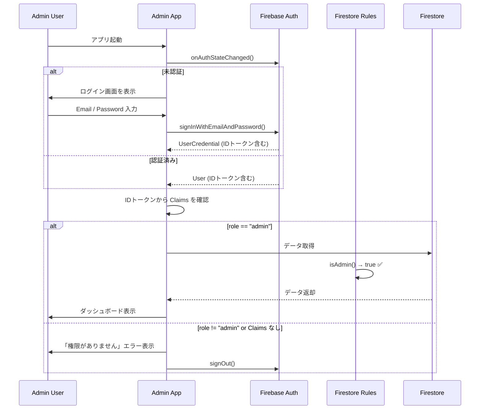

# 認証・認可設計 (Authentication & Authorization)

本ドキュメントでは、本プロジェクトにおける認証（「誰か？」の確認）および認可（「何ができるか？」の権限管理）の設計方針と実装基準を定義します。

## 1. 基本方針：ハイブリッド認証の採用

パフォーマンス、コスト、セキュリティのバランスを最適化するため、**Custom Claimsを用いたハイブリッド認証**を採用します。

### 1.1 Custom Claims とは
Firebase Authentication の IDトークン内に、ユーザーの属性や権限情報（Claims）を埋め込む機能です。
これを「デジタルのスタンプ」として活用することで、サーバーサイド（Firestore Security Rules や Backend API）での権限チェックを劇的に効率化します。

### 1.2 採用のメリット
1.  **圧倒的なパフォーマンス（爆速）**:
    *   Firestoreへの都度アクセス（`get()`）が不要になり、トークンの中身を見るだけで権限判定が完了します。
2.  **コスト削減**:
    *   権限チェックのためのFirestore読み取り課金をゼロに抑えられます。
3.  **堅牢なセキュリティ**:
    *   Claimsの設定はバックエンド（特権環境）からのみ可能であり、ユーザーによる改ざんを防止できます。

---

## 2. 認証 (Authentication)

「あなたが誰か？」を証明するプロセスです。

### 2.1 現状と将来像
*   **現状（未実装）**: 認証機能は未構築。Admin Appは `signInAnonymously`（匿名認証）で暫定的に動作しており、Individual/Corporate Appにはログイン画面が存在しない。
*   **Phase 1 (計画中)**: Admin App向けに **メールアドレス/パスワード認証** によるログイン画面を構築（→ §6 参照）。
*   **Phase 2 (将来)**: Individual/Corporate App向けの認証フロー構築。
*   **Phase 3 (Roadmap)**: **パスキー (Passkey)** の導入を検討。

### 2.2 パスキーとの関係
パスキーと Custom Claims は競合せず、**補完関係**にあります。
*   **パスキー**: 安全かつ簡便な「ログイン（本人確認）」を提供。
*   **Custom Claims**: ログイン後の「権限チェック」を高速化。
これらを組み合わせることで、最強のUXとセキュリティを実現します。

---

## 3. 認可 (Authorization) データ設計

「何をしてよいか？」を制御するデータ設計です。Custom Claims の容量制限（1000バイト）を考慮し、情報の性質に応じて保存場所を使い分けます。

### 3.1 Custom Claims に含める情報（Global Scope）
システム全体で頻繁に利用され、変更頻度が比較的低い「基本ロール」を格納します。

| キー | 値の例 | 説明 |
| :--- | :--- | :--- |
| `role` | `"admin"`, `"corporate"`, `"individual"` | アプリケーションの基本利用区分 |
| `companyId` | `"B00001"`, `null` | 所属企業ID（法人ユーザーのみ） |
| `plan` | `"free"`, `"premium"` | (将来用) サブスクリプションプラン |

> [!NOTE]
> **`id_individual`（個人ユーザーID）をCustom Claimsに含めない理由**:
> 個人ユーザーのIDは `request.auth.uid` として常に利用可能であるため、Claimsに重複して格納する必要がない。
> 実際にFirestore Security Rulesでも `resource.data['id_individual_個人ID'] == request.auth.uid` の形式で直接比較している。

**判定ロジック（Firestore Rules 例）**:
```javascript
// DBアクセスなしで瞬時に判定可能
allow write: if request.auth.token.role == 'admin';
allow read: if request.auth.token.companyId == resource.data.companyId;
```

### 3.2 Firestore に持たせる情報（Context Scope）
数が膨大になるリレーション情報や、動的に変動するステータスは、引き続き Firestore 上で管理し、必要に応じて参照します。

*   **アルムナイ区分 (Lv1〜Lv3)**:
    *   「個人A」対「法人B」のような個別具体的な関係性は、組み合わせが膨大になるため Custom Claims には不向きです。
    *   これらは Firestore の `Relationships` コレクション等で管理し、バックエンドロジックまたはセキュリティルールの `get()` で判定します。

    | レベル | 名称 | 定義 |
    | :--- | :--- | :--- |
    | **Lv1** | 通常つながり | 相互フォロー |
    | **Lv2** | 準アルムナイ | 現/元非正社員 or 半年以上の同僚関係（個人間）/ 勤務関係（法人間） |
    | **Lv3** | 正アルムナイ | 現/元正社員 or 2年以上の同僚関係（個人間）/ 勤務関係（法人間） |

    *参照: [Individual.json `繋がり` セクション](../../yama/reference_information_fordev/json/Individual/Individual%20.json)*

### 3.3 Custom Claims の更新タイミングと伝播遅延

> [!WARNING]
> Custom Claims の変更は **IDトークンのリフレッシュ時（最大1時間後）** に反映されます。
> つまり、`role` や `companyId` を変更しても、**即座にはクライアントに反映されません**。

**対策**:
*   Claims変更後、クライアント側で `user.getIdToken(true)` を呼び出してトークンを強制リフレッシュする。
*   UX上、Claims変更が必要な操作（例: ロール昇格）の直後に再ログインを促すフローを検討する。

### 3.4 コレクション別アクセスポリシーとの対応関係

本ドキュメントの Claims（§3.1）および Context Scope（§3.2）の設計は、以下のドキュメントで定義されたコレクション別アクセスポリシーおよび `firestore.rules` の実装と対応しています。

**→ [Sec_RefactoringPlan.md §3「Firestoreデータ構造・権限設計詳細」](./Sec_RefactoringPlan.md)**

| コレクション | 判定に使用するデータ | 参照元 |
| :--- | :--- | :--- |
| `FeeMgmtAndJobStatDB` | `token.role`, `token.companyId` | Custom Claims (§3.1) |
| `public_profile` | `auth.uid` | Firebase Auth (常時利用可) |
| `private_info` | `auth.uid`, `allowed_companies` | Firebase Auth + Firestore `get()` (§3.2) |
| `corporate` / `job_description` | `token.role`, `token.companyId` | Custom Claims (§3.1) |
| `users` | `auth.uid`, `token.role` | Firebase Auth + Custom Claims |

---

## 4. アカウント運用ルール

### 4.1 Admin権限者のID分離
開発チームメンバーであっても、個人の検証用アカウントに安易に Admin 権限を付与してはいけません。

*   **ルール**: Admin 権限を持つアカウントは、**専用の独立したID**（例: `admin_dev@example.com`）として作成・管理する。
*   **理由**:
    1.  **権限の分離**: 日常の開発・検証（一般ユーザー視点）と、管理操作（特権視点）を明確に区別し、意図しないデータ閲覧や操作ミスを防ぐため。
    2.  **セキュリティ**: 万が一の個人アカウント流出時に、管理権限まで奪われるリスクを遮断するため。

### 4.2 バックエンド実装要件
Custom Claims を付与するための仕組みを `apps/backend` (Dart) に実装する必要があります。

1.  **Firebase Admin SDK の導入**: Dart バックエンドから特権操作を行うためのセットアップ。
2.  **Claims 付与 API**: 特定のユーザーに対して `setCustomUserClaims` を実行する機能（Adminのみ実行可能）。

### 4.3 Claims 付与の運用フロー（検討事項）
Claims をいつ・誰が・どのトリガーで付与するかを明確にする必要がある。

| トリガー | 対象Claims | 付与主体 | 備考 |
| :--- | :--- | :--- | :--- |
| **ユーザー新規登録時** | `role` (individual) | Cloud Functions (自動) | `onCreate` トリガーで自動付与 |
| **法人アカウント作成時** | `role` (corporate), `companyId` | Admin画面から手動 or API | 管理者が企業紐付けと同時に付与 |
| **Admin権限の昇格時** | `role` (admin) | 既存Admin が Admin画面から手動 | 権限分離の原則に基づき、慎重に運用 |
| **企業所属の変更時** | `companyId` | Admin画面 or バックエンドAPI | 転職・異動時にCompanyIdを更新 |
| **プラン変更時** | `plan` | 決済システム連携 (将来) | サブスクリプション変更に連動 |

---

## 5. Adminアカウントの管理設計

### 5.1 新規コレクションの要否

> [!IMPORTANT]
> **結論: Admin専用の新規Firestoreコレクションは不要。**
> 既存の `users` コレクションで Admin アカウントを一元管理する。

**理由**:
1.  `users` コレクションは既に `role` フィールド（`admin`, `corporate`, `individual`）を持ち、全ロールを統一管理する設計になっている。
2.  `firestore.rules` の `isAdmin()` 関数は `request.auth.token.role == 'admin'`（Custom Claims）で判定しており、別コレクションを参照しない。
3.  アカウント管理を分散させると、整合性の維持コストが増大する。

### 5.2 Adminアカウントのデータ構造

Adminアカウントは以下の構成で管理される。

#### Firestore `users/{uid}` ドキュメント

| フィールド | 型 | 値 | 説明 |
| :--- | :--- | :--- | :--- |
| `adminId` | string | `"a000"`, `"a001"` | 管理者識別ID（aと数字3桁の4桁） |
| `role` | string | `"admin"` | アプリケーションロール |
| `companyId` | string / null | `null` | 管理者は特定企業に所属しない |
| `email` | string | `"m.yamakawa@lat-inc.com"` | 連絡先・識別用 |
| `displayName` | string | `"M. Yamakawa"` | 表示名 |
| `createdAt` | timestamp | - | 作成日時 |
| `updatedAt` | timestamp | - | 更新日時 |

#### Firebase Authentication アカウント

| 項目 | 説明 |
| :--- | :--- |
| **認証方式** | メールアドレス / パスワード |
| **Custom Claims** | `{ role: "admin" }` |
| **UID** | Firestore `users` のドキュメントIDと一致 |

### 5.3 初期Adminアカウント（2名分）

以下の2アカウントを初期構成として作成する。

| # | Admin ID | Firebase Auth Email | UID (Generated) | displayName | 用途 |
| :--- | :--- | :--- | :--- | :--- | :--- |
| 1 | `a000` | `m.yamakawa@lat-inc.com` | `KPXa3AqE8QUUdHp9plpT9ubTOvv1` | M. Yamakawa | 主管理者 |
| 2 | `a001` | `t.sameshima@lat-inc.com` | `aRm2vSYQv3ceXx3Qdnbx7HbaQSe2` | T. Sameshima | 副管理者 |

> [!NOTE]
> **作成手順**:
> 1. Firebase Console → Authentication → ユーザーを追加（メール/パスワード）
> 2. 取得した UID を使い、Firestore `users/{uid}` に上記スキーマのドキュメントを作成
> 3. Firebase Admin SDK で `setCustomUserClaims(uid, { role: 'admin' })` を実行
>
> 手順3はバックエンド実装（§4.2）完了後に自動化が可能。それまでは Firebase Console または Admin SDK スクリプトで手動設定する。

---

## 6. ログインアーキテクチャ設計（設計のみ・未実装）

> [!CAUTION]
> **本セクションは設計ドキュメントです。実装は別途計画に基づいて行う。**

### 6.1 背景と必要性

現在の Admin App は `signInAnonymously`（匿名認証）を使用しており、以下の**重大な問題**がある:

| 問題 | 影響 |
| :--- | :--- |
| 匿名ユーザーには Custom Claims を付与できない | `firestore.rules` の `isAdmin()` チェックが機能しない |
| 誰でも Admin App を起動できる | アクセス制御が事実上無効 |
| `dev_admin_grant` フラグで開発時に権限付与 | 本番環境では使えない（セキュリティホール） |

→ **メールアドレス/パスワード認証によるログイン画面**の構築が必須。

### 6.2 認証フロー設計



### 6.3 画面設計

#### LoginScreen（新規作成）

| 要素 | 仕様 |
| :--- | :--- |
| **Email入力** | `TextInput` (keyboardType: email-address) |
| **Password入力** | `TextInput` (secureTextEntry: true) |
| **ログインボタン** | `signInWithEmailAndPassword()` を呼び出し |
| **エラー表示** | 認証失敗時にメッセージ表示（例: 「メールアドレスまたはパスワードが正しくありません」） |
| **ローディング** | 認証処理中はスピナー表示 |

#### ナビゲーション変更

```
現状:  App起動 → signInAnonymously → Dashboard
変更後: App起動 → onAuthStateChanged
                  ├─ 未認証 → LoginScreen → signIn → Claims確認 → Dashboard
                  └─ 認証済み → Claims確認 → Dashboard
```

### 6.4 実装対象ファイル（予定）

| ファイル | 変更内容 |
| :--- | :--- |
| `admin_app/expo_frontend/src/screens/LoginScreen.js` | **[NEW]** ログイン画面コンポーネント |
| `admin_app/expo_frontend/App.js` | `signInAnonymously` → ログイン判定ロジックに置換 |
| `admin_app/expo_frontend/src/navigation/AppNavigator.js` | 未認証時は LoginScreen へルーティング |
| `shared/src/core/firebaseConfig.js` | (変更不要。既存の `auth` インスタンスをそのまま使用) |

### 6.5 セキュリティ考慮事項

| 項目 | 対策 |
| :--- | :--- |
| **パスワードポリシー** | Firebase Auth のデフォルト（6文字以上）。将来的に強化を検討 |
| **ログイン試行制限** | Firebase Auth が自動的にブルートフォース保護を提供 |
| **セッション管理** | Firebase Auth のトークン自動更新機構を利用（明示的なセッション管理不要） |
| **ログアウト** | Admin App にログアウトボタンを設置し、`signOut()` を呼び出し |
| **`dev_admin_grant` の廃止** | ログイン機能の本番稼働後、`dev_admin_grant` フラグによる権限付与ロジックを削除 |
