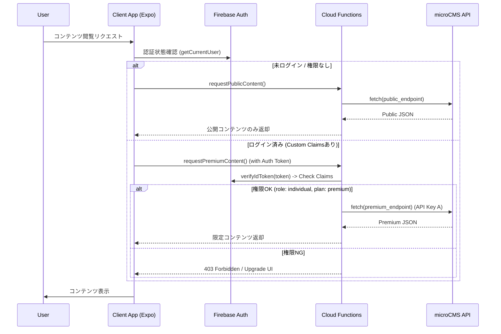

# microCMS連携LPアプリ開発・実装計画書

## 1. 概要 (Overview)

本ドキュメントは、microCMSを活用したスマホネイティブアプリ（LP等）の基盤構築およびFirebase認証・認可の組み込みに関する実装計画を定義します。

**本フェーズのスコープ**:
*   microCMSと連携するスマホネイティブLPアプリの**基盤構築**。
*   Firebase Authentication と Cloud Functions を用いた**セキュアな認証・認可フローの実装**。
*   **対象外**: 具体的なコンテンツの企画・制作、大量配信時のキャッシュ最適化などの運用フェーズ。これらは基盤完成後に別途検討します。

**基本概念の参照元**:
[Authentication_Authorization.md §8. 外部コンテンツ管理アーキテクチャ (microCMS連携)](./Authentication_Authorization.md#8-外部コンテンツ管理アーキテクチャ-microcms連携)

## 2. 要件定義 (Requirements)

### 2.1 機能要件
1.  **LPコンテンツ配信**: microCMSで管理された記事、お知らせ、LPコンテンツをアプリ上に表示する。
2.  **会員限定コンテンツ**: 特定の権限（ログイン済み、Premiumプラン等）を持つユーザーのみが閲覧できるエリアを設ける。
3.  **認証統合**: 既存のFirebase Authentication基盤を利用し、シームレスにログイン・権限判定を行う。
4.  **動的なUI切り替え**: 権限の有無に応じて、コンテンツの表示/非表示や「鍵マーク」の表示を切り替える。

### 2.2 非機能要件
1.  **セキュリティ**: microCMSのAPIキーをクライアントアプリに露出させない（サーバーサイド隠蔽）。
2.  **パフォーマンス**: 認証判定を高速に行い、UXを損なわない（Custom Claims利用）。
3.  **API制限対策**: microCMS無料プランのAPIリクエスト数制限を考慮し、適切なキャッシュ戦略を導入する。

## 3. 基本設計 (Architecture)

### 3.1 システム構成図



### 3.2 技術スタック
*   **CMS**: microCMS (Headless CMS)
*   **Frontend**: Expo (React Native)
*   **Backend**: Firebase Cloud Functions (Node.js / TypeScript)
*   **Auth**: Firebase Authentication (Custom Claims)
*   **Cache**: Firebase Hosting CDN / Cloud Firestore (Optional)

## 4. 詳細設計 (Detailed Design)

### 4.1 認可設計 (Custom Claims & Context Scope)

`Authentication_Authorization.md` の定義 (§3.1, §3.2) に準拠し、認可レベルに応じて判定ロジックを使い分ける。

#### A. Custom Claims (Global Scope)
高速な判定に使用。基本はこちらを利用する。

| Claim Key | Value Example | 説明 | 参照元 |
| :--- | :--- | :--- | :--- |
| `role` | `"individual"`, `"corporate"` | アプリ利用区分 | Auth.md §3.1 |
| `plan` | `"premium"`, `"free"` | サブスクリプションプラン | Auth.md §3.1 |

#### B. Firestore参照 (Context Scope) - アルムナイ区分など
「特定の企業のアルムナイのみ閲覧可能」といった、個別の関係性に基づく高度な認可が必要な場合に利用。
Custom Claims には含めず、Cloud Functions 内で Firestore を参照して判定する。

| 区分 | 定義 | 判定方法 | 参照元 |
| :--- | :--- | :--- | :--- |
| **Lv1〜Lv3** | アルムナイ/つながり | Functions内で `Relationships` コレクションを検索 | Auth.md §3.2 |

### 4.2 Cloud Functions 設計

アプリから直接 microCMS SDK を叩くのではなく、以下の Callable Function を実装する。
※ 2026-03-04追記: `onCall` から `onRequest` (HTTP関数) へ変更。

#### onRequestへの変更理由と効果
1.  **GETメソッドのサポート**: `onCall` はPOSTメソッドを強制するが、コンテンツ取得系APIはRESTfulな設計上GETメソッドが適切であるため。
2.  **キャッシュ制御**: HTTPヘッダー（`Cache-Control`）を利用したCDNキャッシュやブラウザキャッシュの制御が可能になり、パフォーマンス向上とコスト削減が見込める。
3.  **外部サービス連携**: Webフックや他のHTTPクライアントからの利用が容易になる。

*   **Function Name**: `getLpContent`
*   **Trigger Type**: `onRequest` (HTTP Request)
*   **Method**: `GET`
*   **URL**: `https://<region>-<project-id>.cloudfunctions.net/getLpContent`
*   **Input**: Query Parameters or Request Body
*   **Logic**:
    1.  **CORS制御**: 全オリジン(`origin: true`)または特定のドメインからのアクセスを許可。
    2.  **認証チェック**: `Authorization: Bearer <ID_TOKEN>` ヘッダーを検証。
        *   未認証でもアクセス可能（ゲスト扱い）。
    3.  **メタデータ取得**: microCMS からコンテンツのメタデータ（`is_premium_only` 等）を取得。
    4.  **認可判定**:
        *   `is_premium_only` の場合、デコードしたトークンの `plan` を確認。
    5.  **データ返却**: JSON形式で返却。権限NGなら制限付きデータを返す。

#### 変更理由と期待効果 (2026-03-04)
*   **変更理由**:
    *   `onCall` はクライアントSDKに依存しており、`curl` や外部ツールからの疎通確認が難しい。
    *   LPアプリの特性上、未ログインユーザー（ゲスト）の閲覧頻度が高く、将来的にSSG/ISR等のサーバーサイドフェッチと相性が良い `onRequest` が適していると判断。
*   **期待する効果**:
    *   **デバッグ効率向上**: `curl` コマンドで簡単にAPIの動作確認が可能になり、INTERNALエラー等の原因切り分けが容易になる。
    *   **汎用性向上**: クライアントSDK（Firebase JS SDK）に依存せず、標準的な `fetch` API で利用可能。
    *   **将来性**: 将来的にWeb版LPを展開する際、SEO対策（サーバーサイドレンダリング）への移行がスムーズになる。

### 4.3 microCMS スキーマ設計例
*   **API Endpoint**: `lp_home`
*   **Fields**:
    *   `title` (text)
    *   `body` (rich editor)
    *   `thumbnail` (image)
    *   **Access Control Fields**:
        *   `is_premium_only` (boolean): Premiumプラン限定か
        *   `target_company_id` (text): アルムナイ限定の場合の対象企業ID
        *   `min_alumni_rank` (select): 必要ランク (Lv1/Lv2/Lv3)

## 5. 開発環境・プロジェクト構成 (Development Environment)

実装に着手する前に、以下の構成を前提とします。

### 5.1 ディレクトリ構成
既存の `apps` ディレクトリ配下に、新規Expoプロジェクトとして構築します。
※既存の `individual_user_app` とは独立させることで、マーケティング施策の変更に柔軟に対応します。

```text
apps/
└── lp_app/                 # [New] LP用ネイティブアプリ
    ├── app.json            # Expo Config
    ├── package.json
    └── src/
        ├── features/
        │   └── cms/        # microCMS連携ロジック
        └── screens/        # LP画面
```

### 5.2 Firebaseプロジェクト
*   **Project ID**: 既存の本番/開発プロジェクト (`engineer-registration-app`) を利用します。
*   **理由**: ユーザーデータベース (`users` collection) と認証情報 (Authentication) を共有し、LPから会員登録したユーザーがそのまま本体アプリを利用できるようにするため。

### 5.3 TypeScript型定義 (推奨)
microCMSのレスポンスには型定義を用意し、開発効率と安全性を高めます。

```typescript
// types/microcms.ts
export interface LpContent {
  id: string;
  title: string;
  body: string;
  thumbnail?: { url: string };
  is_premium_only: boolean;
  // ...
}
```

## 6. 実装計画 (Implementation Plan)

以下はGitHub Milestone作成の元となるタスクリストです。
**本計画のゴールは、microCMSからデータを取得し、認証状態に応じて出し分けができる「基盤」の完成です。**

### Phase 1: 基盤構築 (Infrastructure)
- [x] **microCMS環境セットアップ**
    - サービス作成、APIキー発行。
    - **動作確認用**の最小限のコンテンツ入稿（公開用/限定用）。
- [x] **Cloud Functions 環境準備**
    - `microcms-js-sdk` のインストール。
    - 環境変数 (`MICROCMS_SERVICE_DOMAIN`, `MICROCMS_API_KEY`) の設定。

### Phase 2: バックエンド実装 (Backend)
- [x] **コンテンツ取得Functionの実装 (`getLpContent`)**
    - 認証チェックロジックの実装。
    - microCMSデータ取得ロジックの実装。
    - `is_premium_only` フラグに基づくフィルタリング実装。
- [x] **単体テスト**
    - 権限あり/なし/未認証 パターンでの挙動検証。

### Phase 3: フロントエンド実装 (Frontend)
- [x] **LP画面のUI実装 (プロトタイプ)**
    - コンテンツリスト表示（デザインは最小限）。
    - 詳細表示。
- [x] **認証連携**
    - `cloudFunctions` 呼び出しの実装。
    - 権限不足時のUIハンドリング（ロックアイコン、アップグレード訴求）の基本実装。

### Phase 4: キャッシュ戦略 (Optional/Future)
- [x] **キャッシュ層の導入**
    - 必要に応じてFirestoreにコンテンツをキャッシュし、APIコール数を削減する仕組みを検討・実装。

### Phase 5: 高度な運用機能 (Milestone 16)

- [x] **Webhookによるキャッシュの自動更新 (On-Demand Revalidation)**
    - microCMSのWebhookを受け取り、更新されたコンテンツのキャッシュを即座に無効化するCloud Functionsを作成する。
    - 署名検証（`X-MICROCMS-Signature`）を行い、セキュリティを確保する。
- [x] **画像最適化 (Image Optimization)**
    - microCMS (imgix) の画像APIを活用し、デバイス解像度や通信環境に応じた最適な画像サイズ・フォーマット(WebP等)を取得するロジックを実装する。
- [x] **プレビューモードの実装 (Preview Mode)**
    - 管理者権限を持つユーザーのみ、microCMSの下書き状態（draftKey利用）のコンテンツをアプリ内で確認できる機能を実装する。
    - **機密性保護**: draftKey はクライアント側に露出させず、Cloud Functions 内でのみセキュアに管理する。
- [x] **アナリティクス連携 (Analytics Integration)**
    - コンテンツごとの閲覧数、滞在時間、Premiumコンテンツへのアクセス試行数などを計測し、マーケティング施策に活用する。
- [x] **エラー監視とオブザーバビリティ (Monitoring)**
    - Cloud Functions のエラー率や microCMS API のレート制限状況を監視し、異常検知時に通知する仕組みを構築する。
- [x] **SEO・OGP設定 (SEO Metadata)**
    - microCMSの記事データから動的に `<meta>` タグ（Title, Description, OGP画像）を生成し、SNSシェアや検索流入を最適化する。
- [x] **利用規約・プライバシーポリシー (Legal Pages)**
    - 認証機能（Firebase Auth）利用に伴い必須となる固定ページを作成し、ストア審査や法規対応を行う。
    - ✅ 2026-03-04: `PrivacyPolicyScreen.js` を実装し、フッターからの導線を追加。

### Phase 6: 初期ログイン機能とテスト自動化 (Milestone 16)

本フェーズでは、LPアプリ内に初回リリースへ向けた限定的なログイン機能を実装する。
アプリリリースまでの期間は運用上、**既存のAdmin管理者2名のみがログインを行う想定**とする。
ただし、これは「利用想定」であり、コード上は Email / Password を持つ Firebaseのusersコレクション内にデータが存在しているユーザーであればログイン自体は可能（※LPアプリ内に新規登録導線は実装しない）。

- [x] **リブランディング (Level 1)**
    - アプリ名を「Engineer Registration App」から「**Career Dev Tool**」へ変更。
    - ユーザーの目に触れる表示名（アプリ名、ヘッダー、フッター）および開発者向けメタデータ（package.json description）を更新。
    - ※物理的なディレクトリ名やBundle ID等の変更（Level 2以降）はリスク回避のため実施しない。
- [ ] **Admin用ログイン画面の実装**
    - LPアプリ側は Firebase Authentication の **パスキー（Passkey）ログインを主導線**とし、「Password でのログインはこちら」リンクから Email / Password 画面へ遷移できる構成に変更。
    - 画面ヘッダーに「新規登録」ボタンを設置し、タップ後は**招待コード確認画面**へ遷移する（一般公開ではなく招待制を前提とした登録導線）。
    - **技術選定**: モバイル体験最優先のため、React Nativeフェーズでは `react-native-passkey` を採用（Flutter移行時は `passkeys` パッケージへ移行予定）。
- [ ] **Passkeyログイン実装（Client Side）**
    - **Web**: `@firebase-web-authn/browser` の `signInWithPasskey(auth, functions)` を利用してログイン（実装済み）。
    - **Native**: `react-native-passkey` を用いたパスキー認証 → Cloud Functions で検証 → Firebase Auth へサインイン（未実装）。
- [x] **ロール別リダイレクト機能の実装**
    - ログイン成功後、Custom Claims の `role` に基づき以下の通り遷移する。
        - **Admin**: `admin_app` (Web)
        - **Corporate**: `corporate_user_app`
        - **Individual**: `individual_user_app`
    - `navigationHelper.js` にプラットフォーム（Web/Native）を考慮したリダイレクトロジックを集約。
- [x] **ログイン導線の整備**
    - ヘッダーに「ログイン」ボタンを配置し、デフォルトで **パスキーログイン画面** へ遷移させる。
    - 従来の Email / Password ログイン（管理者用含む）への導線は、パスキーログイン画面内のテキストリンク「Password でのログインはこちら」として配置。
    - **裏コマンド（シークレットタップ）**: ヘッダーロゴ（`Career Dev Tool`）の **長押し** でも Email / Password ログイン画面へ直接遷移可能（開発・管理者用ショートカット）。
- [x] **認証状態の管理とアクセス制御**
    - ログインしたAdminユーザーの認証状態（Token, Custom Claims）を保持。
    - Adminユーザーにのみ、プレビューモード等の限定機能や画面へのアクセスを許可する。
- [ ] **E2Eテスト用認証フローの確立**
    - 自動E2Eテストツール（Maestro等）が安定してログイン処理を実行し、ログイン後画面のテストを行えるよう、テスト専用アカウントの実装とMaestroシナリオを確立。

### 6.1 ネイティブパスキー検証手順 (Development Client)

ネイティブアプリ（iOS/Android）でのパスキー認証はOSの深層機能を使用するため、標準のExpo Goアプリでは動作しません。以下の手順でカスタムビルド（Development Client）を作成し、実機またはエミュレーターで検証を行ってください。

#### 6.1.1 Expo Go でのログイン可否（整理）

- **Email / Password ログイン**: Expo Go でも動作する（Firebase JS SDK 経由）。
- **Passkey ログイン（Native）**: Expo Go では動作しない（Development Client が必要）。
- **ログイン後の管理画面遷移（実機）**:
  - 実機（Expo Go）から `http://localhost:8081` は参照できない（スマホの `localhost` はスマホ自身を指す）。
  - 開発中に Admin へ遷移させる場合は、`apps/lp_app/src/utils/navigationHelper.js` の `APP_URLS.admin` を **端末から到達可能なURL** にする。
    - 例: `http://<PCのLAN IP>:8081`（同一Wi-Fi内）
    - もしくは本番のHosting URL（`https://admin-app-site-d11f0.web.app`）へ遷移させる

1.  **前提条件**:
    *   `expo-dev-client` がインストールされていること（対応済み）。
    *   iOSの場合はMac環境とXcodeが必須。
    *   Androidの場合はAndroid Studioが必須。

2.  **ビルドとインストール**:
    プロジェクトルートから以下のコマンドを実行します。

    ```bash
    # プロジェクトルートへ移動 (環境に合わせて調整してください)
    cd engineer-registration-app-yama/yama

    # アプリディレクトリへ移動
    cd apps/lp_app
    
    # iOSの場合 (Simulator または 実機)
    npx expo run:ios
    
    # Androidの場合 (Emulator または 実機)
    npx expo run:android
    
    # EAS Build (クラウドビルド)
    eas build --profile development --platform ios
    ```

3.  **検証**:
    *   ビルド完了後、端末にインストールされた「LP App (Dev)」を起動します。
    *   Metro Bundlerとの接続を確認し、アプリが起動したら「ログイン」ボタンをタップしてパスキー認証をテストします。

### 6.2 Passkeyログイン実装（Client Side）概要

#### 目的 / 期待する効果

- **パスワードレス化**: Email / Password を主導線から外し、運用上のパスワード管理コストと漏洩リスクを抑える。
- **フィッシング耐性の向上**: Passkeyはオリジン/RPに紐づくため、偽サイト誘導による資格情報詐取を受けにくい。
- **UX向上**: 生体認証/端末ロック解除により入力負荷が小さく、ログイン完了までが速い。
- **権限連動の一貫性**: ログイン後は Custom Claims の `role` に基づいて既存のリダイレクト機構へ接続し、管理者向け機能（プレビュー等）も同じ権限体系で制御する。

#### 詳細設計

**対象コンポーネント**

- `apps/lp_app/src/screens/PasskeyLoginScreen.js`

**プラットフォーム分岐**

- **Web**: `@firebase-web-authn/browser` の `signInWithPasskey(auth, functions)` を利用し、Firebase Authentication と Cloud Functions の連携をライブラリ側に委譲する。
- **Native (iOS/Android)**: `react-native-passkey` と Cloud Functions を組み合わせ、認証結果を Firebase Authentication へ接続する。

**Nativeログインフロー（想定）**

1. **チャレンジ取得**
   - Callable Function: `getPasskeyChallenge`
   - 返却値: `challenge`, `rpId` など（認証オプション）
2. **端末でパスキー認証**
   - `Passkey.authenticate({ rpId, challenge, allowCredentials })` を実行
   - 成功時に WebAuthn 互換のレスポンス（`id`, `rawId`, `response.clientDataJSON`, `response.authenticatorData`, `response.signature` 等）を取得
3. **サーバー検証 & トークン発行**
   - Callable Function: `verifyPasskeyAndGetToken`
   - 入力: `response`（手順2の結果）
   - 出力: `{ customToken }`
4. **Firebase Authへサインイン**
   - `signInWithCustomToken(auth, customToken)` を実行して `userCredential` を取得
5. **ロール取得とリダイレクト**
   - `userCredential.user.getIdTokenResult()` から `claims.role` を取得
   - `redirectToApp(role)` により role別に遷移

**失敗時の扱い**

- UI: 「ログイン失敗」を表示し、再試行を許可（Email / Password へのフォールバック導線は維持）。
- 計測: `login_failure` を `method=passkey` として送信し、`error_code` / `error_message` を記録する。

**セキュリティ上の前提**

- クライアントには microCMS APIキー等の秘匿情報を置かないのと同様に、Passkey検証（署名検証）は Cloud Functions 側で実施する。
- Challenge は **使い捨て** とし、期限切れ（TTL）を設定する（Functions側の `passkey_challenges` 管理方針に従う）。

#### 実装計画（概要）

1. **前提条件の確定**
   - RP ID / Origin / Associated Domains（iOS）/ Asset Links（Android）の整合性を確定し、Functions側の検証条件と一致させる。
2. **Nativeログイン経路の実装**
   - `PasskeyLoginScreen.js` のネイティブ分岐を、チャレンジ取得 → 認証 → 検証 → Custom Token サインインの実フローに置き換える。
3. **エラーハンドリングと計測の整理**
   - 既存の `login` / `login_failure` 計測仕様に合わせ、Passkey経路のエラーコード体系とメッセージを整理する。
4. **動作確認**
   - Development Clientでの実機/シミュレータ確認（6.1）を行い、ロール別リダイレクトと管理者限定機能の連動を確認する。

### 付録: メンテナンス記録 (Maintenance Roles)

- **CI/CD パイプラインの修復 (2026-03-04)**
    - **問題**: Sub-packages で `resolution: workspace` を使用している際、Docker ビルド内でワークスペースルートの `pubspec.yaml` が欠落し `dart pub get` が失敗する問題が発生（2026-02-13より継続）。
    - **対策**: `infrastructure/firebase/functions/Dockerfile` 内で最小限のワークスペース `pubspec.yaml` を動的に生成し、Flutter非依存なパッケージのみをワークスペースに含めることで解決。

## 7. 推奨される次のタスク (Recommended Next Tasks)

以下のタスクは、`getLpContent` 関数の本番運用に向けた推奨事項です（2026-03-04時点）。

1.  **Firestore権限の付与（キャッシュ機能の有効化）**
    *   **現状**: Functionsのサービスアカウント (`flutter-frontend-21d0a@appspot.gserviceaccount.com`) にFirestoreへのアクセス権限がないため、`PERMISSION_DENIED` エラーが発生し、キャッシュ機能が動作していません（microCMSへの直接フォールバックで機能自体は維持されています）。
    *   **対応**: Google Cloud Consoleにて、上記サービスアカウントに対して `Cloud Datastore User` などの適切なロールを付与してください。これにより、microCMSへのAPIリクエスト数を削減し、レスポンス速度を向上させることができます。

2.  **CORS設定の厳格化**
    *   **現状**: `getLpContent` 関数は `cors({ origin: true })` で設定されており、すべてのオリジンからのアクセスを許可しています。
    *   **対応**: 本番運用時は、セキュリティ向上のため、許可するオリジンを特定のドメイン（例: LPアプリのホスティングドメイン）に制限することを推奨します。

## 8. 実装詳細記録 (Implementation Details - Milestone 16)

本セクションでは、GitHub Issue #449 に基づき実施した追加実装の詳細を記録します。

### 8.1 アナリティクス機能の強化 (Analytics Enhancement)

#### 何を (What)
microCMS連携LPアプリにおいて、ユーザーの行動（画面遷移、クリックイベント、ログイン成否）を詳細に追跡するための分析基盤とトラッキングイベントを実装しました。

#### どんな目的で (Why)
当初予定していたSEO機能の実装を見送る（後述）代わりに、アプリ内でのユーザー行動データを詳細に収集・分析することで、マーケティング施策の精度向上とUX改善に繋げるためです。特に、管理者ログインフローやコンバージョンポイント（登録ボタン等）の利用状況を可視化することを重視しました。

#### どのように実装したのか (How)
1.  **Firebase Analyticsの条件付き初期化**:
    *   `apps/lp_app/src/features/firebase/config.js` にて、`isSupported()` を用いた環境判定を行い、Web/Native環境に応じて適切にAnalyticsインスタンスを初期化するロジックを実装。
2.  **トラッキング用ユーティリティの共通化**:
    *   `apps/lp_app/src/features/analytics/index.js` を作成し、`logCustomEvent`, `logScreenView`, `setAnalyticsUser` 等のラッパー関数を実装。これにより、各画面でのイベント送信コードを簡略化・統一。
3.  **画面遷移の自動計測**:
    *   `AppNavigation.js` の `onStateChange` イベントフックを利用し、React Navigation の状態変化を検知して自動的にスクリーンビューイベントを送信する仕組みを構築。
4.  **重要イベントの個別実装**:
    *   `HomeScreen.js`: 「登録する」ボタン、外部リンク、ロゴ長押し（管理者機能）などの主要アクションにカスタムイベントを設定。
    *   `LoginScreen.js`: ログイン成功・失敗（エラーコード含む）を記録し、成功時には `setAnalyticsUser` でユーザーIDを紐付け。

### 8.2 SEO機能の実装スキップ (SEO Implementation Skipped)

#### 何を (What)
microCMS記事データに基づく動的な `<meta>` タグ（Title, Description, OGP）の生成・出力機能の実装を意図的にスキップしました。

#### どんな目的で (Why)
本アプリが**完全招待制のクローズドなビジネスSNS**であるため、SEOによってマスからの流入を促進することは目的に反すると判断しました。
検索エンジン経由の不特定多数の流入よりも、招待されたユーザーの行動分析やアプリ内体験の向上を優先するため、SEO機能の実装をスキップしました。

#### どのように実装したのか (How)
*   `react-native-helmet-async` 等のSEO関連ライブラリの導入を行わず、メタデータ生成ロジックの実装を省略しました。
*   既存のコードベース（Cloud Functions 等）には影響を与えず、フロントエンド側の実装スコープから除外しました。
