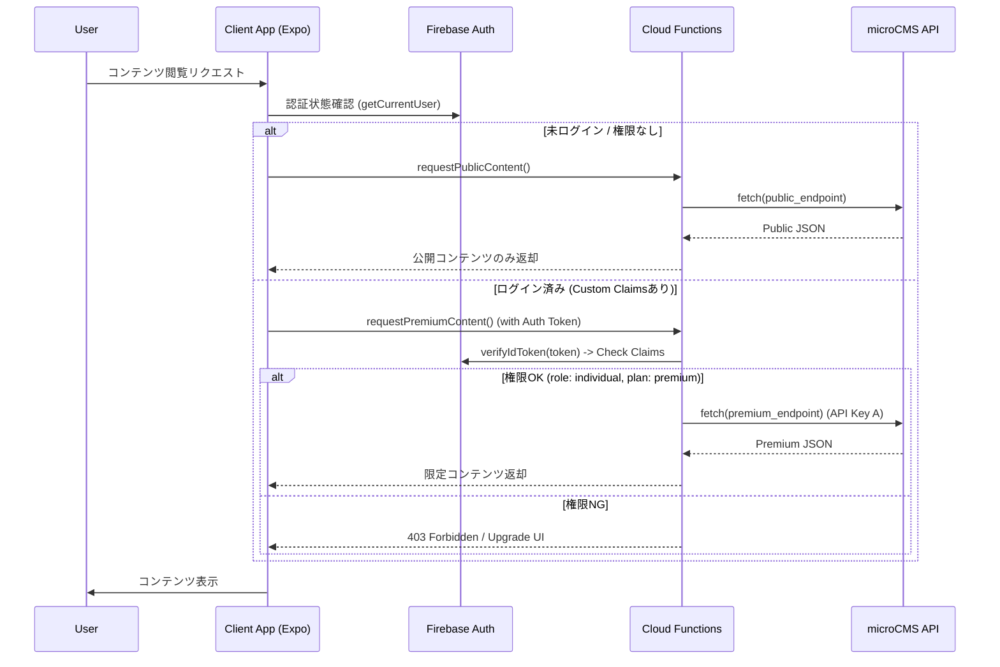

# microCMS連携LPアプリ開発・実装計画書

## 1. 概要 (Overview)

本ドキュメントは、microCMSを活用したスマホネイティブアプリ（LP等）の基盤構築およびFirebase認証・認可の組み込みに関する実装計画を定義します。

**本フェーズのスコープ**:
*   microCMSと連携するスマホネイティブLPアプリの**基盤構築**。
*   Firebase Authentication と Cloud Functions を用いた**セキュアな認証・認可フローの実装**。
*   **対象外**: 具体的なコンテンツの企画・制作、大量配信時のキャッシュ最適化などの運用フェーズ。これらは基盤完成後に別途検討します。

**基本概念の参照元**:
[Authentication_Authorization.md §8. 外部コンテンツ管理アーキテクチャ (microCMS連携)](./Authentication_Authorization.md#8-外部コンテンツ管理アーキテクチャ-microcms連携)

## 2. 要件定義 (Requirements)

### 2.1 機能要件
1.  **LPコンテンツ配信**: microCMSで管理された記事、お知らせ、LPコンテンツをアプリ上に表示する。
2.  **会員限定コンテンツ**: 特定の権限（ログイン済み、Premiumプラン等）を持つユーザーのみが閲覧できるエリアを設ける。
3.  **認証統合**: 既存のFirebase Authentication基盤を利用し、シームレスにログイン・権限判定を行う。
4.  **動的なUI切り替え**: 権限の有無に応じて、コンテンツの表示/非表示や「鍵マーク」の表示を切り替える。

### 2.2 非機能要件
1.  **セキュリティ**: microCMSのAPIキーをクライアントアプリに露出させない（サーバーサイド隠蔽）。
2.  **パフォーマンス**: 認証判定を高速に行い、UXを損なわない（Custom Claims利用）。
3.  **API制限対策**: microCMS無料プランのAPIリクエスト数制限を考慮し、適切なキャッシュ戦略を導入する。

## 3. 基本設計 (Architecture)

### 3.1 システム構成図



### 3.2 技術スタック
*   **CMS**: microCMS (Headless CMS)
*   **Frontend**: Expo (React Native)
*   **Backend**: Firebase Cloud Functions (Node.js / TypeScript)
*   **Auth**: Firebase Authentication (Custom Claims)
*   **Cache**: Firebase Hosting CDN / Cloud Firestore (Optional)

## 4. 詳細設計 (Detailed Design)

### 4.1 認可設計 (Custom Claims & Context Scope)

`Authentication_Authorization.md` の定義 (§3.1, §3.2) に準拠し、認可レベルに応じて判定ロジックを使い分ける。

#### A. Custom Claims (Global Scope)
高速な判定に使用。基本はこちらを利用する。

| Claim Key | Value Example | 説明 | 参照元 |
| :--- | :--- | :--- | :--- |
| `role` | `"individual"`, `"corporate"` | アプリ利用区分 | Auth.md §3.1 |
| `plan` | `"premium"`, `"free"` | サブスクリプションプラン | Auth.md §3.1 |

#### B. Firestore参照 (Context Scope) - アルムナイ区分など
「特定の企業のアルムナイのみ閲覧可能」といった、個別の関係性に基づく高度な認可が必要な場合に利用。
Custom Claims には含めず、Cloud Functions 内で Firestore を参照して判定する。

| 区分 | 定義 | 判定方法 | 参照元 |
| :--- | :--- | :--- | :--- |
| **Lv1〜Lv3** | アルムナイ/つながり | Functions内で `Relationships` コレクションを検索 | Auth.md §3.2 |

### 4.2 Cloud Functions 設計

アプリから直接 microCMS SDK を叩くのではなく、以下の Callable Function を実装する。
※ 2026-03-04追記: `onCall` から `onRequest` (HTTP関数) へ変更。

#### onRequestへの変更理由と効果
1.  **GETメソッドのサポート**: `onCall` はPOSTメソッドを強制するが、コンテンツ取得系APIはRESTfulな設計上GETメソッドが適切であるため。
2.  **キャッシュ制御**: HTTPヘッダー（`Cache-Control`）を利用したCDNキャッシュやブラウザキャッシュの制御が可能になり、パフォーマンス向上とコスト削減が見込める。
3.  **外部サービス連携**: Webフックや他のHTTPクライアントからの利用が容易になる。

*   **Function Name**: `getLpContent`
*   **Trigger Type**: `onRequest` (HTTP Request)
*   **Method**: `GET`
*   **URL**: `https://<region>-<project-id>.cloudfunctions.net/getLpContent`
*   **Input**: Query Parameters or Request Body
*   **Logic**:
    1.  **CORS制御**: 全オリジン(`origin: true`)または特定のドメインからのアクセスを許可。
    2.  **認証チェック**: `Authorization: Bearer <ID_TOKEN>` ヘッダーを検証。
        *   未認証でもアクセス可能（ゲスト扱い）。
    3.  **メタデータ取得**: microCMS からコンテンツのメタデータ（`is_premium_only` 等）を取得。
    4.  **認可判定**:
        *   `is_premium_only` の場合、デコードしたトークンの `plan` を確認。
    5.  **データ返却**: JSON形式で返却。権限NGなら制限付きデータを返す。

#### 変更理由と期待効果 (2026-03-04)
*   **変更理由**:
    *   `onCall` はクライアントSDKに依存しており、`curl` や外部ツールからの疎通確認が難しい。
    *   LPアプリの特性上、未ログインユーザー（ゲスト）の閲覧頻度が高く、将来的にSSG/ISR等のサーバーサイドフェッチと相性が良い `onRequest` が適していると判断。
*   **期待する効果**:
    *   **デバッグ効率向上**: `curl` コマンドで簡単にAPIの動作確認が可能になり、INTERNALエラー等の原因切り分けが容易になる。
    *   **汎用性向上**: クライアントSDK（Firebase JS SDK）に依存せず、標準的な `fetch` API で利用可能。
    *   **将来性**: 将来的にWeb版LPを展開する際、SEO対策（サーバーサイドレンダリング）への移行がスムーズになる。

### 4.3 microCMS スキーマ設計例
*   **API Endpoint**: `lp_home`
*   **Fields**:
    *   `title` (text)
    *   `body` (rich editor)
    *   `thumbnail` (image)
    *   **Access Control Fields**:
        *   `is_premium_only` (boolean): Premiumプラン限定か
        *   `target_company_id` (text): アルムナイ限定の場合の対象企業ID
        *   `min_alumni_rank` (select): 必要ランク (Lv1/Lv2/Lv3)

## 5. 開発環境・プロジェクト構成 (Development Environment)

実装に着手する前に、以下の構成を前提とします。

### 5.1 ディレクトリ構成
既存の `apps` ディレクトリ配下に、新規Expoプロジェクトとして構築します。
※既存の `individual_user_app` とは独立させることで、マーケティング施策の変更に柔軟に対応します。

```text
apps/
└── lp_app/                 # [New] LP用ネイティブアプリ
    ├── app.json            # Expo Config
    ├── package.json
    └── src/
        ├── features/
        │   └── cms/        # microCMS連携ロジック
        └── screens/        # LP画面
```

### 5.2 Firebaseプロジェクト
*   **Project ID**: 既存の本番/開発プロジェクト (`engineer-registration-app`) を利用します。
*   **理由**: ユーザーデータベース (`users` collection) と認証情報 (Authentication) を共有し、LPから会員登録したユーザーがそのまま本体アプリを利用できるようにするため。

### 5.3 TypeScript型定義 (推奨)
microCMSのレスポンスには型定義を用意し、開発効率と安全性を高めます。

```typescript
// types/microcms.ts
export interface LpContent {
  id: string;
  title: string;
  body: string;
  thumbnail?: { url: string };
  is_premium_only: boolean;
  // ...
}
```

## 6. 実装計画 (Implementation Plan)

以下はGitHub Milestone作成の元となるタスクリストです。
**本計画のゴールは、microCMSからデータを取得し、認証状態に応じて出し分けができる「基盤」の完成です。**

### Phase 1: 基盤構築 (Infrastructure)
- [x] **microCMS環境セットアップ**
    - サービス作成、APIキー発行。
    - **動作確認用**の最小限のコンテンツ入稿（公開用/限定用）。
- [x] **Cloud Functions 環境準備**
    - `microcms-js-sdk` のインストール。
    - 環境変数 (`MICROCMS_SERVICE_DOMAIN`, `MICROCMS_API_KEY`) の設定。

### Phase 2: バックエンド実装 (Backend)
- [x] **コンテンツ取得Functionの実装 (`getLpContent`)**
    - 認証チェックロジックの実装。
    - microCMSデータ取得ロジックの実装。
    - `is_premium_only` フラグに基づくフィルタリング実装。
- [x] **単体テスト**
    - 権限あり/なし/未認証 パターンでの挙動検証。

### Phase 3: フロントエンド実装 (Frontend)
- [x] **LP画面のUI実装 (プロトタイプ)**
    - コンテンツリスト表示（デザインは最小限）。
    - 詳細表示。
- [x] **認証連携**
    - `cloudFunctions` 呼び出しの実装。
    - 権限不足時のUIハンドリング（ロックアイコン、アップグレード訴求）の基本実装。

### Phase 4: キャッシュ戦略 (Optional/Future)
- [x] **キャッシュ層の導入**
    - 必要に応じてFirestoreにコンテンツをキャッシュし、APIコール数を削減する仕組みを検討・実装。

### Phase 5: 高度な運用機能 (Milestone 16)

- [x] **Webhookによるキャッシュの自動更新 (On-Demand Revalidation)**
    - microCMSのWebhookを受け取り、更新されたコンテンツのキャッシュを即座に無効化するCloud Functionsを作成する。
    - 署名検証（`X-MICROCMS-Signature`）を行い、セキュリティを確保する。
- [x] **画像最適化 (Image Optimization)**
    - microCMS (imgix) の画像APIを活用し、デバイス解像度や通信環境に応じた最適な画像サイズ・フォーマット(WebP等)を取得するロジックを実装する。
- [x] **プレビューモードの実装 (Preview Mode)**
    - 管理者権限を持つユーザーのみ、microCMSの下書き状態（draftKey利用）のコンテンツをアプリ内で確認できる機能を実装する。
    - **機密性保護**: draftKey はクライアント側に露出させず、Cloud Functions 内でのみセキュアに管理する。
- [x] **アナリティクス連携 (Analytics Integration)**
    - コンテンツごとの閲覧数、滞在時間、Premiumコンテンツへのアクセス試行数などを計測し、マーケティング施策に活用する。
- [x] **エラー監視とオブザーバビリティ (Monitoring)**
    - Cloud Functions のエラー率や microCMS API のレート制限状況を監視し、異常検知時に通知する仕組みを構築する。
- [x] **SEO・OGP設定 (SEO Metadata)**
    - microCMSの記事データから動的に `<meta>` タグ（Title, Description, OGP画像）を生成し、SNSシェアや検索流入を最適化する。
- [x] **利用規約・プライバシーポリシー (Legal Pages)**
    - 認証機能（Firebase Auth）利用に伴い必須となる固定ページを作成し、ストア審査や法規対応を行う。
    - ✅ 2026-03-04: `PrivacyPolicyScreen.js` を実装し、フッターからの導線を追加。

### Phase 6: 初期ログイン機能とテスト自動化 (Milestone 16)

本フェーズでは、LPアプリ内に初回リリースへ向けた限定的なログイン機能を実装する。
アプリリリースまでの期間、**ログイン対象者は既存のAdmin管理者2名のみ**とする。

- [x] **Admin用ログイン画面の実装**
    - Firebase Authentication を用いた Email / Password ログインフォームを構築。
    - 管理者以外の新規登録動線は設けない（リリースまではAdmin専用）。
- [x] **ログイン導線の隠蔽**
    - 一般ユーザーに誤認されないよう、ログイン画面へのリンクはフッター等の目立たない位置に配置するか、特定の操作（シークレットタップ等）で開く設計とする。
- [x] **認証状態の管理とアクセス制御**
    - ログインしたAdminユーザーの認証状態（Token, Custom Claims）を保持。
    - Adminユーザーにのみ、プレビューモード等の限定機能や画面へのアクセスを許可する。
- [x] **E2Eテスト用認証フローの確立**
    - 自動E2Eテストツール（Maestro等）が安定してログイン処理を実行し、ログイン後画面のテストを行えるよう、テスト専用アカウントの実装とMaestroシナリオを確立。

### 付録: メンテナンス記録 (Maintenance Roles)

- **CI/CD パイプラインの修復 (2026-03-04)**
    - **問題**: Sub-packages で `resolution: workspace` を使用している際、Docker ビルド内でワークスペースルートの `pubspec.yaml` が欠落し `dart pub get` が失敗する問題が発生（2026-02-13より継続）。
    - **対策**: `infrastructure/firebase/functions/Dockerfile` 内で最小限のワークスペース `pubspec.yaml` を動的に生成し、Flutter非依存なパッケージのみをワークスペースに含めることで解決。

## 7. 推奨される次のタスク (Recommended Next Tasks)

以下のタスクは、`getLpContent` 関数の本番運用に向けた推奨事項です（2026-03-04時点）。

1.  **Firestore権限の付与（キャッシュ機能の有効化）**
    *   **現状**: Functionsのサービスアカウント (`flutter-frontend-21d0a@appspot.gserviceaccount.com`) にFirestoreへのアクセス権限がないため、`PERMISSION_DENIED` エラーが発生し、キャッシュ機能が動作していません（microCMSへの直接フォールバックで機能自体は維持されています）。
    *   **対応**: Google Cloud Consoleにて、上記サービスアカウントに対して `Cloud Datastore User` などの適切なロールを付与してください。これにより、microCMSへのAPIリクエスト数を削減し、レスポンス速度を向上させることができます。

2.  **CORS設定の厳格化**
    *   **現状**: `getLpContent` 関数は `cors({ origin: true })` で設定されており、すべてのオリジンからのアクセスを許可しています。
    *   **対応**: 本番運用時は、セキュリティ向上のため、許可するオリジンを特定のドメイン（例: LPアプリのホスティングドメイン）に制限することを推奨します。
