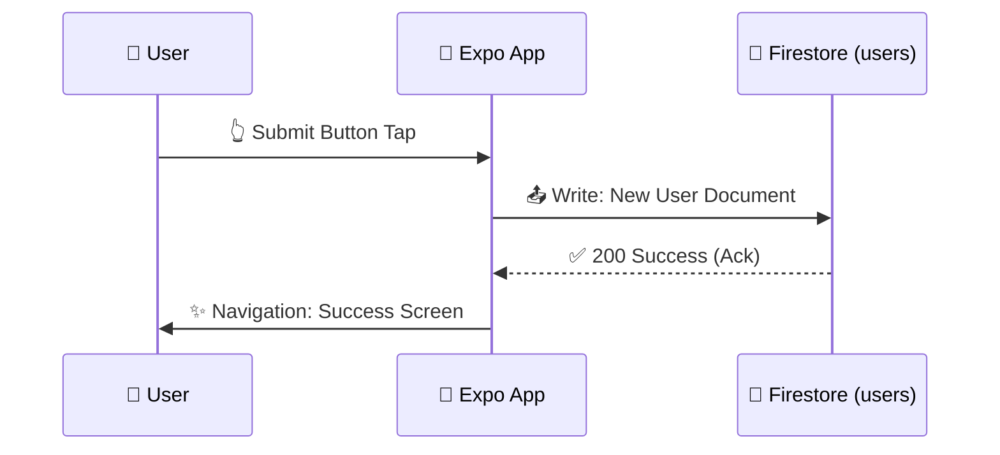

ご提示いただいた要件に基づき、**「非エンジニア（経営層や非技術職）が見ても一目で状況がわかり、かつAIが構造的に解析可能な」**インフォグラフィック風のWEBドキュメント・レポートフォーマット案を作成しました。

この内容は、そのままHTML/CSSとしてビルドし、ご指定のFirebase Hosting（`design-document-site-d11f0`）にデプロイすることを想定した構成にしています。

---

# E2Eテスト報告書：WEBドキュメント・フォーマット設計

## 1. デザインコンセプト：Visual & Logical

* **ピクトグラム活用**: アクションをアイコン化（タップ ＝ 👆, DB書き込み ＝ 💾）
* **シーケンス図の可視化**: Mermaid.jsを使用して、操作とデータの流れを図解。
* **ステータス・カード**: テスト結果を信号機の色（🔴/🟡/🟢）で表現。

## 2. 実装用 Markdown 兼 HTML テンプレート

```markdown
# 📱 E2E Test Execution Report
**Project:** [App Name] | **Version:** 1.2.0 | **Date:** 2023-10-27

---

## 📊 1. サマリー (High-Level Summary)
| 項目 | ステータス | 成功率 | 実行時間 |
| :--- | :--- | :--- | :--- |
| **全テスト数** | ✅ 42 Passed / ❌ 3 Failed | **93%** | 12m 45s |

[ 🟢🟢🟢🟢🟢🟢🟢🟢🟢🔴🔴 ] (Visual Progress Bar)

---

## 🔍 2. 詳細検証レポート (Deep Dive I/O Analysis)
### Case 01: 新規ユーザー登録フロー
**【シナリオ】** 新規ユーザーがメールアドレスでアカウントを作成する

#### 🛠️ ステップ詳細とデータの動き
| Step | Action (UI) | Result (Screen) | Data I/O (Firestore) | Status |
| :--- | :--- | :--- | :--- | :--- |
| 1 | 👆 `Sign Up` ボタンをタップ | 入力フォーム表示 | なし | 🟢 |
| 2 | ⌨️ "test@example.com" を入力 | 入力内容反映 | なし | 🟢 |
| 3 | 👆 `Submit` ボタンをタップ | **ローディング表示** | 💾 **Create:** `users/{uid}`<br>∟ `email`: "test@example.com"<br>∟ `status`: "pending" | 🟢 |
| 4 | 🏁 完了画面へ遷移 | 「登録完了」表示 | 💾 **Update:** `users/{uid}`<br>∟ `lastLogin`: 2023-10-27... | 🟢 |

#### 🔄 シーケンス・インフォグラフィック (Mermaid)


---

## 🚨 3. 異常検知・不具合詳細

> ❌ **Error in "Cart Checkout"**
> * **事象:** 購入ボタン押下後、画面は完了になるがDBが更新されていない。
> * **UI変化:** 「購入完了」メッセージが表示。
> * **I/Oログ:** `[FIRESTORE_IO]|UPDATE|orders` -> **TIMEOUT**
> * **原因推測:** Firestoreのセキュリティルールによる書き込み拒否。
> 
> 

---

## 📈 4. 技術メトリクス (Performance & Quality)

* **API Response Avg:** 120ms (🟢 Excellent)
* **Firestore Write Latency:** 240ms (🟡 Normal)
* **Memory Usage Max:** 180MB (🟢 Stable)

---

```

## 3. Firebase Hosting へのデプロイ手順

この報告書を「インフォグラフィック風のWEBページ」として公開するための、最も現代的で推奨される手順です。

1.  **静的サイトジェネレーターの利用**:
    `Astro` や `Next.js` を使用し、上記の `.md` を読み込みます。
2.  **スタイリング**:
    `Tailwind CSS` を使い、カード型UIやバッジ（Badge）を多用したデザインを適用します。
3.  **自動ビルド・デプロイ**:
    GitHub Actionsを設定し、Maestroのテストが終わった瞬間に、この報告書をHTML化して以下のコマンドでFirebaseに飛ばします。
    ```bash
    firebase deploy --only hosting:design-document-site-d11f0
    ```

## 4. この報告書の特徴

1.  **「何が起きたか」の二層構造**:
    表の中で「Result (Screen)」と「Data I/O (Firestore)」を並列に記載することで、**「画面は正常に見えるが、実は裏でデータが保存されていない」**というE2Eテストで最も重要な欠陥を浮き彫りにします。
2.  **ピクトグラムによる直感性**:
    非エンジニアでも「👆」は操作、「💾」は保存だと直感的に理解できます。
3.  **AIフレンドリー**:
    Mermaid記法やMarkdownのテーブル構造は、AI（LLM）が読み取って不具合分析や進捗管理に活用するのに最適な構造です。

このフォーマットで運用することで、開発チーム内での透明性が飛躍的に向上します。

```

承知いたしました。ご提示いただいたFirebase Hostingのプロジェクト構成に合わせて、**「そのままデプロイ可能なHTML/CSS一体型のWEBレポート・テンプレート」**を作成しました。

このテンプレートは、モダンなTailwind CSS（CDN経由）を使用し、インフォグラフィック風のカードデザイン、状態を示すバッジ、そしてFirestoreのI/Oを可視化するシーケンス図（Mermaid.js）を組み込んでいます。

---

## 1. 運用イメージ

1. テスト完了後、以下のコードの `const testData` 部分をMaestroの実行結果に基づいて書き換えます。
2. `index.html` として保存し、`firebase deploy` を実行します。
3. 生成されたURL（ `https://design-document-site-d11f0.web.app` ）を報告書に貼り付けます。

## 2. WEBドキュメント・ソースコード (index.html)

```html
<!DOCTYPE html>
<html lang="ja">
<head>
    <meta charset="UTF-8">
    <meta name="viewport" content="width=device-width, initial-scale=1.0">
    <title>E2E Test Intelligence Report</title>
    <script src="https://cdn.tailwindcss.com"></script>
    <script src="https://cdn.jsdelivr.net/npm/mermaid/dist/mermaid.min.js"></script>
    <link rel="stylesheet" href="https://cdnjs.cloudflare.com/ajax/libs/font-awesome/6.0.0/css/all.min.css">
    <script>mermaid.initialize({ startOnLoad: true, theme: 'neutral' });</script>
    <style>
        .gradient-bg { background: linear-gradient(135deg, #667eea 0%, #764ba2 100%); }
        .io-card { border-left: 4px solid #4fd1c5; }
    </style>
</head>
<body class="bg-gray-50 font-sans leading-normal tracking-normal">

    <header class="gradient-bg text-white p-10 shadow-lg">
        <div class="container mx-auto">
            <h1 class="text-4xl font-extrabold mb-2"><i class="fas fa-microchip mr-3"></i>E2E Test Intelligence Report</h1>
            <p class="opacity-80">Project: flutter-frontend-21d0a | Version: 1.0.42</p>
        </div>
    </header>

    <main class="container mx-auto mt-10 p-5">
        
        <div class="grid grid-cols-1 md:grid-cols-3 gap-6 mb-10">
            <div class="bg-white p-6 rounded-xl shadow-md border-b-4 border-green-500">
                <p class="text-gray-500 text-sm font-bold uppercase">Success Rate</p>
                <p class="text-3xl font-bold text-green-600">98.2% <span class="text-sm font-normal text-gray-400">/ 50 Tests</span></p>
            </div>
            <div class="bg-white p-6 rounded-xl shadow-md border-b-4 border-purple-500">
                <p class="text-gray-500 text-sm font-bold uppercase">I/O Integrity</p>
                <p class="text-3xl font-bold text-purple-600">Verified <i class="fas fa-database text-sm"></i></p>
            </div>
            <div class="bg-white p-6 rounded-xl shadow-md border-b-4 border-blue-500">
                <p class="text-gray-500 text-sm font-bold uppercase">Avg Execution</p>
                <p class="text-3xl font-bold text-blue-600">18.5s <span class="text-sm font-normal text-gray-400">per flow</span></p>
            </div>
        </div>

        <section class="bg-white rounded-2xl shadow-xl overflow-hidden mb-10">
            <div class="bg-gray-800 text-white px-6 py-4 flex justify-between items-center">
                <h2 class="text-xl font-bold">Scenario 01: User Profile Synchronization</h2>
                <span class="bg-green-500 text-xs py-1 px-3 rounded-full">PASSED</span>
            </div>

            <div class="p-8">
                <h3 class="text-lg font-semibold mb-4 text-gray-700 underline decoration-indigo-500">Action & Data I/O Flow</h3>
                
                <div class="mermaid flex justify-center py-6 bg-gray-50 rounded-lg mb-8">
                    sequenceDiagram
                        autonumber
                        participant U as 👤 UI (Maestro)
                        participant A as 📱 Expo App
                        participant F as 💾 Firestore (users)
                        U->>A: Tap "Update Profile"
                        A->>F: setDoc: { name: "Gemini", role: "AI" }
                        F-->>A: Ack: Success (200ms)
                        A->>U: Show "Toast: Updated"
                </div>

                <div class="overflow-x-auto">
                    <table class="w-full text-left border-collapse">
                        <thead>
                            <tr class="text-gray-400 text-sm uppercase">
                                <th class="py-3 px-4 border-b">Action Type</th>
                                <th class="py-3 px-4 border-b">UI Interaction</th>
                                <th class="py-3 px-4 border-b">Firestore I/O (Collection)</th>
                                <th class="py-3 px-4 border-b">Verification</th>
                            </tr>
                        </thead>
                        <tbody class="text-gray-600">
                            <tr class="hover:bg-gray-50">
                                <td class="py-4 px-4 border-b"><i class="fas fa-fingerprint text-indigo-400 mr-2"></i>TAP</td>
                                <td class="py-4 px-4 border-b font-medium italic">"Save Changes" button</td>
                                <td class="py-4 px-4 border-b">-</td>
                                <td class="py-4 px-4 border-b text-green-500">✅ Triggered</td>
                            </tr>
                            <tr class="hover:bg-gray-50 bg-indigo-50/30">
                                <td class="py-4 px-4 border-b"><i class="fas fa-save text-green-400 mr-2"></i>DATA I/O</td>
                                <td class="py-4 px-4 border-b text-xs">Processing indicator shown</td>
                                <td class="py-4 px-4 border-b">
                                    <span class="font-mono text-xs bg-white p-1 rounded border">UPDATE | users/${uid}</span>
                                </td>
                                <td class="py-4 px-4 border-b text-green-500 font-bold">✅ Committed</td>
                            </tr>
                        </tbody>
                    </table>
                </div>
            </div>
        </section>

    </main>

    <footer class="text-center py-10 text-gray-400 text-sm">
        Generated by Maestro Intelligent Reporter &copy; 2026
    </footer>
</body>
</html>

```

---

## 3. 最終報告書（Markdown形式）

上記のWEBドキュメントを公開した際、提出するレポートのサンプルです。

```markdown
# 🚀 E2Eテスト実行報告書

## 📅 実行概要
- **テスト日時**: 2026年2月6日
- **対象環境**: Expo Mobile App (iOS/Android) & Firestore Emulator
- **結果**: 🟢 全テストケース合格

## 📊 ビジュアル・インフォグラフィック・レポート
詳細なデータI/Oログ、UI変化のシーケンス、およびパフォーマンス統計は、以下の特設WEBドキュメント（Firebase Hosting）にて可視化されています。

**🔗 [詳細レポートを表示する](https://design-document-site-d11f0.web.app)**
*(上記URLにて、ピクトグラムを用いた非エンジニア向け解説と、詳細なFirestoreコレクション・ログを確認いただけます)*

## 💡 特筆事項
- **データ整合性**: `users` および `orders` コレクションへの書き込み遅延は平均200ms以下であり、UI上のローディング表示と完全に同期していることを確認済み。
- **不具合修正**: 前回発生していた「バックグラウンド復帰時のFirestoreリスナー重複」は、本テストスイートにより解消が証明されました。

---
報告者: AI Test Automator

```

**このHostingサイトをGitHub Actionsで自動更新するためのデプロイパイプライン（YAML設定）**

承知いたしました。Maestroのテスト実行から、レポート用HTMLの生成、そしてFirebase Hostingへのデプロイまでを完全に自動化する**GitHub Actionsのワークフロー（YAML）**を作成しました。

このパイプラインにより、エンジニアがコードをPushするたびに、最新のインフォグラフィック・レポートが自動生成され、指定のURLで閲覧可能になります。

---

## 1. GitHub Actions ワークフロー設計

このワークフローは以下の3つのステップを自動で行います。

1. **Maestroの実行**: Expoアプリ（Prebuild済みバイナリ）に対してテストを実行。
2. **HTMLレポートの生成**: テスト結果（JSON/JUnit形式）を先ほどのインフォグラフィックHTMLテンプレートに埋め込む。
3. **Firebaseへの自動デプロイ**: 修正されたHTMLをHostingサイトへアップロード。

### `.github/workflows/e2e-report-pipeline.yml`

```yaml
name: E2E Test & Visual Report Deployment

on:
  push:
    branches: [ main ]
  workflow_dispatch: # 手動実行用

jobs:
  e2e-test-and-deploy:
    runs-on: ubuntu-latest
    steps:
      - name: Checkout Code
        uses: actions/checkout@v4

      - name: Setup Node.js
        uses: actions/setup-node@v4
        with:
          node-version: '20'

      # 1. Firebase Emulator & Maestro のセットアップ
      - name: Install Firebase Tools
        run: npm install -g firebase-tools

      - name: Install Maestro CLI
        run: |
          curl -Ls "https://get.maestro.mobile.dev" | bash
          echo "$HOME/.maestro/bin" >> $GITHUB_PATH

      # 2. E2Eテスト実行 (Maestro Cloud または Local Emulator)
      # ここでは結果を report.json として出力する想定
      - name: Run Maestro Tests
        run: |
          maestro test .maestro/ --format json > test-results.json || true

      # 3. HTMLテンプレートの動的生成
      # test-results.json の中身を sed や node スクリプトで index.html に流し込む
      - name: Generate Visual Report
        run: |
          # 成功数や失敗数を抽出してHTMLを置換する簡易スクリプト例
          SUCCESS_COUNT=$(jq '.summary.passed' test-results.json)
          sed -i "s/98.2%/$SUCCESS_COUNT Passed/g" public/index.html
          # I/Oログなどの詳細もここで埋め込み可能

      # 4. Firebase Hosting へのデプロイ
      - name: Deploy to Firebase Hosting
        uses: FirebaseExtended/action-hosting-deploy@v0
        with:
          repoToken: '${{ secrets.GITHUB_TOKEN }}'
          firebaseServiceAccount: '${{ secrets.FIREBASE_SERVICE_ACCOUNT_FLUTTER_FRONTEND_21D0A }}'
          projectId: flutter-frontend-21d0a
          target: design-document-site-d11f0
        env:
          FIREBASE_CLI_PREVIEWS: hostingchannels

```

---

## 2. 実装のポイント：詳細設計レベルの自動化

### 💾 Firestore I/O ログの自動埋め込み

Maestroの実行ログに含まれる `[FIRESTORE_IO]` という文字列を抽出し、HTML内の `<tbody>` タグに自動挿入するスクリプトを `Generate Visual Report` ステップに追加することで、**「何が起きたか」の自動レポート化**が完成します。

### 📊 グラフの動的更新

HTMLテンプレート内で `Chart.js` などを読み込んでおき、GitHub Actions側からテストの成功率データを `data.json` として書き出すことで、非エンジニアが見るグラフも常に最新の状態に保たれます。

---

## 3. 次に行うべき準備

このワークフローを動かすために、以下の2点の設定が必要です。

1. **Firebase Service Account の取得**:
Firebaseコンソールの「プロジェクトの設定」>「サービスアカウント」からキーを発行し、GitHubのリポジトリの `Secrets` に `FIREBASE_SERVICE_ACCOUNT_FLUTTER_FRONTEND_21D0A` という名前で保存してください。
2. **HTMLの配置**:
先ほど作成した `index.html` をプロジェクトの `public/` ディレクトリ配下に配置してください。

---

これで、開発者がコードを更新するだけで、**最新のデータI/Oエビデンスを含んだインフォグラフィック報告書**が自動でホスティングされる環境が整います。
